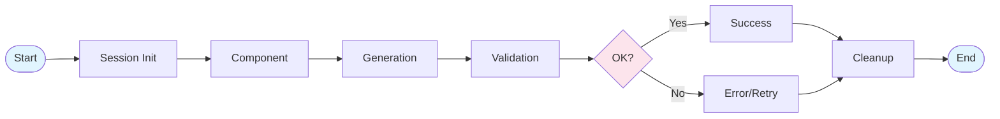
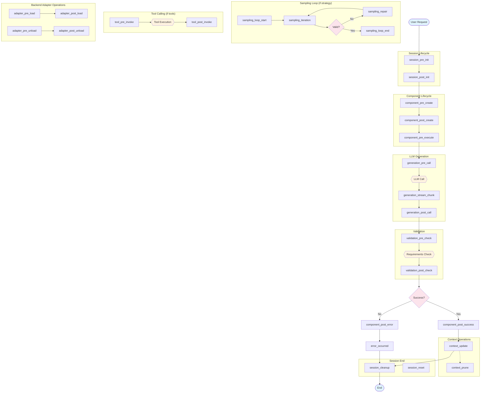

# Mellea Plugin Hook System Design Document

Mellea's hook system provides extension points for deployed generative AI applications that need policy enforcement, observability, and customization without modifying core library code. Hooks enable plugins to register and respond to events throughout the framework's execution lifecycle — from session initialization through generation, validation, and cleanup.


## 1. Overview

### Design Principles

1. **Consistent Interface**: All hooks follow the same async pattern with payload and context parameters
2. **Composable**: Multiple plugins can register for the same hook, executing in priority order
3. **Fail-safe**: Hook failures can be handled gracefully without breaking core execution
4. **Minimal Intrusion**: Plugins are opt-in; default Mellea behavior remains unchanged without plugins. Plugins work identically whether invoked through a session (`m.instruct(...)`) or via the functional API (`instruct(backend, context, ...)`)
5. **Architecturally Aligned**: Hook categories reflect Mellea's true abstraction boundaries — Session lifecycle, Component lifecycle, and the (Backend, Context) generation pipeline
6. **Code-First**: Plugins are defined and composed in Python. Decorators are the primary registration mechanism; YAML configuration is a secondary option for deployment-time overrides
7. **Functions-First**: The simplest plugin is a plain async function decorated with `@hook`. Class-based plugins exist for stateful, multi-hook scenarios but are not required

### Hook Method Signature

All hooks follow this consistent async pattern:

```python
# Standalone function hook (primary)
@hook("hook_name", mode="enforce", priority=50)
async def my_hook(
    payload: PluginPayload,
    context: PluginContext
) -> PluginResult | None

# Class-based method hook
class MyPlugin(MelleaPlugin):
    @hook("hook_name")
    async def my_hook(
        self,
        payload: PluginPayload,
        context: PluginContext
    ) -> PluginResult | None
```

- **`payload`**: Mutable, strongly-typed data specific to the hook point
- **`context`**: Read-only shared context with session metadata and utilities
- **`mode`**: `"enforce"` (default), `"permissive"`, or `"fire_and_forget"` — controls execution behavior (see Execution Mode below)
- **`priority`**: Lower numbers execute first (default: 50)
- **Returns**: A `PluginResult` with continuation flag, modified payload, and violation/explanation — or `None` to continue unchanged

### Concurrency Model

Hooks use Python's `async`/`await` cooperative multitasking. Because Python's event loop only switches execution at `await` points, hook code won't be interrupted mid-logic. This means:

- **Sequential when awaited**: Calling `await hook(...)` keeps control flow deterministic — the hook completes before the caller continues.
- **Race conditions only at `await` points**: Shared state is safe to read and write between `await` calls within a single hook. Races only arise if multiple hooks modify the same shared state and are dispatched concurrently.
- **No preemptive interruption**: Unlike threads, a hook handler runs uninterrupted until it yields control via `await`.

### Execution Mode

Hooks support three execution modes, configurable per-registration via the `mode` parameter on the `@hook` decorator:

| Mode | Behavior |
|------|----------|
| **`enforce`** (default) | Awaited inline. If the hook returns `PluginResult(continue_processing=False)`, execution is blocked. Use for policy enforcement, budget controls, and authorization. |
| **`permissive`** | Awaited inline. Violations are logged but do not block execution. Use for monitoring, auditing, and gradual rollout of policies. |
| **`fire_and_forget`** | Dispatched via `asyncio.create_task()` and runs in the background. The `PluginResult` is ignored — cannot modify payloads or block execution. Use for logging, telemetry, and non-critical side effects where latency matters more than ordering guarantees. |

Fire-and-forget hooks receive the payload snapshot as it existed at dispatch time; `enforce`/`permissive` hooks in the same chain that execute earlier (higher priority) can modify the payload before fire-and-forget hooks see it. Any exceptions in fire-and-forget hooks are logged but do not propagate.

> **Note**: All three modes (`enforce`, `permissive`, `fire_and_forget`) are supported by the ContextForge Plugin Framework's `PluginMode` enum. The additional modes `enforce_ignore_error` and `disabled` remain available in the `PluginMode` enum and YAML configuration for deployment-time control, but are not exposed as `@hook` decorator values. They are deployment concerns, not definition-time concerns.

### Plugin Framework

The hook system is backed by a lightweight plugin framework built as a Mellea dependency (not a separate user-facing package). This framework:

- Provides the `@hook` decorator for registering standalone async functions as hook handlers
- Provides the `@plugin` decorator for marking plain classes as multi-hook plugins
- Provides the `MelleaPlugin` base class for stateful plugins that need lifecycle hooks (`initialize`/`shutdown`) and typed context accessors
- Exposes `PluginSet` for grouping related hooks/plugins into composable, reusable units
- Exposes `register()` for global plugin registration and `block()` as a convenience for returning blocking `PluginResult`s
- Implements a plugin manager that loads, registers, and governs the execution of plugins

The public API surface:

```python
from mellea.plugins import hook, plugin, block, PluginSet, register, MelleaPlugin
```

### Global vs Session-Scoped Plugins

Plugins can be registered at two scopes:

- **Global**: Registered via `register()` at module or application startup. Global plugins fire for every hook invocation — both session-based (`m.instruct(...)`) and functional (`instruct(backend, context, ...)`).
- **Session-scoped**: Passed via the `plugins` parameter to `start_session()`. Session-scoped plugins fire only for hook invocations within that session.

Both scopes coexist. When a hook fires within a session, both global plugins and that session's plugins execute, ordered by priority. When a hook fires via the functional API outside a session, only global plugins execute.

**Implementation**: A single `PluginManager` instance manages all plugins. Plugins are tagged with an optional `session_id`. At dispatch time, the manager filters: global plugins (no session tag) always run; session-tagged plugins run only when the dispatch context matches their session ID.

**Functional API support**: The functional API (`instruct(backend, context, ...)`) does not require a session. Hooks still fire at the same execution points. If global plugins are registered, they execute. If no plugins are registered, hooks are no-ops with zero overhead.

### Hook Invocation Responsibilities

Hooks are called from Mellea's base classes (`Component.aact()`, `Backend.generate()`, `SamplingStrategy.run()`, etc.). This means hook invocation is a framework-level concern, and authors of new backends, sampling strategies, or components do not need to manually insert hook calls.

The calling convention is a single async call at each hook site:

```python
result = await plugin_manager.invoke_hook(hook_type, payload, context)
```

The caller (the base class method) is responsible for both invoking the hook and processing the result. Processing means checking the result for one of three possible outcomes:

1. **Continue with original payload**: — `PluginResult(continue_processing=True)` with no `modified_payload`. The caller proceeds unchanged.
2. **Continue with modified payload**: — `PluginResult(continue_processing=True, modified_payload=...)`. The caller uses the modified payload fields in place of the originals.
3. **Block execution** — `PluginResult(continue_processing=False, violation=...)`. The caller raises or returns early with structured error information.

Hooks cannot redirect control flow, jump to arbitrary code, or alter the calling method's logic beyond these outcomes. This is enforced by the `PluginResult` type.

### Payload Design Principles

Hook payloads follow five design principles:

1. **Strongly typed** — Each hook has a dedicated payload dataclass (not a generic dict). This enables IDE autocompletion, static analysis, and clear documentation of what each hook receives.
2. **Sufficient (maximize-at-boundary)** — Each payload includes everything available at that point in time. Post-hooks include the pre-hook fields plus results. This avoids forcing plugins to maintain their own state across pre/post pairs.
3. **Immutable context** — `PluginContext` fields are read-only; only the `payload` is mutable. This separates "what the plugin can observe" from "what the plugin can change."
4. **Serializable** — Payloads should be serializable for external (MCP-based) plugins that run out-of-process. All payload fields use types that can round-trip through JSON or similar formats.
5. **Versioned** — Payload schemas carry a `payload_version` so plugins can detect incompatible changes at registration time rather than at runtime.

## 2. Common Payload Fields

All hook payloads inherit these base fields:

```python
class BasePayload(PluginPayload):
    session_id: str | None = None      # Session identifier (None for functional API calls)
    request_id: str                    # Unique ID for this execution chain
    timestamp: datetime                # When the event fired
    hook: str                          # Name of the hook (e.g., "generation_pre_call")
    user_metadata: dict[str, Any]      # Custom metadata carried by user code
```

## 3. Hook Summary Table

| Hook Point | Category | Domain | Description |
|------------|----------|--------|-------------|
| `session_pre_init` | Session Lifecycle | Session | Before session initialization |
| `session_post_init` | Session Lifecycle | Session | After session is fully initialized |
| `session_reset` | Session Lifecycle | Session | When session context is reset |
| `session_cleanup` | Session Lifecycle | Session | Before session cleanup/teardown |
| `component_pre_create` | Component Lifecycle | Component / (Backend, Context) | Before component creation |
| `component_post_create` | Component Lifecycle | Component / (Backend, Context) | After component created, before execution |
| `component_pre_execute` | Component Lifecycle | Component / (Backend, Context) | Before component execution via `aact()` |
| `component_post_success` | Component Lifecycle | Component / (Backend, Context) | After successful component execution |
| `component_post_error` | Component Lifecycle | Component / (Backend, Context) | After component execution fails |
| `generation_pre_call` | Generation Pipeline | (Backend, Context) | Before LLM backend call |
| `generation_post_call` | Generation Pipeline | (Backend, Context) | After LLM response received |
| `generation_stream_chunk` | Generation Pipeline | (Backend, Context) | For each streaming chunk |
| `validation_pre_check` | Validation | (Backend, Context) | Before requirement validation |
| `validation_post_check` | Validation | (Backend, Context) | After validation completes |
| `sampling_loop_start` | Sampling Pipeline | (Backend, Context) | When sampling strategy begins |
| `sampling_iteration` | Sampling Pipeline | (Backend, Context) | After each sampling attempt |
| `sampling_repair` | Sampling Pipeline | (Backend, Context) | When repair is invoked |
| `sampling_loop_end` | Sampling Pipeline | (Backend, Context) | When sampling completes |
| `tool_pre_invoke` | Tool Execution | (Backend, Context) | Before tool/function invocation |
| `tool_post_invoke` | Tool Execution | (Backend, Context) | After tool execution |
| `adapter_pre_load` | Backend Adapter Ops | Backend | Before `backend.load_adapter()` |
| `adapter_post_load` | Backend Adapter Ops | Backend | After adapter loaded |
| `adapter_pre_unload` | Backend Adapter Ops | Backend | Before `backend.unload_adapter()` |
| `adapter_post_unload` | Backend Adapter Ops | Backend | After adapter unloaded |
| `context_update` | Context Operations | Context | When context changes |
| `context_prune` | Context Operations | Context | When context is trimmed |
| `error_occurred` | Error Handling | Cross-cutting | When an unrecoverable error occurs |

## 4. Hook Definitions

### A. Session Lifecycle Hooks

Hooks that manage session boundaries, useful for initialization, state setup, and resource cleanup.

#### `session_pre_init`

- **Trigger**: Called immediately when `mellea.start_session()` is invoked, before backend initialization.
- **Use Cases**:
  - Loading user-specific policies
  - Validating backend/model combinations
  - Enforcing model usage policies
  - Routing to alternative backends
- **Payload**:
  ```python
  class SessionPreInitPayload(BasePayload):
      backend_name: str              # Requested backend identifier
      model_id: str | ModelIdentifier  # Target model
      model_options: dict | None     # Generation parameters
      backend_kwargs: dict           # Additional backend configuration
      context_type: type[Context]    # Context class to use
  ```
- **Context**:
  - `environment`: dict - Environment variables snapshot
  - `cwd`: str - Current working directory


#### `session_post_init`

- **Trigger**: Called after session is fully initialized, before any operations.
- **Use Cases**:
  - Initializing plugin-specific session state
  - Setting up telemetry/observability
  - Registering session-scoped resources
  - Remote logging setup
- **Payload**:
  ```python
  class SessionPostInitPayload(BasePayload):
      backend: Backend               # Initialized backend instance
      context: Context               # Initial context
      logger: FancyLogger            # Session logger
  ```
- **Context**:
  - `backend_info`: dict - Backend capabilities and metadata
  - `model_info`: dict - Model details (context window, etc.)


#### `session_reset`

- **Trigger**: Called when `session.reset()` is invoked to clear context.
- **Use Cases**:
  - Resetting plugin state
  - Logging context transitions
  - Preserving audit trails before reset
- **Payload**:
  ```python
  class SessionResetPayload(BasePayload):
      previous_context: Context      # Context before reset
      new_context: Context           # Fresh context after reset
  ```
- **Context**:
  - `session`: MelleaSession
  - `reset_reason`: str | None - Optional reason for reset


#### `session_cleanup`

- **Trigger**: Called when `session.close()`, `cleanup()`, or context manager exit occurs.
- **Use Cases**:
  - Flushing telemetry buffers
  - Persisting audit trails
  - Aggregating session metrics
  - Cleaning up temporary resources
- **Payload**:
  ```python
  class SessionCleanupPayload(BasePayload):
      context: Context               # Final context state
      total_generations: int         # Count of generations performed
      total_tokens_used: int | None  # Aggregate token usage
      interaction_count: int         # Total number of turns
  ```
- **Context**:
  - `generate_logs`: list[GenerateLog] - All logs from session
  - `duration_ms`: int - Session duration
  - `session`: MelleaSession - Final session state


### B. Component Lifecycle Hooks

Hooks around Component creation and execution. All Mellea primitives — Instruction, Message, Query, Transform, GenerativeSlot — are Components. These hooks cover the full Component lifecycle; there are no separate hooks per component type.

All component payloads include a `component_type: str` field (e.g., `"Instruction"`, `"Message"`, `"GenerativeSlot"`, `"Query"`, `"Transform"`) so plugins can filter by type. For example, a plugin targeting only generative slots would check `component_type == "GenerativeSlot"`.

Not all `ComponentPreCreatePayload` fields are populated for every component type. The table below shows which fields are available per type (`✓` = populated, `—` = `None` or empty):

| Field | Instruction | Message | Query | Transform | GenerativeSlot |
|-------|:-----------:|:-------:|:-----:|:---------:|:--------------:|
| `description` | ✓ | ✓ | ✓ | ✓ | ✓ |
| `images` | ✓ | ✓ | — | — | ✓ |
| `requirements` | ✓ | — | — | — | ✓ |
| `icl_examples` | ✓ | — | — | — | ✓ |
| `grounding_context` | ✓ | — | — | — | ✓ |
| `user_variables` | ✓ | — | — | — | ✓ |
| `prefix` | ✓ | — | — | — | ✓ |
| `template_id` | ✓ | — | — | — | ✓ |

Plugins should check for `None`/empty values rather than assuming all fields are present for all component types.


#### `component_pre_create`

- **Trigger**: Called when `instruct()`, `chat()`, or a generative slot is invoked, before the prompt is constructed.
- **Use Cases**:
  - PII redaction on user input
  - Prompt injection detection
  - Input validation and sanitization
  - Injecting mandatory requirements
  - Enforcing content policies
- **Payload**:
  ```python
  class ComponentPreCreatePayload(BasePayload):
      component_type: str                        # "Instruction", "GenerativeSlot", etc.
      description: str                           # Main instruction text
      images: list[ImageBlock] | None            # Attached images
      requirements: list[Requirement | str]      # Validation requirements
      icl_examples: list[str | CBlock]           # In-context learning examples
      grounding_context: dict[str, str]          # Grounding variables
      user_variables: dict[str, str] | None      # Template variables
      prefix: str | CBlock | None                # Output prefix
      template_id: str | None                    # Identifier of prompt template
  ```
- **Context**:
  - `backend`: Backend
  - `context`: Context - Context the component will be added to
  - `history_snapshot`: ContextSnapshot - Conversation history


#### `component_post_create`

- **Trigger**: After component is created and formatted, before backend call.
- **Use Cases**:
  - Appending system prompts
  - Context stuffing (RAG injection)
  - Logging component patterns
  - Validating final component structure
- **Payload**:
  ```python
  class ComponentPostCreatePayload(BasePayload):
      component_type: str            # "Instruction", "GenerativeSlot", etc.
      component: Component           # The created component
      template_repr: TemplateRepresentation  # Formatted representation
  ```
- **Context**:
  - `backend`: Backend
  - `context`: Context


#### `component_pre_execute`

- **Trigger**: Before any component is executed via `aact()`.
- **Use Cases**:
  - Policy enforcement on generation requests
  - Injecting/modifying model options
  - Routing to different strategies
  - Authorization checks
  - Logging execution patterns
- **Payload**:
  ```python
  class ComponentPreExecutePayload(BasePayload):
      component_type: str            # "Instruction", "GenerativeSlot", etc.
      action: Component | CBlock     # The component to execute
      context: Context               # Current context
      context_view: list[Component | CBlock] | None  # Linearized context
      requirements: list[Requirement]  # Attached requirements
      model_options: dict            # Generation parameters
      format: type | None            # Structured output format
      strategy: SamplingStrategy | None  # Sampling strategy
      tool_calls_enabled: bool       # Whether tools are available
  ```
- **Context**:
  - `backend`: Backend
  - `context`: Context


#### `component_post_success`

- **Trigger**: After component execution completes successfully.
- **Use Cases**:
  - Logging generation results
  - Output validation (hallucination check)
  - PII scrubbing from response
  - Applying output transformations
  - Audit logging
  - Collecting metrics
- **Payload**:
  ```python
  class ComponentPostSuccessPayload(BasePayload):
      component_type: str            # "Instruction", "GenerativeSlot", etc.
      action: Component | CBlock     # Executed component
      result: ModelOutputThunk       # Generation result
      context_before: Context        # Context before execution
      context_after: Context         # Context after execution
      generate_log: GenerateLog      # Detailed execution log
      sampling_results: list[SamplingResult] | None  # If sampling was used
      latency_ms: int                # Execution time
  ```
- **Context**:
  - `backend`: Backend
  - `context`: Context
  - `token_usage`: dict | None
  - `original_input`: dict - Input that triggered generation

> **Design Decision: Separate Success/Error Hooks**
>
> `component_post_success` and `component_post_error` are separate hooks rather than a single `component_post` with a sum type over success/failure. The reasons are:
>
> 1. **Registration granularity** — Plugins subscribe to only what they need. An audit logger may only care about errors; a metrics collector may only care about successes.
> 2. **Distinct payload shapes** — Success payloads carry `result`, `generate_log`, and `sampling_results`; error payloads carry `exception`, `error_type`, and `stack_trace`. A sum type would force nullable fields or tagged unions, adding complexity for every consumer.
> 3. **Different execution modes** — Error hooks may be fire-and-forget (for alerting); success hooks may be blocking (for output transformation). Separate hooks allow per-hook execution timing configuration.


#### `component_post_error`

- **Trigger**: When component execution fails with an exception.
- **Use Cases**:
  - Error logging and alerting
  - Custom error recovery
  - Retry logic
  - Graceful degradation
- **Payload**:
  ```python
  class ComponentPostErrorPayload(BasePayload):
      component_type: str            # "Instruction", "GenerativeSlot", etc.
      action: Component | CBlock     # Component that failed
      error: Exception               # The exception raised
      error_type: str                # Exception class name
      stack_trace: str               # Full stack trace
      context: Context               # Context at time of error
      model_options: dict            # Options used
  ```
- **Context**:
  - `backend`: Backend
  - `context`: Context
  - `recoverable`: bool - Can execution continue


### C. Generation Pipeline Hooks

Low-level hooks between the component abstraction and raw LLM API calls. These operate on the (Backend, Context) tuple — they do not require a session.

> **Context Modification Sequencing**
>
> Modifications to `Context` at `component_pre_execute` are reflected in the subsequent `generation_pre_call`, because context linearization happens after the component-level hook. Modifications to `Context` after `generation_pre_call` (e.g., in `generation_post_call`) do not affect the current generation — the prompt has already been sent. This ordering is by design: `component_pre_execute` is the last point where context changes influence what the LLM sees.


#### `generation_pre_call`

- **Trigger**: Just before the backend transmits data to the LLM API.
- **Use Cases**:
  - Tool selection filtering and requirements
  - Prompt injection detection
  - Content filtering
  - Token budget enforcement
  - Cost estimation
  - Prompt caching/deduplication
  - Rate limiting
  - Last-mile formatting
- **Payload**:
  ```python
  class GenerationPreCallPayload(BasePayload):
      action: Component | CBlock           # Source action
      context: Context                     # Current context
      linearized_context: list[Component | CBlock]  # Context as list
      formatted_prompt: str | list[dict]   # Final prompt to send
      model_options: dict[str, Any]        # Generation parameters
      tools: dict[str, Callable] | None    # Available tools
      format: type | None                  # Structured output format
      estimated_tokens: int | None         # Token estimate
  ```
- **Context**:
  - `backend`: Backend
  - `context`: Context
  - `backend_name`: str
  - `model_id`: str
  - `provider`: str - Provider name (e.g., "ibm/granite")


#### `generation_post_call`

- **Trigger**: Immediately after receiving the raw response from the LLM API, before parsing.
- **Use Cases**:
  - Output filtering/sanitization
  - PII detection and redaction
  - Response caching
  - Quality metrics collection
  - Hallucination detection
  - Raw trace logging
  - Error interception (API limits/retries)
- **Payload**:
  ```python
  class GenerationPostCallPayload(BasePayload):
      prompt: str | list[dict]       # Sent prompt
      raw_response: dict             # Full JSON response from provider
      processed_output: str          # Processed output text
      model_output: ModelOutputThunk # Output thunk
      token_usage: dict | None       # Token counts
      latency_ms: int                # Generation time
      finish_reason: str             # Why generation stopped
  ```
- **Context**:
  - `backend`: Backend
  - `context`: Context
  - `backend_name`: str
  - `model_id`: str
  - `status_code`: int | None - HTTP status from provider
  - `stream_chunks`: int | None - Number of chunks if streaming


#### `generation_stream_chunk`

- **Trigger**: For each streaming chunk received from the LLM.
- **Use Cases**:
  - Real-time content filtering
  - Progressive output display
  - Early termination on policy violation
  - Streaming analytics
- **Payload**:
  ```python
  class GenerationStreamChunkPayload(BasePayload):
      chunk: str                     # Current chunk text
      accumulated: str               # All text so far
      chunk_index: int               # Chunk sequence number
      is_final: bool                 # Is this the last chunk
  ```
- **Context**:
  - `thunk_id`: str
  - `backend`: Backend
  - `context`: Context
  - `backend_name`: str
  - `model_id`: str


### D. Validation Hooks

Hooks around requirement verification and output validation. These operate on the (Backend, Context) tuple.


#### `validation_pre_check`

- **Trigger**: Before running validation/requirements check.
- **Use Cases**:
  - Injecting additional requirements
  - Filtering requirements based on context
  - Overriding validation strategy
  - Custom validation logic
- **Payload**:
  ```python
  class ValidationPreCheckPayload(BasePayload):
      requirements: list[Requirement]  # Requirements to check
      target: CBlock | None            # Target to validate
      context: Context                 # Current context
      model_options: dict              # Options for LLM-as-judge
  ```
- **Context**:
  - `backend`: Backend
  - `context`: Context
  - `validation_type`: str - "python" | "llm_as_judge"


#### `validation_post_check`

- **Trigger**: After all validations complete.
- **Use Cases**:
  - Logging validation outcomes
  - Triggering alerts on failures
  - Collecting requirement effectiveness metrics
  - Overriding validation results
  - Monitoring sampling attempts
- **Payload**:
  ```python
  class ValidationPostCheckPayload(BasePayload):
      requirements: list[Requirement]
      results: list[ValidationResult]
      all_passed: bool
      passed_count: int
      failed_count: int
      generate_logs: list[GenerateLog | None]  # Logs from LLM-as-judge
  ```
- **Context**:
  - `backend`: Backend
  - `context`: Context
  - `validation_duration_ms`: int


### E. Sampling & Repair Hooks

Hooks around sampling strategies and failure recovery. These operate on the (Backend, Context) tuple — sampling strategies take explicit `(action, context, backend)` arguments and do not require a session.


#### `sampling_loop_start`

- **Trigger**: When a sampling strategy begins execution.
- **Use Cases**:
  - Logging sampling attempts
  - Adjusting loop budget dynamically
  - Initializing sampling-specific state
- **Payload**:
  ```python
  class SamplingLoopStartPayload(BasePayload):
      strategy_name: str             # Strategy class name
      action: Component              # Initial action
      context: Context               # Initial context
      requirements: list[Requirement]  # All requirements
      loop_budget: int               # Maximum iterations
  ```
- **Context**:
  - `backend`: Backend
  - `context`: Context
  - `strategy_name`: str
  - `strategy_config`: dict


#### `sampling_iteration`

- **Trigger**: After each sampling attempt, including validation results.
- **Use Cases**:
  - Iteration-level metrics
  - Early termination decisions
  - Debug sampling behavior
  - Adaptive strategy adjustment
- **Payload**:
  ```python
  class SamplingIterationPayload(BasePayload):
      iteration: int                 # Current iteration number
      action: Component              # Action used this iteration
      result: ModelOutputThunk       # Generation result
      validation_results: list[tuple[Requirement, ValidationResult]]
      all_valid: bool                # Did all requirements pass
      valid_count: int
      total_count: int
  ```
- **Context**:
  - `backend`: Backend
  - `context`: Context
  - `strategy_name`: str
  - `remaining_budget`: int
  - `elapsed_ms`: int


#### `sampling_repair`

- **Trigger**: When a repair strategy is invoked after validation failure. Behavior varies by sampling strategy.
- **Strategy-Specific Behavior**:
  - **RejectionSamplingStrategy**: Identity retry — same action, original context. No actual repair; simply regenerates. (`repair_type: "identity"`)
  - **RepairTemplateStrategy**: Appends failure descriptions via `copy_and_repair()`, producing a modified context that includes what went wrong. (`repair_type: "template_repair"`)
  - **MultiTurnStrategy**: Adds a Message describing failures to the conversation context, treating repair as a new conversational turn. (`repair_type: "multi_turn_message"`)
  - **SOFAISamplingStrategy**: Two-solver approach with targeted feedback between attempts. (`repair_type: "sofai_feedback"`)
- **Use Cases**:
  - Logging repair patterns
  - Injecting custom repair strategies
  - Analyzing failure modes
  - Adjusting repair approach
- **Payload**:
  ```python
  class SamplingRepairPayload(BasePayload):
      repair_type: str               # "identity" | "template_repair" | "multi_turn_message" | "sofai_feedback" | "custom"
      failed_action: Component       # Action that failed
      failed_result: ModelOutputThunk  # Failed output
      failed_validations: list[tuple[Requirement, ValidationResult]]
      old_context: Context           # Context without failure
      new_context: Context           # Context with failure
      repair_action: Component       # New action for retry
      repair_context: Context        # Context for retry
      repair_iteration: int          # Which repair attempt
  ```
- **Context**:
  - `backend`: Backend
  - `context`: Context
  - `strategy_name`: str
  - `past_failures`: list[str]


#### `sampling_loop_end`

- **Trigger**: When sampling completes (success or failure).
- **Use Cases**:
  - Sampling effectiveness metrics
  - Failure analysis
  - Cost tracking
  - Selecting best failed attempt
- **Payload**:
  ```python
  class SamplingLoopEndPayload(BasePayload):
      success: bool                  # Did sampling succeed
      iterations_used: int           # Total iterations performed
      final_result: ModelOutputThunk | None  # Best result
      final_action: Component | None
      final_context: Context | None
      failure_reason: str | None     # If failed, why
      all_results: list[ModelOutputThunk]
      all_validations: list[list[tuple[Requirement, ValidationResult]]]
  ```
- **Context**:
  - `backend`: Backend
  - `context`: Context
  - `strategy_name`: str
  - `total_duration_ms`: int
  - `tokens_used`: int | None


### F. Tool Calling Hooks

Hooks around tool/function execution. These operate on the (Backend, Context) tuple.


#### `tool_pre_invoke`

- **Trigger**: Before invoking a tool/function from LLM output.
- **Use Cases**:
  - Tool authorization
  - Argument validation/sanitization
  - Tool routing/redirection
  - Rate limiting per tool
- **Payload**:
  ```python
  class ToolPreInvokePayload(BasePayload):
      tool_name: str                 # Name of tool to call
      tool_args: dict[str, Any]      # Arguments to pass
      tool_callable: Callable        # The actual function
      model_tool_call: ModelToolCall # Raw model output
  ```
- **Context**:
  - `backend`: Backend
  - `context`: Context
  - `available_tools`: list[str]
  - `invocation_source`: str - "transform" | "action" | etc.


#### `tool_post_invoke`

- **Trigger**: After tool execution completes.
- **Use Cases**:
  - Output transformation
  - Error handling/recovery
  - Tool usage metrics
  - Result caching
- **Payload**:
  ```python
  class ToolPostInvokePayload(BasePayload):
      tool_name: str
      tool_args: dict[str, Any]
      tool_output: Any               # Raw tool output
      tool_message: ToolMessage      # Formatted message
      execution_time_ms: int
      success: bool                  # Did tool execute without error
      error: Exception | None        # Error if any
  ```
- **Context**:
  - `backend`: Backend
  - `context`: Context
  - `invocation_source`: str


### G. Backend Adapter Operations

Hooks around LoRA/aLoRA adapter loading and unloading on backends. Based on the `AdapterMixin` protocol in `mellea/backends/adapters/adapter.py`.

> **Future Work: Backend Switching**
>
> These hooks cover adapter load/unload on a single backend. Hooks for switching the entire backend on a session (e.g., from Ollama to OpenAI mid-session) are a potential future extension and are distinct from adapter management.


#### `adapter_pre_load`

- **Trigger**: Before `backend.load_adapter()` is called.
- **Use Cases**:
  - Validating adapter compatibility
  - Enforcing adapter usage policies
  - Logging adapter load attempts
- **Payload**:
  ```python
  class AdapterPreLoadPayload(BasePayload):
      adapter_name: str              # Name/path of adapter
      adapter_config: dict           # Adapter configuration
      backend_name: str              # Backend being adapted
  ```
- **Context**:
  - `backend`: Backend


#### `adapter_post_load`

- **Trigger**: After adapter has been successfully loaded.
- **Use Cases**:
  - Confirming adapter activation
  - Updating metrics/state
  - Triggering downstream reconfiguration
- **Payload**:
  ```python
  class AdapterPostLoadPayload(BasePayload):
      adapter_name: str
      adapter_config: dict
      backend_name: str
      load_duration_ms: int          # Time to load adapter
  ```
- **Context**:
  - `backend`: Backend


#### `adapter_pre_unload`

- **Trigger**: Before `backend.unload_adapter()` is called.
- **Use Cases**:
  - Flushing adapter-specific state
  - Logging adapter lifecycle
  - Preventing unload during active generation
- **Payload**:
  ```python
  class AdapterPreUnloadPayload(BasePayload):
      adapter_name: str
      backend_name: str
  ```
- **Context**:
  - `backend`: Backend


#### `adapter_post_unload`

- **Trigger**: After adapter has been unloaded.
- **Use Cases**:
  - Confirming adapter deactivation
  - Cleaning up adapter-specific resources
  - Updating metrics
- **Payload**:
  ```python
  class AdapterPostUnloadPayload(BasePayload):
      adapter_name: str
      backend_name: str
      unload_duration_ms: int        # Time to unload adapter
  ```
- **Context**:
  - `backend`: Backend


### H. Context Operations Hooks

Hooks around context changes and management. These operate on the Context directly.


#### `context_update`

- **Trigger**: When a component or CBlock is explicitly appended to a session's context (e.g., after a successful generation or a user-initiated addition). Does not fire on internal framework reads or context linearization.
- **Use Cases**:
  - Context audit trail
  - Memory management policies
  - Sensitive data detection
  - Token usage monitoring
- **Payload**:
  ```python
  class ContextUpdatePayload(BasePayload):
      previous_context: Context      # Context before change
      new_data: Component | CBlock   # Data being added
      resulting_context: Context     # Context after change
      context_type: str              # "simple" | "chat"
      change_type: str               # "append" | "reset"
  ```
- **Context**:
  - `context`: Context
  - `history_length`: int


#### `context_prune`

- **Trigger**: When `view_for_generation` is called and context exceeds token limits, or when a dedicated prune API is invoked. This is the point where context is linearized and token budget enforcement becomes relevant.
- **Use Cases**:
  - Token budget management
  - Recording pruning events
  - Custom pruning strategies
  - Archiving pruned content
- **Payload**:
  ```python
  class ContextPrunePayload(BasePayload):
      context_before: Context        # Context before pruning
      context_after: Context         # Context after pruning
      pruned_items: list[Component | CBlock]  # Items removed
      reason: str                    # Why pruning occurred
      tokens_freed: int | None       # Token estimate freed
  ```
- **Context**:
  - `context`: Context
  - `token_limit`: int | None


### I. Error Handling Hooks

Cross-cutting hook for error conditions.


#### `error_occurred`

- **Trigger**: When an unrecoverable error occurs during any operation.
- **Fires for**:
  - `ComponentParseError` — structured output parsing failures
  - Backend communication errors — connection failures, API errors, timeouts
  - Assertion violations — internal invariant failures
  - Any unhandled `Exception` during component execution, validation, or tool invocation
- **Does NOT fire for**:
  - Validation failures within sampling loops — these are handled by `sampling_iteration` and `sampling_repair`
  - Controlled plugin violations via `PluginResult(continue_processing=False)` — these are policy decisions, not errors
- **Use Cases**:
  - Error logging/alerting
  - Custom error recovery
  - Error metrics
  - Graceful degradation
  - Notification systems
- **Payload**:
  ```python
  class ErrorOccurredPayload(BasePayload):
      error: Exception               # The exception
      error_type: str                # Exception class name
      error_location: str            # Where error occurred
      recoverable: bool              # Can execution continue
      context: Context | None        # Context at time of error
      action: Component | None       # Action being performed
      stack_trace: str               # Full stack trace
  ```
- **Context**:
  - `session`: MelleaSession | None
  - `backend`: Backend | None
  - `context`: Context | None
  - `operation`: str - What operation was being performed


## 5. PluginContext by Domain

The `PluginContext` passed to hooks varies by domain, providing only the references relevant to that category:

### Session Hooks

```python
# session_* hooks
session: MelleaSession
session_id: str

# Environment
environment: dict[str, str]
cwd: str

# Plugin State
shared_state: dict[str, Any]       # Shared across plugins

# Utilities
logger: Logger
metrics: MetricsCollector

# Request Metadata
request_id: str
parent_request_id: str | None
timestamp: datetime

# User Information
user_id: str | None
user_metadata: dict[str, Any]
```

### Component, Generation, Validation, Sampling, and Tool Hooks

```python
# component_*, generation_*, validation_*, sampling_*, tool_* hooks
backend: Backend
context: Context

# Backend Information (generation hooks)
backend_name: str                  # Available on generation_* hooks
model_id: str                      # Available on generation_* hooks

# Strategy Information (sampling hooks)
strategy_name: str                 # Available on sampling_* hooks

# Plugin State
shared_state: dict[str, Any]

# Utilities
logger: Logger
metrics: MetricsCollector

# Request Metadata
request_id: str
parent_request_id: str | None
timestamp: datetime

# User Information
user_id: str | None
user_metadata: dict[str, Any]
```

### Adapter Hooks

```python
# adapter_* hooks
backend: Backend

# Plugin State
shared_state: dict[str, Any]

# Utilities
logger: Logger
metrics: MetricsCollector

# Request Metadata
request_id: str
timestamp: datetime
```

### Context Hooks

```python
# context_* hooks
context: Context

# Plugin State
shared_state: dict[str, Any]

# Utilities
logger: Logger
metrics: MetricsCollector

# Request Metadata
request_id: str
timestamp: datetime
```

### Error Hook

```python
# error_occurred
session: MelleaSession | None
backend: Backend | None
context: Context | None

# Plugin State
shared_state: dict[str, Any]

# Utilities
logger: Logger
metrics: MetricsCollector

# Request Metadata
request_id: str
timestamp: datetime
operation: str
```

### Context Snapshot

When conversation history is relevant, the plugin context object may include a `ContextSnapshot`:

```python
@dataclass
class ContextSnapshot:
    history_length: int                # Number of turns
    last_turn: dict | None             # Last user/assistant exchange
    token_estimate: int | None         # Estimated token count
```

## 6. Hook Results

Hooks can return different result types to control execution:

1. **Continue (no-op)** — `PluginResult(continue_processing=True)` with no `modified_payload`. Execution proceeds with the original payload unchanged.
2. **Continue with modification** — `PluginResult(continue_processing=True, modified_payload=...)`. Execution proceeds with the modified payload fields in place of the originals.
3. **Block execution** — `PluginResult(continue_processing=False, violation=...)`. Execution halts with structured error information via `PluginViolation`.

These three outcomes are exhaustive. Hooks cannot redirect control flow, throw arbitrary exceptions, or alter the calling method's logic beyond these outcomes. This is enforced by the `PluginResult` type — there is no escape hatch. The `violation` field provides structured error information but does not influence which code path runs next.

### Modify Payload

```python
return PluginResult(
    continue_processing=True
    modified_payload=modified_payload,
)
```

### Block Execution

```python
violation = PluginViolation(
    reason="Policy violation",
    description="Detailed explanation",
    code="POLICY_001",
    details={"field": "value"},
    severity="error"  # "error" | "warning"
)

return PluginResult(
    continue_processing=False,
    violation=violation
)
```

## 7. Registration & Configuration

### Public API

All plugin registration APIs are available from `mellea.plugins`:

```python
from mellea.plugins import hook, plugin, block, PluginSet, register, MelleaPlugin
```

### Standalone Function Hooks

The simplest way to define a hook handler is with the `@hook` decorator on a plain async function:

```python
from mellea.plugins import hook, block

@hook("generation_pre_call", mode="enforce", priority=10)
async def enforce_budget(payload, ctx):
    if (payload.estimated_tokens or 0) > 4000:
        return block("Token budget exceeded")

@hook("component_post_success", mode="fire_and_forget")
async def log_result(payload, ctx):
    print(f"[{payload.component_type}] {payload.latency_ms}ms")
```

**Parameters**:
- `hook_type: str` — the hook point name (required, first positional argument)
- `mode: str` — `"enforce"` (default), `"permissive"`, or `"fire_and_forget"`
- `priority: int` — lower numbers execute first (default: 50)

The `block()` helper is shorthand for returning `PluginResult(continue_processing=False, violation=PluginViolation(reason=...))`. It accepts an optional `code`, `description`, and `details` for structured violation information.

### Class-Based Plugins

For plugins that need shared state across multiple hooks, use the `@plugin` decorator on a class or subclass `MelleaPlugin`:

**`@plugin` decorator** — marks a plain class as a multi-hook plugin:

```python
from mellea.plugins import plugin, hook

@plugin("pii-redactor", priority=5)
class PIIRedactor:
    def __init__(self, patterns: list[str] | None = None):
        self.patterns = patterns or []

    @hook("component_pre_create")
    async def redact_input(self, payload, ctx):
        ...

    @hook("generation_post_call")
    async def redact_output(self, payload, ctx):
        ...
```

The `@plugin` decorator accepts:
- `name: str` — plugin name (required, first positional argument)
- `priority: int` — default priority for all hooks in this plugin (default: 50). Individual `@hook` decorators on methods can override.

**`MelleaPlugin` subclass** — for plugins that need lifecycle hooks (`initialize`/`shutdown`) or typed context accessors:

```python
from mellea.plugins import MelleaPlugin, hook

class MetricsPlugin(MelleaPlugin):
    def __init__(self, endpoint: str):
        super().__init__()
        self.endpoint = endpoint
        self._buffer = []

    async def initialize(self):
        self._client = await connect(self.endpoint)

    async def shutdown(self):
        await self._client.flush(self._buffer)
        await self._client.close()

    @hook("component_post_success")
    async def collect(self, payload, ctx):
        backend = self.get_backend(ctx)  # typed accessor
        self._buffer.append({"latency": payload.latency_ms})
```

Convention-based registration (methods named `on_<hook_type>`) remains supported for `MelleaPlugin` subclasses.

### Composing Plugins with PluginSet

`PluginSet` groups related hooks and plugins for reuse across sessions:

```python
from mellea.plugins import PluginSet

security = PluginSet("security", [
    enforce_budget,
    PIIRedactor(patterns=[r"\d{3}-\d{2}-\d{4}"]),
])

observability = PluginSet("observability", [
    log_result,
    MetricsPlugin(endpoint="https://..."),
])
```

`PluginSet` accepts standalone hook functions, `@plugin`-decorated class instances, and `MelleaPlugin` instances. PluginSets can be nested.

### Global Registration

Register plugins globally so they fire for all hook invocations — both session-based and functional API:

```python
from mellea.plugins import register

register(security)                          # single item
register([security, observability])         # list
register(enforce_budget)                    # standalone function
```

`register()` accepts a single item or a list. Items can be standalone hook functions, plugin instances, or `PluginSet`s.

### Session-Scoped Registration

Pass plugins to `start_session()` to scope them to that session:

```python
m = mellea.start_session(
    backend_name="openai",
    model_id="gpt-4",
    plugins=[security, observability],
)
```

The `plugins` parameter accepts the same types as `register()`: standalone hook functions, plugin instances, and `PluginSet`s. These plugins fire only within this session, in addition to any globally registered plugins. They are automatically deregistered when the session is cleaned up.

### Functional API (No Session)

When using the functional API directly:

```python
from mellea.stdlib.functional import instruct

result = instruct(backend, context, "Extract the user's age")
```

Only globally registered plugins fire. If no global plugins are registered, hooks are no-ops with zero overhead. Session-scoped plugins do not apply because there is no session.

### Priority

- Lower numbers execute first
- Within the same priority, execution order is deterministic but unspecified
- Default priority: 50
- Priority can be set on `@hook` (per-handler), `@plugin` (per-plugin default), or `PluginSet` (per-set default). Most specific wins: per-handler > per-plugin > per-set.

### YAML Configuration (Secondary)

For deployment-time configuration, plugins can also be loaded from YAML. This is useful for enabling/disabling plugins or changing priorities without code changes:

```yaml
plugins:
  - name: content-policy
    kind: mellea.plugins.ContentPolicyPlugin
    hooks:
      - component_pre_create
      - generation_post_call
    mode: enforce
    priority: 10
    config:
      blocked_terms: ["term1", "term2"]

  - name: telemetry
    kind: mellea.plugins.TelemetryPlugin
    hooks:
      - component_post_success
      - validation_post_check
      - sampling_loop_end
    mode: fire_and_forget
    priority: 100
    config:
      endpoint: "https://telemetry.example.com"
```

### Execution Modes (YAML / PluginMode Enum)

The following modes are available in the ContextForge `PluginMode` enum and YAML configuration:

- **`enforce`** (`PluginMode.ENFORCE`): Awaited inline, block execution on violation
- **`permissive`** (`PluginMode.PERMISSIVE`): Awaited inline, log violations without blocking
- **`fire_and_forget`** (`PluginMode.FIRE_AND_FORGET`): Background task, result ignored
- **`enforce_ignore_error`** (`PluginMode.ENFORCE_IGNORE_ERROR`): Like `enforce`, but tolerate plugin errors
- **`disabled`** (`PluginMode.DISABLED`): Skip hook execution

The `@hook` decorator exposes `enforce`, `permissive`, and `fire_and_forget` — all backed by ContextForge's `PluginMode` enum. The others (`enforce_ignore_error`, `disabled`) are deployment-time concerns configured via YAML or programmatic `PluginConfig`.

### Custom Hook Types

The plugin framework supports custom hook types for domain-specific extension points beyond the built-in lifecycle hooks. This is particularly relevant for agentic patterns (ReAct, tool-use loops, etc.) where the execution flow is application-defined.

Custom hooks use the same `@hook` decorator:

```python
@hook("react_pre_reasoning")
async def before_reasoning(payload, ctx):
    ...
```

Custom hooks follow the same calling convention, payload chaining, and result semantics as built-in hooks. The plugin manager discovers them via the decorator metadata at registration time. As agentic patterns stabilize in Mellea, frequently-used custom hooks may be promoted to built-in hooks.

## 8. Example Implementations

### Token Budget Enforcement (Standalone Function)

```python
from mellea.plugins import hook, block

@hook("generation_pre_call", mode="enforce", priority=10)
async def enforce_token_budget(payload, ctx):
    budget = 4000
    estimated = payload.estimated_tokens or 0
    if estimated > budget:
        return block(
            f"Estimated {estimated} tokens exceeds budget of {budget}",
            code="TOKEN_BUDGET_001",
            details={"estimated": estimated, "budget": budget},
        )
```

### Content Policy (Standalone Function)

```python
from mellea.plugins import hook, block

BLOCKED_TERMS = ["term1", "term2"]

@hook("component_pre_create", mode="enforce", priority=10)
async def enforce_content_policy(payload, ctx):
    # Only enforce on Instructions and GenerativeSlots
    if payload.component_type not in ("Instruction", "GenerativeSlot"):
        return None

    for term in BLOCKED_TERMS:
        if term.lower() in payload.description.lower():
            return block(
                f"Component contains blocked term: {term}",
                code="CONTENT_POLICY_001",
            )
```

### Audit Logger (Fire-and-Forget)

```python
from mellea.plugins import hook

@hook("component_post_success", mode="fire_and_forget")
async def audit_log_success(payload, ctx):
    await send_to_audit_service({
        "event": "generation_success",
        "session_id": payload.session_id,
        "component_type": payload.component_type,
        "latency_ms": payload.latency_ms,
        "timestamp": payload.timestamp.isoformat(),
    })

@hook("component_post_error", mode="fire_and_forget")
async def audit_log_error(payload, ctx):
    await send_to_audit_service({
        "event": "generation_error",
        "session_id": payload.session_id,
        "error_type": payload.error_type,
        "timestamp": payload.timestamp.isoformat(),
    })
```

### PII Redaction Plugin (Class-Based with `@plugin`)

```python
import re
from mellea.plugins import plugin, hook, PluginResult

@plugin("pii-redactor", priority=5)
class PIIRedactor:
    def __init__(self, patterns: list[str] | None = None):
        self.patterns = patterns or [r"\d{3}-\d{2}-\d{4}"]

    @hook("component_pre_create")
    async def redact_input(self, payload, ctx):
        redacted = self._redact(payload.description)
        if redacted != payload.description:
            payload.description = redacted
            return PluginResult(continue_processing=True, modified_payload=payload)

    @hook("generation_post_call")
    async def redact_output(self, payload, ctx):
        redacted = self._redact(payload.processed_output)
        if redacted != payload.processed_output:
            payload.processed_output = redacted
            return PluginResult(continue_processing=True, modified_payload=payload)

    def _redact(self, text: str) -> str:
        for pattern in self.patterns:
            text = re.sub(pattern, "[REDACTED]", text)
        return text
```

### Generative Slot Profiler (`MelleaPlugin` Subclass)

```python
from collections import defaultdict
from mellea.plugins import MelleaPlugin, hook

class SlotProfiler(MelleaPlugin):
    """Uses MelleaPlugin for lifecycle hooks and typed context accessors."""

    def __init__(self):
        super().__init__()
        self._stats = defaultdict(lambda: {"calls": 0, "total_ms": 0})

    async def initialize(self):
        # Called once when the plugin manager starts
        self._stats.clear()

    @hook("component_post_success")
    async def profile(self, payload, ctx):
        if payload.component_type != "GenerativeSlot":
            return None
        stats = self._stats[payload.action.__name__]
        stats["calls"] += 1
        stats["total_ms"] += payload.latency_ms
```

### Composition Example

```python
from mellea.plugins import PluginSet, register
import mellea

# Group by concern
security = PluginSet("security", [
    enforce_token_budget,
    enforce_content_policy,
    PIIRedactor(patterns=[r"\d{3}-\d{2}-\d{4}"]),
])

observability = PluginSet("observability", [
    audit_log_success,
    audit_log_error,
    SlotProfiler(),
])

# Global: fires for all invocations (session and functional API)
register(observability)

# Session-scoped: security only for this session
m = mellea.start_session(
    backend_name="openai",
    model_id="gpt-4",
    plugins=[security],
)

# Functional API: only global plugins (observability) fire
from mellea.stdlib.functional import instruct
result = instruct(backend, context, "Extract the user's age")
```


## 9. Hook Execution Flow

### Simplified Main Flow



### Detailed Flow



## 10. Observability Integration

### Shallow Logging and OTel

"Shallow logging" refers to OTel-instrumenting the HTTP transport layer of LLM client libraries (openai, ollama, litellm). This captures request/response spans at the network level without awareness of Mellea's semantic concepts (components, sampling strategies, validation).

The hook system provides natural integration points for enriching these shallow spans with Mellea-level context:

- **`generation_pre_call`**: Inject span attributes such as `component_type`, `strategy_name`, and `request_id` into the active OTel context before the HTTP call fires
- **`generation_post_call`**: Attach result metadata — `finish_reason`, `token_usage`, validation outcome — to the span after the call completes
- **`request_id` from `BasePayload`**: Serves as a correlation ID linking Mellea-level hook events to transport-level OTel spans

> **Forward-looking**: Mellea does not currently include OTel integration. This section describes the intended design for how hooks and shallow logging would compose when OTel support is added.

## 11. Error Handling, Security & Isolation

### Error Handling

- **Isolation**: Plugin exceptions should not crash Mellea sessions; wrap each handler in try/except
- **Logging**: All plugin errors are logged with full context
- **Timeouts**: Support configurable timeouts for plugin execution
- **Circuit Breaker**: Disable failing plugins after repeated errors

### Security Considerations

- **Data Privacy**: Payloads may include user content; plugins must respect privacy policies
- **Redaction**: Consider masking sensitive fields for plugins that should not see them
- **Sandboxing**: Provide options to run plugins in restricted environments
- **Validation**: Validate plugin inputs and outputs to prevent injection attacks

### Isolation Options

This is a proposal for supporting compartmentalized execution of plugins.

```yaml
plugins:
  - name: untrusted-plugin
    kind: external.UntrustedPlugin
    isolation:
      sandbox: true
      timeout_ms: 5000
      max_memory_mb: 256
      allowed_operations: ["read_payload", "emit_metric"]
```

## 12. Backward Compatibility & Migration

### Versioning

- Hook payload contracts are versioned (e.g., `payload_version: "1.0"`)
- Breaking changes increment major version
- Deprecated fields marked and maintained for one major version
- Hook payload versions are independent of Mellea release versions. Payload versions change only when the payload schema changes, which may or may not coincide with a Mellea release

### Default Behavior

- Without plugins registered, Mellea behavior is unchanged
- Default "no-op" plugin manager if no configuration provided
