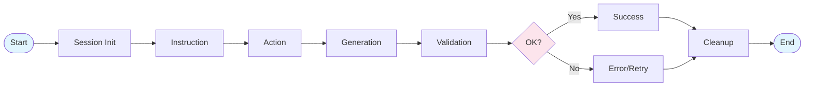
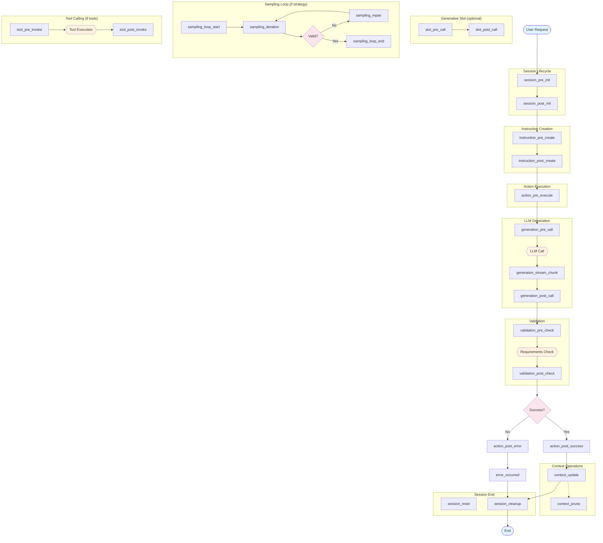

# Mellea Plugin Hook Points Design Document

This document defines the hook system for Mellea, enabling plugins to register and respond to events throughout the framework's execution lifecycle. Hooks provide extensibility points for policy enforcement, data transformation, observability, and custom behavior injection.


## 1. Overview

### Design Principles

1. **Consistent Interface**: All hooks follow the same async pattern with payload and context parameters
2. **Composable**: Multiple plugins can register for the same hook, executing in priority order
3. **Fail-safe**: Hook failures can be handled gracefully without breaking core execution
4. **Minimal Intrusion**: Plugins are opt-in; default Mellea behavior remains unchanged without plugins

### Hook Method Signature

All hooks follow this consistent async pattern:

```python
async def hook_name(
    self,
    payload: PluginPayload,
    context: PluginContext
) -> PluginResult
```

- **`payload`**: Mutable, strongly-typed data specific to the hook point
- **`context`**: Read-only shared context with session metadata and utilities
- **Returns**: A result object with continuation flag, modified payload, and violation/explanation

### Plugin Framework

To enable this extension system, we plan to leverage a lightweight, standalone plugin framework that:
- Installs as a Python package dependency with minimum footprint
- Exposes APIs to define hook invocation points, and base data objects for plugin payload, context, and result.
- Exposes a base calss and decorator to implement concrete plugins and register hook functions
- Implements a plugin manager that loads, registers, and governs the execution of plugins

## 2. Common Payload Fields

All hook payloads inherit these base fields:

```python
class BasePayload(PluginPayload):
    session_id: str                    # Unique session identifier
    request_id: str                    # Unique ID for this execution chain
    timestamp: datetime                # When the event fired
    hook: str                          # Name of the hook (e.g., "generation_pre_call")
    user_metadata: dict[str, Any]      # Custom metadata carried by user code
```

## 3. Hook Summary Table

| Hook Point | Category | Description |
|------------|----------|-------------|
| `session_pre_init` | Session | Before session initialization |
| `session_post_init` | Session | After session is fully initialized |
| `session_reset` | Session | When session context is reset |
| `session_cleanup` | Session | Before session cleanup/teardown |
| `instruction_pre_create` | Instruction | Before Instruction component creation |
| `instruction_post_create` | Instruction | After Instruction created, before execution |
| `action_pre_execute` | Action | Before any action execution |
| `action_post_success` | Action | After successful action completion |
| `action_post_error` | Action | After action fails with error |
| `generation_pre_call` | Generation | Before LLM backend call |
| `generation_post_call` | Generation | After LLM response received |
| `generation_stream_chunk` | Generation | For each streaming chunk |
| `validation_pre_check` | Validation | Before requirement validation |
| `validation_post_check` | Validation | After validation completes |
| `sampling_loop_start` | Sampling | When sampling strategy begins |
| `sampling_iteration` | Sampling | After each sampling attempt |
| `sampling_repair` | Sampling | When repair is invoked |
| `sampling_loop_end` | Sampling | When sampling completes |
| `tool_pre_invoke` | Tool | Before tool/function invocation |
| `tool_post_invoke` | Tool | After tool execution |
| `slot_pre_call` | Generative Slot | Before generative slot invocation |
| `slot_post_call` | Generative Slot | After generative slot returns |
| `context_update` | Context | When context changes |
| `context_prune` | Context | When context is trimmed |
| `error_occurred` | Error | When an error occurs |

## 4. Hook Definitions

### A. Session Lifecycle Hooks

Hooks that manage session boundaries, useful for initialization, state setup, and resource cleanup.

#### `session_pre_init`

- **Trigger**: Called immediately when `mellea.start_session()` is invoked, before backend initialization.
- **Use Cases**:
  - Loading user-specific policies
  - Validating backend/model combinations
  - Enforcing model usage policies
  - Routing to alternative backends
- **Payload**:
  ```python
  class SessionPreInitPayload(BasePayload):
      backend_name: str              # Requested backend identifier
      model_id: str | ModelIdentifier  # Target model
      model_options: dict | None     # Generation parameters
      backend_kwargs: dict           # Additional backend configuration
      context_type: type[Context]    # Context class to use
  ```
- **Context**:
  - `environment`: dict - Environment variables snapshot
  - `cwd`: str - Current working directory


#### `session_post_init`

- **Trigger**: Called after session is fully initialized, before any operations.
- **Use Cases**:
  - Initializing plugin-specific session state
  - Setting up telemetry/observability
  - Registering session-scoped resources
  - Remote logging setup
- **Payload**:
  ```python
  class SessionPostInitPayload(BasePayload):
      backend: Backend               # Initialized backend instance
      context: Context               # Initial context
      logger: FancyLogger            # Session logger
  ```
- **Context**:
  - `backend_info`: dict - Backend capabilities and metadata
  - `model_info`: dict - Model details (context window, etc.)


#### `session_reset`

- **Trigger**: Called when `session.reset()` is invoked to clear context.
- **Use Cases**:
  - Resetting plugin state
  - Logging context transitions
  - Preserving audit trails before reset
- **Payload**:
  ```python
  class SessionResetPayload(BasePayload):
      previous_context: Context      # Context before reset
      new_context: Context           # Fresh context after reset
  ```
- **Context**:
  - `session`: MelleaSession
  - `reset_reason`: str | None - Optional reason for reset


#### `session_cleanup`

- **Trigger**: Called when `session.close()`, `cleanup()`, or context manager exit occurs.
- **Use Cases**:
  - Flushing telemetry buffers
  - Persisting audit trails
  - Aggregating session metrics
  - Cleaning up temporary resources
- **Payload**:
  ```python
  class SessionCleanupPayload(BasePayload):
      context: Context               # Final context state
      total_generations: int         # Count of generations performed
      total_tokens_used: int | None  # Aggregate token usage
      interaction_count: int         # Total number of turns
  ```
- **Context**:
  - `generate_logs`: list[GenerateLog] - All logs from session
  - `duration_ms`: int - Session duration
  - `session`: MelleaSession - Final session state


### B. Instruction & Action Hooks

Hooks around the high-level primitives like `instruct()`, `chat()`, and action execution.


#### `instruction_pre_create`

- **Trigger**: Called when `instruct()`, `chat()`, or a generative slot is invoked, before the prompt is constructed.
- **Use Cases**:
  - PII redaction on user input
  - Prompt injection detection
  - Input validation and sanitization
  - Injecting mandatory requirements
  - Enforcing content policies
- **Payload**:
  ```python
  class InstructionPreCreatePayload(BasePayload):
      description: str                           # Main instruction text
      images: list[ImageBlock] | None            # Attached images
      requirements: list[Requirement | str]      # Validation requirements
      icl_examples: list[str | CBlock]           # In-context learning examples
      grounding_context: dict[str, str]          # Grounding variables
      user_variables: dict[str, str] | None      # Template variables
      prefix: str | CBlock | None                # Output prefix
      template_id: str | None                    # Identifier of prompt template
  ```
- **Context**:
  - `session`: MelleaSession
  - `parent_context`: Context - Context instruction will be added to
  - `history_snapshot`: ContextSnapshot - Conversation history


#### `instruction_post_create`

- **Trigger**: After Instruction component is created and formatted, before backend call.
- **Use Cases**:
  - Appending system prompts
  - Context stuffing (RAG injection)
  - Logging instruction patterns
  - Validating final instruction structure
- **Payload**:
  ```python
  class InstructionPostCreatePayload(BasePayload):
      instruction: Instruction       # Created instruction component
      template_repr: TemplateRepresentation  # Formatted representation
      component: Component           # The structured prompt object
  ```
- **Context**:
  - `session`: MelleaSession
  - `parent_context`: Context


#### `action_pre_execute`

- **Trigger**: Before any action (Instruction, Query, Transform) is executed via `act()`.
- **Use Cases**:
  - Policy enforcement on generation requests
  - Injecting/modifying model options
  - Routing to different strategies
  - Authorization checks
  - Logging action patterns
- **Payload**:
  ```python
  class ActionPreExecutePayload(BasePayload):
      action: Component | CBlock     # The action to execute
      context: Context               # Current context
      context_view: list[Component | CBlock] | None  # Linearized context
      requirements: list[Requirement]  # Attached requirements
      model_options: dict            # Generation parameters
      format: type | None            # Structured output format
      strategy: SamplingStrategy | None  # Sampling strategy
      tool_calls_enabled: bool       # Whether tools are available
  ```
- **Context**:
  - `session`: MelleaSession
  - `backend`: Backend
  - `action_type`: str - Type of action being executed


#### `action_post_success`

- **Trigger**: After action execution completes successfully.
- **Use Cases**:
  - Logging generation results
  - Output validation (hallucination check)
  - PII scrubbing from response
  - Applying output transformations
  - Audit logging
  - Collecting metrics
- **Payload**:
  ```python
  class ActionPostSuccessPayload(BasePayload):
      action: Component | CBlock     # Executed action
      result: ModelOutputThunk       # Generation result
      context_before: Context        # Context before action
      context_after: Context         # Context after action
      generate_log: GenerateLog      # Detailed execution log
      sampling_results: list[SamplingResult] | None  # If sampling was used
      latency_ms: int                # Execution time
  ```
- **Context**:
  - `session`: MelleaSession
  - `token_usage`: dict | None
  - `original_input`: dict - Input that triggered generation


#### `action_post_error`

- **Trigger**: When action execution fails with an exception.
- **Use Cases**:
  - Error logging and alerting
  - Custom error recovery
  - Retry logic
  - Graceful degradation
- **Payload**:
  ```python
  class ActionPostErrorPayload(BasePayload):
      action: Component | CBlock     # Action that failed
      error: Exception               # The exception raised
      error_type: str                # Exception class name
      stack_trace: str               # Full stack trace
      context: Context               # Context at time of error
      model_options: dict            # Options used
  ```
- **Context**:
  - `session`: MelleaSession
  - `recoverable`: bool - Can execution continue


### C. Generation Hooks (Backend Execution)

Low-level hooks between the component abstraction and raw LLM API calls.


#### `generation_pre_call`

- **Trigger**: Just before the backend transmits data to the LLM API.
- **Use Cases**:
  - Tool selection filtering and requirements
  - Prompt injection detection
  - Content filtering
  - Token budget enforcement
  - Cost estimation
  - Prompt caching/deduplication
  - Rate limiting
  - Last-mile formatting
- **Payload**:
  ```python
  class GenerationPreCallPayload(BasePayload):
      action: Component | CBlock           # Source action
      context: Context                     # Current context
      linearized_context: list[Component | CBlock]  # Context as list
      formatted_prompt: str | list[dict]   # Final prompt to send
      model_options: dict[str, Any]        # Generation parameters
      tools: dict[str, Callable] | None    # Available tools
      format: type | None                  # Structured output format
      estimated_tokens: int | None         # Token estimate
  ```
- **Context**:
  - `backend_name`: str
  - `model_id`: str
  - `provider`: str - Provider name (e.g., "ibm/granite")


#### `generation_post_call`

- **Trigger**: Immediately after receiving the raw response from the LLM API, before parsing.
- **Use Cases**:
  - Output filtering/sanitization
  - PII detection and redaction
  - Response caching
  - Quality metrics collection
  - Hallucination detection
  - Raw trace logging
  - Error interception (API limits/retries)
- **Payload**:
  ```python
  class GenerationPostCallPayload(BasePayload):
      prompt: str | list[dict]       # Sent prompt
      raw_response: dict             # Full JSON response from provider
      processed_output: str          # Processed output text
      model_output: ModelOutputThunk # Output thunk
      token_usage: dict | None       # Token counts
      latency_ms: int                # Generation time
      finish_reason: str             # Why generation stopped
  ```
- **Context**:
  - `backend_name`: str
  - `model_id`: str
  - `status_code`: int | None - HTTP status from provider
  - `stream_chunks`: int | None - Number of chunks if streaming


#### `generation_stream_chunk`

- **Trigger**: For each streaming chunk received from the LLM.
- **Use Cases**:
  - Real-time content filtering
  - Progressive output display
  - Early termination on policy violation
  - Streaming analytics
- **Payload**:
  ```python
  class GenerationStreamChunkPayload(BasePayload):
      chunk: str                     # Current chunk text
      accumulated: str               # All text so far
      chunk_index: int               # Chunk sequence number
      is_final: bool                 # Is this the last chunk
  ```
- **Context**:
  - `thunk_id`: str
  - `backend_name`: str
  - `model_id`: str


### D. Validation Hooks

Hooks around requirement verification and output validation.


#### `validation_pre_check`

- **Trigger**: Before running validation/requirements check.
- **Use Cases**:
  - Injecting additional requirements
  - Filtering requirements based on context
  - Overriding validation strategy
  - Custom validation logic
- **Payload**:
  ```python
  class ValidationPreCheckPayload(BasePayload):
      requirements: list[Requirement]  # Requirements to check
      target: CBlock | None            # Target to validate
      context: Context                 # Current context
      model_options: dict              # Options for LLM-as-judge
  ```
- **Context**:
  - `session`: MelleaSession
  - `validation_type`: str - "python" | "llm_as_judge"


#### `validation_post_check`

- **Trigger**: After all validations complete.
- **Use Cases**:
  - Logging validation outcomes
  - Triggering alerts on failures
  - Collecting requirement effectiveness metrics
  - Overriding validation results
  - Monitoring sampling attempts
- **Payload**:
  ```python
  class ValidationPostCheckPayload(BasePayload):
      requirements: list[Requirement]
      results: list[ValidationResult]
      all_passed: bool
      passed_count: int
      failed_count: int
      generate_logs: list[GenerateLog | None]  # Logs from LLM-as-judge
  ```
- **Context**:
  - `session`: MelleaSession
  - `validation_duration_ms`: int


### E. Sampling & Repair Hooks

Hooks around sampling strategies and failure recovery.


#### `sampling_loop_start`

- **Trigger**: When a sampling strategy begins execution.
- **Use Cases**:
  - Logging sampling attempts
  - Adjusting loop budget dynamically
  - Initializing sampling-specific state
- **Payload**:
  ```python
  class SamplingLoopStartPayload(BasePayload):
      strategy_name: str             # Strategy class name
      action: Component              # Initial action
      context: Context               # Initial context
      requirements: list[Requirement]  # All requirements
      loop_budget: int               # Maximum iterations
  ```
- **Context**:
  - `session`: MelleaSession
  - `strategy_config`: dict


#### `sampling_iteration`

- **Trigger**: After each sampling attempt, including validation results.
- **Use Cases**:
  - Iteration-level metrics
  - Early termination decisions
  - Debug sampling behavior
  - Adaptive strategy adjustment
- **Payload**:
  ```python
  class SamplingIterationPayload(BasePayload):
      iteration: int                 # Current iteration number
      action: Component              # Action used this iteration
      result: ModelOutputThunk       # Generation result
      validation_results: list[tuple[Requirement, ValidationResult]]
      all_valid: bool                # Did all requirements pass
      valid_count: int
      total_count: int
  ```
- **Context**:
  - `strategy_name`: str
  - `remaining_budget`: int
  - `elapsed_ms`: int


#### `sampling_repair`

- **Trigger**: When repair strategy is invoked after validation failure.
- **Use Cases**:
  - Logging repair patterns
  - Injecting custom repair strategies
  - Analyzing failure modes
  - Adjusting repair approach
- **Payload**:
  ```python
  class SamplingRepairPayload(BasePayload):
      failed_action: Component       # Action that failed
      failed_result: ModelOutputThunk  # Failed output
      failed_validations: list[tuple[Requirement, ValidationResult]]
      old_context: Context           # Context without failure
      new_context: Context           # Context with failure
      repair_action: Component       # New action for retry
      repair_context: Context        # Context for retry
      repair_iteration: int          # Which repair attempt
  ```
- **Context**:
  - `strategy_name`: str
  - `past_failures`: list[str]


#### `sampling_loop_end`

- **Trigger**: When sampling completes (success or failure).
- **Use Cases**:
  - Sampling effectiveness metrics
  - Failure analysis
  - Cost tracking
  - Selecting best failed attempt
- **Payload**:
  ```python
  class SamplingLoopEndPayload(BasePayload):
      success: bool                  # Did sampling succeed
      iterations_used: int           # Total iterations performed
      final_result: ModelOutputThunk | None  # Best result
      final_action: Component | None
      final_context: Context | None
      failure_reason: str | None     # If failed, why
      all_results: list[ModelOutputThunk]
      all_validations: list[list[tuple[Requirement, ValidationResult]]]
  ```
- **Context**:
  - `strategy_name`: str
  - `total_duration_ms`: int
  - `tokens_used`: int | None


### F. Tool Calling Hooks

Hooks around tool/function execution.


#### `tool_pre_invoke`

- **Trigger**: Before invoking a tool/function from LLM output.
- **Use Cases**:
  - Tool authorization
  - Argument validation/sanitization
  - Tool routing/redirection
  - Rate limiting per tool
- **Payload**:
  ```python
  class ToolPreInvokePayload(BasePayload):
      tool_name: str                 # Name of tool to call
      tool_args: dict[str, Any]      # Arguments to pass
      tool_callable: Callable        # The actual function
      model_tool_call: ModelToolCall # Raw model output
  ```
- **Context**:
  - `session`: MelleaSession
  - `available_tools`: list[str]
  - `invocation_source`: str - "transform" | "action" | etc.


#### `tool_post_invoke`

- **Trigger**: After tool execution completes.
- **Use Cases**:
  - Output transformation
  - Error handling/recovery
  - Tool usage metrics
  - Result caching
- **Payload**:
  ```python
  class ToolPostInvokePayload(BasePayload):
      tool_name: str
      tool_args: dict[str, Any]
      tool_output: Any               # Raw tool output
      tool_message: ToolMessage      # Formatted message
      execution_time_ms: int
      success: bool                  # Did tool execute without error
      error: Exception | None        # Error if any
  ```
- **Context**:
  - `session`: MelleaSession
  - `invocation_source`: str


### G. Generative Slot Hooks

Hooks specific to `@generative` decorated functions.


#### `slot_pre_call`

- **Trigger**: When a generative slot function is about to be invoked.
- **Use Cases**:
  - Slot-level authorization
  - Argument validation
  - Profiling setup
  - Logging slot invocations
- **Payload**:
  ```python
  class SlotPreCallPayload(BasePayload):
      slot_name: str                 # Name of the generative slot function
      slot_signature: str            # Typed signature
      args: dict[str, Any]           # Arguments passed to the slot
      kwargs: dict[str, Any]         # Keyword arguments
      docstring: str | None          # Docstring / prompt template
  ```
- **Context**:
  - `session`: MelleaSession
  - `slot_module`: str - Module containing the slot


#### `slot_post_call`

- **Trigger**: Once the slot returns (or fails).
- **Use Cases**:
  - Measuring slot latency
  - Recording success/failure
  - Profiling statistics per slot
  - Output transformation
- **Payload**:
  ```python
  class SlotPostCallPayload(BasePayload):
      slot_name: str
      args: dict[str, Any]
      kwargs: dict[str, Any]
      result: Any                    # The returned value
      duration_ms: int
      success: bool
      error: Exception | None
  ```
- **Context**:
  - `session`: MelleaSession
  - `slot_module`: str


### H. Context Manipulation Hooks

Hooks around context changes and management.


#### `context_update`

- **Trigger**: When data is added to context or context changes.
- **Use Cases**:
  - Context audit trail
  - Memory management policies
  - Sensitive data detection
  - Token usage monitoring
- **Payload**:
  ```python
  class ContextUpdatePayload(BasePayload):
      previous_context: Context      # Context before change
      new_data: Component | CBlock   # Data being added
      resulting_context: Context     # Context after change
      context_type: str              # "simple" | "chat"
      change_type: str               # "append" | "reset"
  ```
- **Context**:
  - `session`: MelleaSession
  - `history_length`: int


#### `context_prune`

- **Trigger**: When context trimming or pruning logic runs.
- **Use Cases**:
  - Token budget management
  - Recording pruning events
  - Custom pruning strategies
  - Archiving pruned content
- **Payload**:
  ```python
  class ContextPrunePayload(BasePayload):
      context_before: Context        # Context before pruning
      context_after: Context         # Context after pruning
      pruned_items: list[Component | CBlock]  # Items removed
      reason: str                    # Why pruning occurred
      tokens_freed: int | None       # Token estimate freed
  ```
- **Context**:
  - `session`: MelleaSession
  - `token_limit`: int | None


### I. Error Handling Hooks

Hooks for error conditions and recovery.


#### `error_occurred`

- **Trigger**: When an error occurs during any operation.
- **Use Cases**:
  - Error logging/alerting
  - Custom error recovery
  - Error metrics
  - Graceful degradation
  - Notification systems
- **Payload**:
  ```python
  class ErrorOccurredPayload(BasePayload):
      error: Exception               # The exception
      error_type: str                # Exception class name
      error_location: str            # Where error occurred
      recoverable: bool              # Can execution continue
      context: Context | None        # Context at time of error
      action: Component | None       # Action being performed
      stack_trace: str               # Full stack trace
  ```
- **Context**:
  - `session`: MelleaSession | None
  - `operation`: str - What operation was being performed


## 5. Plugin Context Object

The `PluginContext` passed to all hooks provides shared state and utilities:

```python  
# Session Information
session_id: str
session: MelleaSession | None

# Backend Information
backend_name: str
model_id: str
backend_capabilities: dict

# Environment
environment: dict[str, str]
cwd: str

# Plugin State
shared_state: dict[str, Any]    # Shared across plugins

# Utilities
logger: Logger
metrics: MetricsCollector

# Request Metadata
request_id: str                 # Unique ID for this execution chain
parent_request_id: str | None   # For nested calls
timestamp: datetime

# User Information
user_id: str | None             # User reference if available
user_metadata: dict[str, Any]   # User-specific data    
```

> Note: this is a suggestion. Requires discussion.

### Context Snapshot

When conversation history is relevant, the plugin context object may include a `ContextSnapshot`:

```python
@dataclass
class ContextSnapshot:    
    history_length: int                # Number of turns
    last_turn: dict | None             # Last user/assistant exchange
    token_estimate: int | None         # Estimated token count    
```

## 6. Hook Results

Hooks can return different result types to control execution:

### Modify Payload

```python
return PluginResult(
    continue_processing=True
    modified_payload=modified_payload,    
)
```

### Block Execution

```python
violation = PluginViolation(
    reason="Policy violation",
    description="Detailed explanation",
    code="POLICY_001",
    details={"field": "value"},
    severity="error"  # "error" | "warning"
)

return PluginResult(    
    continue_processing=False,
    violation=violation
)
```

## 7. Registration & Configuration

### Plugin Registration

Plugins register programmatically or via YAML configuration:

```yaml
plugins:
  - name: content-policy
    kind: mellea.plugins.ContentPolicyPlugin
    hooks:
      - instruction_pre_create
      - generation_post_call
    mode: enforce
    priority: 10
    config:
      blocked_terms: ["term1", "term2"]

  - name: telemetry
    kind: mellea.plugins.TelemetryPlugin
    hooks:
      - action_post_success
      - validation_post_check
      - sampling_loop_end
    mode: permissive
    priority: 100
    config:
      endpoint: "https://telemetry.example.com"
```

### Execution Modes

- **`enforce`**: Block execution on violation
- **`enforce_ignore_error`**: Block on violation, but tolerate plugin errors
- **`permissive`**: Log violations without blocking
- **`disabled`**: Skip hook execution

### Priority

- Lower numbers execute first
- Hooks with same priority may execute in parallel
- Default priority: 50

### Convention-Based Registration

Plugins can use method naming conventions:

```python
class MyPlugin(MelleaPlugin):
    async def on_generation_pre_call(self, payload, context):
        # Automatically registered for generation_pre_call
        ...

    async def on_validation_post_check(self, payload, context):
        # Automatically registered for validation_post_check
        ...
```

### Programmatic Registration

```python
class PIIRedactionPlugin(Plugin):
    def name(self):
        return "PII_Redactor"

    def register(self, hooks):
        hooks.register("instruction_pre_create", self.redact_input)
        hooks.register("generation_post_call", self.redact_output)

    async def redact_input(self, payload, context):
        # Redact PII from input
        ...
```

### Session-Level Configuration

```python
m = mellea.start_session(
    ...,
    plugin_manager=pm,
    hooks_enabled=["instruction_pre_create", "generation_post_call"]
)
```

## 8. Example Implementations

### Content Policy Plugin

```python
class ContentPolicyPlugin(MelleaPlugin):
    async def on_instruction_pre_create(
        self,
        payload: InstructionPreCreatePayload,
        context: PluginContext
    ) -> PluginResult | None:
        blocked_terms = self.config.get("blocked_terms", [])

        for term in blocked_terms:
            if term.lower() in payload.description.lower():
                return PluginResult(
                    continue_processing=False, 
                    violation=PluginViolation(
                        reason="Blocked content detected",
                        description=f"Instruction contains blocked term: {term}",
                        code="CONTENT_POLICY_001"
                )        

    async def on_generation_post_call(
        self,
        payload: GenerationPostCallPayload,
        context: PluginContext
    ) -> PluginResult | None:
        # Redact sensitive patterns from output
        redacted = self._redact_pii(payload.processed_output)

        if redacted != payload.processed_output:
            payload.processed_output = redacted
            return PluginResult(modified_payload=payload)
```

### Audit Logging Plugin

```python
class AuditLoggingPlugin(MelleaPlugin):
    async def on_action_post_success(
        self,
        payload: ActionPostSuccessPayload,
        context: PluginContext
    ) -> PluginResult | None:
        self._log_audit_event({
            "event": "generation_success",
            "session_id": payload.session_id,
            "action_type": type(payload.action).__name__,
            "latency_ms": payload.latency_ms,
            "token_usage": context.get("token_usage"),
            "timestamp": payload.timestamp.isoformat()
        })
        

    async def on_action_post_error(
        self,
        payload: ActionPostErrorPayload,
        context: PluginContext
    ) -> PluginResult | None:
        self._log_audit_event({
            "event": "generation_error",
            "session_id": payload.session_id,
            "error_type": payload.error_type,
            "stack_trace": payload.stack_trace,
            "timestamp": payload.timestamp.isoformat()
        })        
```

### Token Budget Plugin

```python
class TokenBudgetPlugin(MelleaPlugin):
    async def on_generation_pre_call(
        self,
        payload: GenerationPreCallPayload,
        context: PluginContext
    ) -> PluginResult | None:
        budget = self.config.get("max_tokens_per_request", 4000)
        estimated = payload.estimated_tokens or 0

        if estimated > budget:
            return PluginResult(
                    continue_processing=False, 
                    violation=PluginViolation(                      
                      reason="Token budget exceeded",
                      description=f"Estimated {estimated} tokens exceeds budget of {budget}",
                      code="TOKEN_BUDGET_001",
                      details={"estimated": estimated, "budget": budget}
            )        
```

### Generative Slot Profiler

```python
class SlotProfilerPlugin(MelleaPlugin):
    def __init__(self):
        self._stats = defaultdict(lambda: {"calls": 0, "total_ms": 0, "errors": 0})

    async def on_slot_post_call(
        self,
        payload: SlotPostCallPayload,
        context: PluginContext
    ) -> PluginResult | None:
        stats = self._stats[payload.slot_name]
        stats["calls"] += 1
        stats["total_ms"] += payload.duration_ms
        if not payload.success:
            stats["errors"] += 1

        context.emit_metric(
            "slot_latency_ms",
            payload.duration_ms,
            tags={"slot": payload.slot_name, "success": payload.success}
        )
```


## 9. Hook Execution Flow

### Simplified Main Flow



### Detailed Flows



## 10. Error Handling, Security & Isolation

### Error Handling

- **Isolation**: Plugin exceptions should not crash Mellea sessions; wrap each handler in try/except
- **Logging**: All plugin errors are logged with full context
- **Timeouts**: Support configurable timeouts for plugin execution
- **Circuit Breaker**: Disable failing plugins after repeated errors

### Security Considerations

- **Data Privacy**: Payloads may include user content; plugins must respect privacy policies
- **Redaction**: Consider masking sensitive fields for plugins that should not see them
- **Sandboxing**: Provide options to run plugins in restricted environments
- **Validation**: Validate plugin inputs and outputs to prevent injection attacks

### Isolation Options

This is a proposal for supporting compartmentalized execution of plugins.

```yaml
plugins:
  - name: untrusted-plugin
    kind: external.UntrustedPlugin
    isolation:
      sandbox: true
      timeout_ms: 5000
      max_memory_mb: 256
      allowed_operations: ["read_payload", "emit_metric"]
```

## 11. Backward Compatibility & Migration

### Versioning

- Hook payload contracts are versioned (e.g., `payload_version: "1.0"`)
- Breaking changes increment major version
- Deprecated fields marked and maintained for one major version

### Default Behavior

- Without plugins registered, Mellea behavior is unchanged
- Default "no-op" plugin manager if no configuration provided
