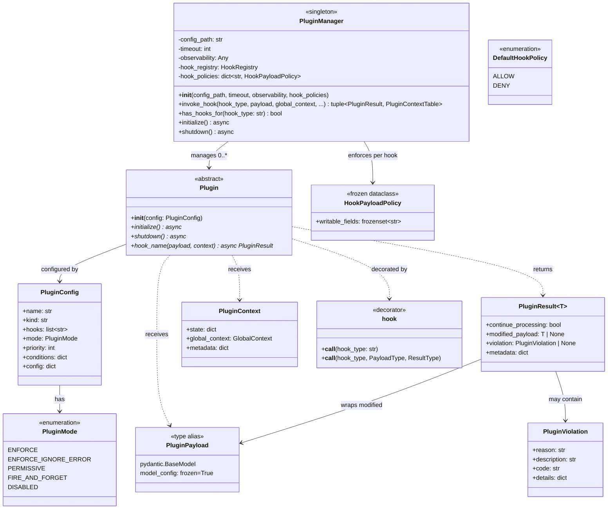

# Mellea Hook System Implementation Plan

This document describes the implementation plan for the extensibility hook system specified in [`docs/dev/hook_system.md`](hook_system.md). The implementation uses the [ContextForge plugin framework](https://github.com/IBM/mcp-context-forge) (`mcpgateway.plugins.framework`) as an optional external dependency for core plumbing, while all Mellea-specific types — hook enums, payload models, and the plugin base class — are owned by Mellea under a new `mellea/plugins/` subpackage.

The primary developer-facing API is Python decorators (`@hook`, `@plugin`) and programmatic registration (`register()`, `PluginSet`). YAML configuration is supported as a secondary mechanism for deployment-time overrides. Plugins work identically whether invoked through a session or via the functional API (`instruct(backend, context, ...)`).

**Note**: The plugin framework is in the process of being extracted as a standalone Python package. Once completed, the package import path prefix will look like `cpex.framework`.


## 1. Package Structure

```
mellea/plugins/
├── __init__.py            # Public API: hook, plugin, block, PluginSet, register, MelleaPlugin
├── _manager.py            # Singleton wrapper + session-tag filtering
├── _base.py               # MelleaBasePayload, MelleaPlugin base class
├── _types.py              # MelleaHookType enum + hook registration
├── _policies.py           # HookPayloadPolicy table + DefaultHookPolicy for Mellea hooks
├── _context.py            # Plugin context factory helper
├── _decorators.py         # @hook and @plugin decorator implementations
├── _pluginset.py          # PluginSet class
├── _registry.py           # register(), block() helpers + global/session dispatch logic
└── hooks/
    ├── __init__.py         # Re-exports all payload classes
    ├── session.py          # session lifecycle payloads
    ├── component.py        # component lifecycle payloads
    ├── generation.py       # generation pipeline payloads
    ├── validation.py       # validation payloads
    ├── sampling.py         # sampling pipeline payloads
    ├── tool.py             # tool execution payloads
    ├── adapter.py          # adapter operation payloads
    ├── context_ops.py      # context operation payloads
    └── error.py            # error handling payload
```

## 2. ContextForge Plugin Framework (Key Interfaces Used)

The following types from `mcpgateway.plugins.framework` form the plumbing layer. Mellea uses these but does **not** import any ContextForge-specific hook types (prompts, tools, resources, agents, http).

| Type | Role |
|------|------|
| `Plugin` | ABC base class. `__init__(config: PluginConfig)`, `initialize()`, `shutdown()`. Hook methods discovered by convention (method name = hook type) or `@hook()` decorator. Signature: `async def hook_name(self, payload, context) -> PluginResult`. |
| `PluginManager` | Borg singleton. `__init__(config_path, timeout, observability, hook_policies)`. Key methods: `invoke_hook(hook_type, payload, global_context, ...) -> (PluginResult, PluginContextTable)`, `has_hooks_for(hook_type) -> bool`, `initialize()`, `shutdown()`. The `hook_policies` parameter accepts a `dict[str, HookPayloadPolicy]` mapping hook types to their writable-field policies. |
| `PluginPayload` | Base type for all hook payloads. Frozen Pydantic `BaseModel` (`ConfigDict(frozen=True)`). Plugins use `model_copy(update={...})` to propose modifications. |
| `PluginResult[T]` | Generic result: `continue_processing: bool`, `modified_payload: T | None`, `violation: PluginViolation | None`, `metadata: dict`. |
| `PluginViolation` | `reason`, `description`, `code`, `details`. |
| `PluginConfig` | `name`, `kind`, `hooks`, `mode`, `priority`, `conditions`, `config`, ... |
| `PluginMode` | `ENFORCE`, `ENFORCE_IGNORE_ERROR`, `PERMISSIVE`, `FIRE_AND_FORGET`, `DISABLED`. |
| `PluginContext` | `state: dict`, `global_context: GlobalContext`, `metadata: dict`. |
| `HookPayloadPolicy` | Frozen dataclass with `writable_fields: frozenset[str]`. Defines which payload fields plugins may modify for a given hook type. |
| `DefaultHookPolicy` | Enum: `ALLOW` (accept all modifications), `DENY` (reject all modifications). Controls behavior for hooks without an explicit policy. |
| `apply_policy()` | `apply_policy(original, modified, policy) -> BaseModel \| None`. Accepts only changes to writable fields via `model_copy(update=...)`, discarding unauthorized changes. Returns `None` if no effective changes. |
| `HookRegistry` | `get_hook_registry()`, `register_hook(hook_type, payload_class, result_class)`, `is_registered(hook_type)`. |
| `@hook` decorator | `@hook("hook_type")` or `@hook("hook_type", PayloadType, ResultType)` for custom method names. |

### Class Diagram



### YAML Plugin Configuration (reference)

Plugins can also be configured via YAML as a secondary mechanism. Programmatic registration via `@hook`, `@plugin`, and `register()` is the primary approach.

```yaml
plugins:
  - name: content-policy
    kind: mellea.plugins.examples.ContentPolicyPlugin
    hooks:
      - component_pre_create
      - generation_post_call
    mode: enforce
    priority: 10
    config:
      blocked_terms: ["term1", "term2"]

  - name: telemetry
    kind: mellea.plugins.examples.TelemetryPlugin
    hooks:
      - component_post_success
      - sampling_loop_end
    mode: fire_and_forget
    priority: 100
    config:
      endpoint: "https://telemetry.example.com"
```

### Mellea Wrapper Layer

Mellea exposes its own `@hook` and `@plugin` decorators that translate to ContextForge registrations internally. This serves two purposes:

1. **Mellea-aligned API**: The `@hook` decorator accepts a `mode` parameter with three string values (`"enforce"`, `"permissive"`, `"fire_and_forget"`) that map directly to ContextForge's `PluginMode` enum (`ENFORCE`, `PERMISSIVE`, `FIRE_AND_FORGET`), matching Mellea's code-first ergonomics without requiring users to import the enum.
2. **Session tagging**: Mellea's wrapper adds session-scoping metadata that ContextForge's `PluginManager` does not natively support. The `_manager.py` layer filters hooks at dispatch time based on session tags.

Users never import from `mcpgateway.plugins.framework` directly.

## 3. Core Types

### 3.1 `MelleaHookType` enum (`mellea/plugins/_types.py`)

A single `MelleaHookType(str, Enum)` containing all 27 hook types. String-based values for compatibility with ContextForge's `invoke_hook(hook_type: str, ...)`.

```python
class MelleaHookType(str, Enum):
    # Session Lifecycle
    SESSION_PRE_INIT = "session_pre_init"
    SESSION_POST_INIT = "session_post_init"
    SESSION_RESET = "session_reset"
    SESSION_CLEANUP = "session_cleanup"

    # Component Lifecycle
    COMPONENT_PRE_CREATE = "component_pre_create"
    COMPONENT_POST_CREATE = "component_post_create"
    COMPONENT_PRE_EXECUTE = "component_pre_execute"
    COMPONENT_POST_SUCCESS = "component_post_success"
    COMPONENT_POST_ERROR = "component_post_error"

    # Generation Pipeline
    GENERATION_PRE_CALL = "generation_pre_call"
    GENERATION_POST_CALL = "generation_post_call"
    GENERATION_STREAM_CHUNK = "generation_stream_chunk"

    # Validation
    VALIDATION_PRE_CHECK = "validation_pre_check"
    VALIDATION_POST_CHECK = "validation_post_check"

    # Sampling Pipeline
    SAMPLING_LOOP_START = "sampling_loop_start"
    SAMPLING_ITERATION = "sampling_iteration"
    SAMPLING_REPAIR = "sampling_repair"
    SAMPLING_LOOP_END = "sampling_loop_end"

    # Tool Execution
    TOOL_PRE_INVOKE = "tool_pre_invoke"
    TOOL_POST_INVOKE = "tool_post_invoke"

    # Backend Adapter Ops
    ADAPTER_PRE_LOAD = "adapter_pre_load"
    ADAPTER_POST_LOAD = "adapter_post_load"
    ADAPTER_PRE_UNLOAD = "adapter_pre_unload"
    ADAPTER_POST_UNLOAD = "adapter_post_unload"

    # Context Operations
    CONTEXT_UPDATE = "context_update"
    CONTEXT_PRUNE = "context_prune"

    # Error Handling
    ERROR_OCCURRED = "error_occurred"
```

### 3.2 `MelleaBasePayload` (`mellea/plugins/_base.py`)

All Mellea hook payloads inherit from this base, which extends `PluginPayload` with the common fields from the hook system spec (Section 2):

```python
class MelleaBasePayload(PluginPayload):
    """Frozen base — all payloads are immutable by design.

    Plugins must use ``model_copy(update={...})`` to propose modifications
    and return the copy via ``PluginResult.modified_payload``.  The plugin
    manager applies the hook's ``HookPayloadPolicy`` to filter changes to
    writable fields only.
    """
    model_config = ConfigDict(frozen=True, arbitrary_types_allowed=True)

    session_id: str | None = None
    request_id: str
    timestamp: datetime = Field(default_factory=datetime.utcnow)
    hook: str
    user_metadata: dict[str, Any] = Field(default_factory=dict)
```

`frozen=True` prevents in-place mutations — attribute assignment on a payload instance raises `FrozenModelError`. `arbitrary_types_allowed=True` is required because payloads include non-serializable Mellea objects (`Backend`, `Context`, `Component`, `ModelOutputThunk`). This means external plugins cannot receive these payloads directly; they are designed for native in-process plugins.

### 3.3 Hook Registration (`mellea/plugins/_types.py`)

A `_register_mellea_hooks()` function registers all hook types with the ContextForge `HookRegistry`. Called once during plugin initialization. Idempotent via `is_registered()` check. Follows the same pattern used by ContextForge's own hook modules (e.g., `mcpgateway/plugins/framework/hooks/tools.py`).

```python
def _register_mellea_hooks() -> None:
    registry = get_hook_registry()
    for hook_type, (payload_cls, result_cls) in _HOOK_REGISTRY.items():
        if not registry.is_registered(hook_type):
            registry.register_hook(hook_type, payload_cls, result_cls)
```

### 3.4 Context Mapping (`mellea/plugins/_context.py`)

The hook system spec defines domain-specific `PluginContext` fields (`session`, `backend`, `context`) that vary by hook category. ContextForge provides a generic `GlobalContext` with a `state: dict`. The mapping uses `GlobalContext.state` as the carrier for Mellea-specific context:

```python
def build_global_context(
    *,
    session: MelleaSession | None = None,
    backend: Backend | None = None,
    context: Context | None = None,
    request_id: str = "",
    **extra_fields,
) -> GlobalContext:
    state: dict[str, Any] = {}
    if session is not None:
        state["session"] = session
    if backend is not None:
        state["backend"] = backend
        state["backend_name"] = getattr(backend, "model_id", "unknown")
    if context is not None:
        state["context"] = context
    state.update(extra_fields)
    return GlobalContext(request_id=request_id, state=state)
```

### 3.5 `MelleaPlugin` Base Class (`mellea/plugins/_base.py`)

`MelleaPlugin` is one of three ways to define plugins, alongside `@hook` on standalone functions (primary) and `@plugin` on plain classes. Use `MelleaPlugin` when you need lifecycle hooks (`initialize`/`shutdown`) or typed context accessors.

Extends ContextForge `Plugin` with typed context accessor helpers so plugin authors don't need to know about the `GlobalContext.state` mapping:

```python
class MelleaPlugin(Plugin):
    """Base class for Mellea plugins with lifecycle hooks and typed accessors."""

    def get_backend(self, context: PluginContext) -> Backend | None:
        return context.global_context.state.get("backend")

    def get_mellea_context(self, context: PluginContext) -> Context | None:
        return context.global_context.state.get("context")

    def get_session(self, context: PluginContext) -> MelleaSession | None:
        return context.global_context.state.get("session")

    @property
    def plugin_config(self) -> dict[str, Any]:
        return self._config.config or {}
```

No new abstract methods. ContextForge's `initialize()` and `shutdown()` suffice.

### 3.6 `@hook` Decorator (`mellea/plugins/_decorators.py`)

The `@hook` decorator works on both standalone async functions and class methods:

```python
@dataclass(frozen=True)
class HookMeta:
    hook_type: str
    mode: Literal["enforce", "permissive", "fire_and_forget"] = "enforce"
    priority: int = 50

def hook(
    hook_type: str,
    *,
    mode: Literal["enforce", "permissive", "fire_and_forget"] = "enforce",
    priority: int = 50,
) -> Callable:
    """Register an async function or method as a hook handler."""
    def decorator(fn):
        fn._mellea_hook_meta = HookMeta(
            hook_type=hook_type,
            mode=mode,
            priority=priority,
        )
        return fn
    return decorator
```

The `mode` parameter controls both execution strategy and result handling. These map directly to ContextForge's `PluginMode` enum:
- `"enforce"` → `PluginMode.ENFORCE` / `"permissive"` → `PluginMode.PERMISSIVE`: Hook is awaited inline (blocking). Difference is whether violations halt execution or are logged only.
- `"fire_and_forget"` → `PluginMode.FIRE_AND_FORGET`: Hook is dispatched as a background `asyncio.create_task()`. Result is ignored. This is handled by ContextForge's `PluginManager` dispatch logic.

When used on a standalone function, the metadata is read at `register()` time or when passed to `start_session(plugins=[...])`. When used on a class method, it is discovered during class registration (either via `@plugin` or `MelleaPlugin` introspection).

### 3.7 `@plugin` Decorator (`mellea/plugins/_decorators.py`)

The `@plugin` decorator marks a plain class as a multi-hook plugin:

```python
@dataclass(frozen=True)
class PluginMeta:
    name: str
    priority: int = 50

def plugin(
    name: str,
    *,
    priority: int = 50,
) -> Callable:
    """Mark a class as a Mellea plugin."""
    def decorator(cls):
        cls._mellea_plugin_meta = PluginMeta(
            name=name,
            priority=priority,
        )
        return cls
    return decorator
```

On registration, all methods with `_mellea_hook_meta` are discovered and registered as hook handlers bound to the instance. Methods without `@hook` are ignored.

### 3.8 `PluginSet` (`mellea/plugins/_pluginset.py`)

A named, composable group of hook functions and plugin instances:

```python
class PluginSet:
    def __init__(
        self,
        name: str,
        items: list[Callable | Any | "PluginSet"],
        *,
        priority: int | None = None,
    ):
        self.name = name
        self.items = items
        self.priority = priority

    def flatten(self) -> list[tuple[Callable | Any, int | None]]:
        """Recursively flatten nested PluginSets into (item, priority_override) pairs."""
        result = []
        for item in self.items:
            if isinstance(item, PluginSet):
                result.extend(item.flatten())
            else:
                result.append((item, self.priority))
        return result
```

PluginSets are inert containers — they do not register anything themselves. Registration happens when they are passed to `register()` or `start_session(plugins=[...])`.

### 3.9 `block()` Helper (`mellea/plugins/_registry.py`)

Convenience function for returning a blocking result from a hook:

```python
def block(
    reason: str,
    *,
    code: str = "",
    description: str = "",
    details: dict[str, Any] | None = None,
) -> PluginResult:
    return PluginResult(
        continue_processing=False,
        violation=PluginViolation(
            reason=reason,
            description=description or reason,
            code=code,
            details=details or {},
        ),
    )
```


### 3.10 Hook Payload Policies (`mellea/plugins/_policies.py`)

Defines the concrete per-hook-type policies for Mellea hooks. These are injected into the `PluginManager` at initialization time via the `hook_policies` parameter.

```python
from mcpgateway.plugins.framework.hooks.policies import HookPayloadPolicy

MELLEA_HOOK_PAYLOAD_POLICIES: dict[str, HookPayloadPolicy] = {
    # Session Lifecycle
    "session_pre_init": HookPayloadPolicy(
        writable_fields=frozenset({"backend_name", "model_id", "model_options", "backend_kwargs"}),
    ),
    # session_post_init, session_reset, session_cleanup: observe-only (no entry)

    # Component Lifecycle
    "component_pre_create": HookPayloadPolicy(
        writable_fields=frozenset({
            "description", "images", "requirements", "icl_examples",
            "grounding_context", "user_variables", "prefix", "template_id",
        }),
    ),
    "component_post_create": HookPayloadPolicy(
        writable_fields=frozenset({"component"}),
    ),
    "component_pre_execute": HookPayloadPolicy(
        writable_fields=frozenset({
            "action", "context", "context_view", "requirements",
            "model_options", "format", "strategy", "tool_calls_enabled",
        }),
    ),
    "component_post_success": HookPayloadPolicy(
        writable_fields=frozenset({"result"}),
    ),
    # component_post_error: observe-only

    # Generation Pipeline
    "generation_pre_call": HookPayloadPolicy(
        writable_fields=frozenset({"model_options", "tools", "format", "formatted_prompt"}),
    ),
    "generation_post_call": HookPayloadPolicy(
        writable_fields=frozenset({"processed_output", "model_output"}),
    ),
    "generation_stream_chunk": HookPayloadPolicy(
        writable_fields=frozenset({"chunk", "accumulated"}),
    ),

    # Validation
    "validation_pre_check": HookPayloadPolicy(
        writable_fields=frozenset({"requirements", "model_options"}),
    ),
    "validation_post_check": HookPayloadPolicy(
        writable_fields=frozenset({"results", "all_passed"}),
    ),

    # Sampling Pipeline
    "sampling_loop_start": HookPayloadPolicy(
        writable_fields=frozenset({"loop_budget"}),
    ),
    # sampling_iteration: observe-only
    "sampling_repair": HookPayloadPolicy(
        writable_fields=frozenset({"repair_action", "repair_context"}),
    ),
    "sampling_loop_end": HookPayloadPolicy(
        writable_fields=frozenset({"final_result"}),
    ),

    # Tool Execution
    "tool_pre_invoke": HookPayloadPolicy(
        writable_fields=frozenset({"tool_args"}),
    ),
    "tool_post_invoke": HookPayloadPolicy(
        writable_fields=frozenset({"tool_output"}),
    ),

    # adapter_*, context_*, error_occurred: observe-only (no entry)
}
```

Hooks absent from this table are observe-only. With `DefaultHookPolicy.DENY` (the Mellea default), any modification attempt on an observe-only hook is rejected with a warning log.

## 4. Plugin Manager Integration (`mellea/plugins/_manager.py`)

### 4.1 Lazy Singleton Wrapper

The `PluginManager` is lazily initialized on first use (either via `register()` or `start_session(plugins=[...])`). A config path is no longer required — code-first registration may be the only path.

```python
_plugin_manager: PluginManager | None = None
_plugins_enabled: bool = False
_session_tags: dict[str, set[str]] = {}  # session_id -> set of plugin keys

def has_plugins() -> bool:
    """Fast check: are plugins configured and available?"""
    return _plugins_enabled

def get_plugin_manager() -> PluginManager | None:
    """Returns the initialized PluginManager, or None if plugins are not configured."""
    return _plugin_manager

def _ensure_plugin_manager() -> PluginManager:
    """Lazily initialize the PluginManager if not already created."""
    global _plugin_manager, _plugins_enabled
    if _plugin_manager is None:
        _register_mellea_hooks()
        pm = PluginManager(
            "",
            timeout=5,
            hook_policies=MELLEA_HOOK_PAYLOAD_POLICIES,
        )
        _run_async_in_thread(pm.initialize())
        _plugin_manager = pm
        _plugins_enabled = True
    return _plugin_manager

async def initialize_plugins(
    config_path: str | None = None, *, timeout: float = 5.0
) -> PluginManager:
    """Initialize the PluginManager with Mellea hook registrations and optional YAML config."""
    global _plugin_manager, _plugins_enabled
    _register_mellea_hooks()
    pm = PluginManager(
        config_path or "",
        timeout=int(timeout),
        hook_policies=MELLEA_HOOK_PAYLOAD_POLICIES,
    )
    await pm.initialize()
    _plugin_manager = pm
    _plugins_enabled = True
    return pm

async def shutdown_plugins() -> None:
    """Shut down the PluginManager."""
    global _plugin_manager, _plugins_enabled, _session_tags
    if _plugin_manager is not None:
        await _plugin_manager.shutdown()
    _plugin_manager = None
    _plugins_enabled = False
    _session_tags.clear()
```

### 4.2 `invoke_hook()` Central Helper

All hook call sites use this single function. Three layers of no-op guards ensure zero overhead when plugins are not configured:

1. **`_plugins_enabled` boolean** — module-level, a single pointer dereference
2. **`has_hooks_for(hook_type)`** — skips invocation when no plugin subscribes to this hook
3. **Returns `(None, original_payload)` immediately** when either guard fails

When `session_id` is provided, the manager invokes both global plugins (those registered without a session tag) and session-scoped plugins matching that session ID. When `session_id` is `None` (functional API path), only global plugins are invoked.

```python
async def invoke_hook(
    hook_type: MelleaHookType,
    payload: MelleaBasePayload,
    *,
    session_id: str | None = None,
    session: MelleaSession | None = None,
    backend: Backend | None = None,
    context: Context | None = None,
    request_id: str = "",
    violations_as_exceptions: bool = True,
    **context_fields,
) -> tuple[PluginResult | None, MelleaBasePayload]:
    """Invoke a hook if plugins are configured.

    Returns (result, possibly-modified-payload).
    If plugins are not configured, returns (None, original_payload) immediately.

    When session_id is provided, both global plugins and session-scoped
    plugins matching that session ID are invoked. When session_id is None
    (functional API path), only global plugins are invoked.
    """
    if not _plugins_enabled or _plugin_manager is None:
        return None, payload

    if not _plugin_manager.has_hooks_for(hook_type.value):
        return None, payload

    # Payloads are frozen — use model_copy to set dispatch-time fields
    updates: dict[str, Any] = {"hook": hook_type.value, "session_id": session_id}
    if not payload.request_id:
        updates["request_id"] = request_id
    payload = payload.model_copy(update=updates)

    global_ctx = build_global_context(
        session=session, backend=backend, context=context,
        request_id=request_id, session_id=session_id, **context_fields,
    )

    result, _ = await _plugin_manager.invoke_hook(
        hook_type=hook_type.value,
        payload=payload,
        global_context=global_ctx,
        violations_as_exceptions=violations_as_exceptions,
    )

    modified = result.modified_payload if result and result.modified_payload else payload
    return result, modified
```

### 4.3 Session-Scoped Registration

`start_session()` in `mellea/stdlib/session.py` gains an optional `plugins` keyword parameter:

```python
def start_session(
    ...,
    plugins: list[Callable | Any | PluginSet] | None = None,
) -> MelleaSession:
```

When `plugins` is provided, `start_session()` registers each item with the session's ID via `register(items, session_id=session.id)`. These plugins fire only within this session, in addition to any globally registered plugins. They are automatically deregistered when the session is cleaned up (at `session_cleanup`).

### 4.4 Dependency Management

Add to `pyproject.toml` under `[project.optional-dependencies]`:

```toml
plugins = ["contextforge-plugin-framework>=0.1.0"]
```

All imports in `mellea/plugins/` are guarded with `try/except ImportError`.

### 4.5 Global Registration (`mellea/plugins/_registry.py`)

Global registration happens via `register()` at application startup:

```python
def register(
    items: Callable | Any | PluginSet | list[Callable | Any | PluginSet],
    *,
    session_id: str | None = None,
) -> None:
    """Register plugins globally or for a specific session.

    When session_id is None, plugins are global (fire for all invocations).
    When session_id is provided, plugins fire only within that session.

    Accepts standalone @hook functions, @plugin-decorated class instances,
    MelleaPlugin instances, PluginSets, or lists thereof.
    """
    pm = _ensure_plugin_manager()

    if not isinstance(items, list):
        items = [items]

    for item in items:
        if isinstance(item, PluginSet):
            for flattened_item, priority_override in item.flatten():
                _register_single(pm, flattened_item, session_id, priority_override)
        else:
            _register_single(pm, item, session_id, None)


def _register_single(
    pm: PluginManager,
    item: Callable | Any,
    session_id: str | None,
    priority_override: int | None,
) -> None:
    """Register a single hook function or plugin instance.

    - Standalone functions with _mellea_hook_meta: wrapped in _FunctionHookAdapter
    - @plugin-decorated class instances: methods with _mellea_hook_meta discovered and registered
    - MelleaPlugin instances: registered directly with ContextForge
    """
    ...
```

A `_FunctionHookAdapter` internal class wraps a standalone `@hook`-decorated function into a ContextForge `Plugin` for the `PluginManager`:

```python
class _FunctionHookAdapter(Plugin):
    """Adapts a standalone @hook-decorated function into a ContextForge Plugin."""

    def __init__(self, fn: Callable, session_id: str | None = None):
        meta = fn._mellea_hook_meta
        config = PluginConfig(
            name=fn.__qualname__,
            kind=fn.__module__ + "." + fn.__qualname__,
            hooks=[meta.hook_type],
            mode=_map_mode(meta.mode),
            priority=meta.priority,
        )
        super().__init__(config)
        self._fn = fn
        self._session_id = session_id

    async def initialize(self):
        pass

    async def shutdown(self):
        pass
```

## 5. Hook Call Sites

**Session context threading**: All `invoke_hook` calls pass `session_id` when operating within a session. For the functional API path, `session_id` is `None` and only globally registered plugins are dispatched. Session-scoped plugins (registered via `start_session(plugins=[...])`) fire only when the dispatch context matches their session ID.

### 5.1 Session Lifecycle

**File**: `mellea/stdlib/session.py`

`start_session()` gains the `plugins` parameter for session-scoped registration:

```python
def start_session(
    backend_name: ... = "ollama",
    model_id: ... = IBM_GRANITE_4_MICRO_3B,
    ctx: Context | None = None,
    *,
    model_options: dict | None = None,
    plugins: list[Callable | Any | PluginSet] | None = None,
    **backend_kwargs,
) -> MelleaSession:
```

Session-scoped plugins passed via `plugins=[...]` are registered with this session's ID and deregistered at `session_cleanup`.

| Hook | Location | Trigger | Result Handling |
|------|----------|---------|-----------------|
| `session_pre_init` | `start_session()`, before `backend_class(model_id, ...)` (~L163) | Before backend instantiation | Supports payload modification: updated `model_options`, `backend_name`. Violation blocks session creation. |
| `session_post_init` | `start_session()`, after `MelleaSession(backend, ctx)` (~L191) | Session fully created | Observability-only. |
| `session_reset` | `MelleaSession.reset()`, before `self.ctx.reset_to_new()` (~L269) | Context about to reset | Observability-only. |
| `session_cleanup` | `MelleaSession.cleanup()`, at top of method (~L272) | Before teardown | Observability-only. Must not raise. Deregisters session-scoped plugins. |

**Sync/async bridge**: These are sync methods. Use `_run_async_in_thread(invoke_hook(...))` from `mellea/helpers/__init__.py`.

**Payload examples**:

```python
# session_pre_init
SessionPreInitPayload(
    backend_name=backend_name,
    model_id=str(model_id),
    model_options=model_options,
    backend_kwargs=backend_kwargs,
    context_type=type(ctx).__name__ if ctx else "SimpleContext",
)

# session_post_init
SessionPostInitPayload(session=session)

# session_cleanup
SessionCleanupPayload(
    context=self.ctx,
    interaction_count=len(self.ctx.as_list()),
)
```

### 5.2 Component Lifecycle

**File**: `mellea/stdlib/functional.py`

| Hook | Location | Trigger | Result Handling |
|------|----------|---------|-----------------|
| `component_pre_create` | `instruct()` before `Instruction(...)` (~L200), `chat()` before `Message(...)` (~L244), `query()` (~L321), `transform()` (~L363), and async variants | Before component constructor | Supports payload modification: updated `description`, `requirements`. Violation blocks creation. |
| `component_post_create` | Same functions, after Component constructor, before `act()`/`aact()` | Component created | Supports `component` replacement. Primarily observability. |
| `component_pre_execute` | `aact()`, at top before strategy branch (~L492) | Before generation begins | Supports `action`, `model_options`, `requirements`, `strategy` modification. Violation blocks execution. |
| `component_post_success` | `aact()`, after result in both branches (~L506, ~L534) | Successful execution | Supports `result` modification (output transformation). Primarily observability. |
| `component_post_error` | `aact()`, in new `try/except Exception` wrapping the body | Exception during execution | Observability-only. Always re-raises after hook. |

**Key changes to `aact()`**:
- Add `time.monotonic()` at entry for latency measurement
- Wrap body (lines ~492–546) in `try/except Exception`
- `except` handler: fire `component_post_error` then `error_occurred`, then re-raise
- Insert `component_post_success` before each `return` path

**Payload examples**:

```python
# component_pre_create (Instruction case)
ComponentPreCreatePayload(
    component_type="Instruction",
    description=description,
    images=images,
    requirements=requirements,
    icl_examples=icl_examples,
    grounding_context=grounding_context,
)

# component_pre_execute
ComponentPreExecutePayload(
    component_type=type(action).__name__,
    action=action,
    context=context,
    requirements=requirements or [],
    model_options=model_options or {},
    format=format,
    strategy_name=type(strategy).__name__ if strategy else None,
    tool_calls_enabled=tool_calls,
)

# component_post_success
ComponentPostSuccessPayload(
    component_type=type(action).__name__,
    action=action,
    result=result,
    context_before=context,
    context_after=new_ctx,
    generate_log=result._generate_log,
    sampling_results=sampling_result if strategy else None,
    latency_ms=int((time.monotonic() - t0) * 1000),
)
```

### 5.3 Generation Pipeline

**Approach**: Add a non-abstract `generate_from_context_with_hooks()` method to the `Backend` ABC in `mellea/core/backend.py`. This wraps the abstract `generate_from_context()` with pre/post hooks, avoiding modifications to all 6 backend implementations (Ollama, OpenAI, HuggingFace, vLLM, Watsonx, LiteLLM).

**New method on `Backend`** (`mellea/core/backend.py`):

```python
async def generate_from_context_with_hooks(
    self,
    action: Component | CBlock,
    ctx: Context,
    *,
    format=None,
    model_options=None,
    tool_calls=False,
) -> tuple[ModelOutputThunk, Context]:
    """Wraps generate_from_context with generation_pre_call / generation_post_call hooks."""
    from mellea.plugins._manager import invoke_hook, has_plugins
    from mellea.plugins._types import MelleaHookType
    from mellea.plugins.hooks.generation import GenerationPreCallPayload, GenerationPostCallPayload

    if has_plugins():
        pre_payload = GenerationPreCallPayload(
            action=action, context=ctx,
            formatted_prompt="",  # Populated after linearization; writable by plugins
            model_options=model_options or {}, format=format, tools=None,
        )
        result, pre_payload = await invoke_hook(
            MelleaHookType.GENERATION_PRE_CALL, pre_payload,
            backend=self, context=ctx,
        )
        # pre_payload is the policy-filtered result — extract all writable fields
        model_options = pre_payload.model_options
        format = pre_payload.format

    t0 = time.monotonic()
    out_result, new_ctx = await self.generate_from_context(
        action, ctx, format=format, model_options=model_options, tool_calls=tool_calls,
    )

    if has_plugins():
        post_payload = GenerationPostCallPayload(
            prompt=...,              # Sent prompt (from linearization)
            raw_response=...,        # Full JSON response from provider
            processed_output=...,    # Extracted text from response
            model_output=out_result,
            token_usage=...,         # From backend response metadata
            latency_ms=int((time.monotonic() - t0) * 1000),
            finish_reason=...,       # From backend response metadata
        )
        await invoke_hook(
            MelleaHookType.GENERATION_POST_CALL, post_payload,
            backend=self, context=new_ctx,
        )

    return out_result, new_ctx
```

**Call site changes** :
- `mellea/stdlib/functional.py:aact()` line 499: `backend.generate_from_context(...)` → `backend.generate_from_context_with_hooks(...)`
- `mellea/stdlib/sampling/base.py:sample()` line ~163: same substitution

| Hook | Location | Trigger | Result Handling |
|------|----------|---------|-----------------|
| `generation_pre_call` | `Backend.generate_from_context_with_hooks()`, before delegate | Before LLM API call | Supports `model_options` modification. Violation blocks (e.g., token budget exceeded). |
| `generation_post_call` | Same method, after delegate returns | After LLM response | Supports output modification (redaction). Primarily observability. |
| `generation_stream_chunk` | **Deferred to Phase 7** — requires hooks in `ModelOutputThunk.astream()` streaming path | Per streaming chunk | Fire-and-forget to avoid slowing streaming. |

### 5.4 Validation

**File**: `mellea/stdlib/functional.py`, in `avalidate()` (~L699–753)

| Hook | Location | Trigger | Result Handling |
|------|----------|---------|-----------------|
| `validation_pre_check` | After `reqs` prepared (~L713), before validation loop | Before validation | Supports `requirements` list modification (inject/filter). |
| `validation_post_check` | After all validations, before `return rvs` (~L753) | After validation | Supports `results` override. Primarily observability. |

**Payload examples**:

```python
# validation_pre_check
ValidationPreCheckPayload(
    requirements=reqs,
    target=output,
    context=context,
    model_options=model_options or {},
)

# validation_post_check
ValidationPostCheckPayload(
    requirements=reqs,
    results=rvs,
    all_passed=all(bool(r) for r in rvs),
    passed_count=sum(1 for r in rvs if bool(r)),
    failed_count=sum(1 for r in rvs if not bool(r)),
)
```

### 5.5 Sampling Pipeline

**File**: `mellea/stdlib/sampling/base.py`, in `BaseSamplingStrategy.sample()` (~L94–256)

| Hook | Location | Trigger | Result Handling |
|------|----------|---------|-----------------|
| `sampling_loop_start` | Before `for` loop (~L157) | Loop begins | Supports `loop_budget` modification. |
| `sampling_iteration` | Inside loop, after validation (~L192) | Each iteration | Observability. Violation can force early termination. |
| `sampling_repair` | After `self.repair()` call (~L224) | Repair invoked | Supports `repair_action`/`repair_context` modification. |
| `sampling_loop_end` | Before return in success (~L209) and failure (~L249) paths | Loop ends | Observability. Supports `final_result` override. |

**Additional change**: Add `_get_repair_type() -> str` method to each sampling strategy subclass:

| Strategy Class | Repair Type |
|---|---|
| `RejectionSamplingStrategy` | `"identity"` |
| `RepairTemplateStrategy` | `"template_repair"` |
| `MultiTurnStrategy` | `"multi_turn_message"` |
| `SOFAISamplingStrategy` | `"sofai_feedback"` |

**Payload examples**:

```python
# sampling_loop_start
SamplingLoopStartPayload(
    strategy_name=type(self).__name__,
    action=action,
    context=context,
    requirements=reqs,
    loop_budget=self.loop_budget,
)

# sampling_repair
SamplingRepairPayload(
    repair_type=self._get_repair_type(),
    failed_action=sampled_actions[-1],
    failed_result=sampled_results[-1],
    failed_validations=sampled_scores[-1],
    repair_action=next_action,
    repair_context=next_context,
    repair_iteration=loop_count,
)
```

### 5.6 Tool Execution

**File**: `mellea/stdlib/functional.py`, in the `_call_tools()` helper (~L904)

| Hook | Location | Trigger | Result Handling |
|------|----------|---------|-----------------|
| `tool_pre_invoke` | Before `tool.call_func()` (~L917) | Before tool call | Supports `tool_args` modification. Violation blocks tool call. |
| `tool_post_invoke` | After `tool.call_func()` (~L919) | After tool call | Supports `tool_output` modification. Primarily observability. |

### 5.7 Backend Adapter Operations

**Files**: `mellea/backends/openai.py` (`load_adapter` ~L907, `unload_adapter` ~L944), `mellea/backends/huggingface.py` (`load_adapter` ~L1192, `unload_adapter` ~L1224)

| Hook | Location | Trigger | Result Handling |
|------|----------|---------|-----------------|
| `adapter_pre_load` | Start of `load_adapter()` | Before adapter load | Violation prevents loading. |
| `adapter_post_load` | End of `load_adapter()` | After adapter loaded | Observability. |
| `adapter_pre_unload` | Start of `unload_adapter()` | Before adapter unload | Violation prevents unloading. |
| `adapter_post_unload` | End of `unload_adapter()` | After adapter unloaded | Observability. |

**Sync/async bridge**: Adapter methods are synchronous. Use `_run_async_in_thread(invoke_hook(...))`.

### 5.8 Context Operations

**Files**: `mellea/stdlib/context.py` (`ChatContext.add()` ~L17, `SimpleContext.add()` ~L31)

| Hook | Location | Trigger | Result Handling |
|------|----------|---------|-----------------|
| `context_update` | After `from_previous()` in `add()` | Context appended | Observability-only (context is immutable). |
| `context_prune` | `ChatContext.view_for_generation()` when window truncates | Context windowed | Observability-only. |

**Performance note**: `context_update` fires on every context addition, which is frequent. The `has_hooks_for()` guard is critical — when no plugin subscribes to `context_update`, the overhead is a single boolean check.

### 5.9 Error Handling

**File**: `mellea/stdlib/functional.py` (utility function callable from any error path)

| Hook | Location | Trigger | Result Handling |
|------|----------|---------|-----------------|
| `error_occurred` | `aact()` except block + utility `fire_error_hook()` | Unrecoverable error | Observability-only. Must never raise from own execution. |

**Fires for**: `ComponentParseError`, backend communication errors, assertion violations, unhandled exceptions during component execution, validation, or tool invocation.

**Does NOT fire for**: Validation failures within sampling loops (handled by `sampling_iteration`/`sampling_repair`), controlled `PluginViolation` blocks (those are policy decisions, not errors).

**Utility function**:

```python
async def fire_error_hook(
    error: Exception,
    location: str,
    *,
    session=None, backend=None, context=None, action=None,
) -> None:
    """Fire the error_occurred hook. Never raises."""
    try:
        payload = ErrorOccurredPayload(
            error=error,
            error_type=type(error).__name__,
            error_location=location,
            stack_trace=traceback.format_exc(),
            recoverable=False,
            action=action,
        )
        await invoke_hook(
            MelleaHookType.ERROR_OCCURRED, payload,
            session=session, backend=backend, context=context,
            violations_as_exceptions=False,
        )
    except Exception:
        pass  # Never propagate errors from error hook
```


## 8. Modifications Summary

| File | Changes |
|------|---------|
| `mellea/stdlib/functional.py` | ~12 hook insertions (component lifecycle, validation, tools, error) |
| `mellea/stdlib/session.py` | 4 session hooks + `plugins` param on `start_session()` + session-scoped plugin registration/deregistration |
| `mellea/stdlib/sampling/base.py` | 4 sampling hooks + `generate_from_context` → `generate_from_context_with_hooks` |
| `mellea/core/backend.py` | Add `generate_from_context_with_hooks()` wrapper method to `Backend` ABC |
| `mellea/stdlib/context.py` | 2 context operation hooks in `ChatContext.add()`, `SimpleContext.add()` |
| `mellea/backends/openai.py` | 4 adapter hooks in `load_adapter()` / `unload_adapter()` |
| `mellea/backends/huggingface.py` | 4 adapter hooks in `load_adapter()` / `unload_adapter()` |
| `pyproject.toml` | Add `plugins` optional dependency + `plugins` test marker |
| `mellea/plugins/__init__.py` (new) | Public API: `hook`, `plugin`, `block`, `PluginSet`, `register`, `MelleaPlugin` |
| `mellea/plugins/_decorators.py` (new) | `@hook` and `@plugin` decorator implementations, `HookMeta`, `PluginMeta` |
| `mellea/plugins/_pluginset.py` (new) | `PluginSet` class with `flatten()` for recursive expansion |
| `mellea/plugins/_registry.py` (new) | `register()`, `block()`, `_FunctionHookAdapter`, `_register_single()` |
| `mellea/plugins/_manager.py` (new) | Singleton wrapper, `invoke_hook()` with session-tag filtering, `_ensure_plugin_manager()` |
| `mellea/plugins/_base.py` (new) | `MelleaBasePayload` (frozen), `MelleaPlugin` base class |
| `mellea/plugins/_types.py` (new) | `MelleaHookType` enum, `_register_mellea_hooks()` |
| `mellea/plugins/_policies.py` (new) | `MELLEA_HOOK_PAYLOAD_POLICIES` table, injected into `PluginManager` at init |
| `mellea/plugins/_context.py` (new) | `build_global_context()` factory |
| `mellea/plugins/hooks/` (new) | Hook payload dataclasses (session, component, generation, etc.) |
| `test/plugins/` (new) | Tests for plugins subpackage |

> Note: + update docs and add examples.
