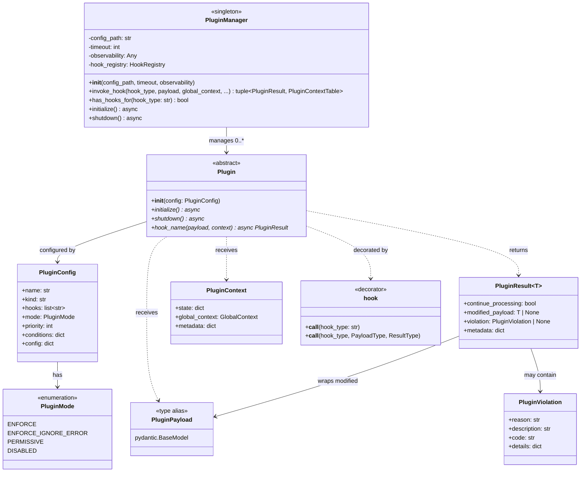

# Mellea Hook System Implementation Plan

This document describes the implementation plan for the extensibility hook system specified in [`docs/dev/hook_system.md`](hook_system.md). The implementation uses the [ContextForge plugin framework](https://github.com/IBM/mcp-context-forge) (`mcpgateway.plugins.framework`) as an optional external dependency for core plumbing, while all Mellea-specific types — hook enums, payload models, and the plugin base class — are owned by Mellea under a new `mellea/plugins/` subpackage.


## 1. Package Structure

```
mellea/plugins/
├── __init__.py            # Public API with try/except ImportError guard
├── _manager.py            # Lazy singleton wrapper around PluginManager
├── _base.py               # MelleaBasePayload, MelleaPlugin base class
├── _types.py              # MelleaHookType enum + hook registration
├── _context.py            # Plugins context factory helper
└── hooks/
    ├── __init__.py         # Re-exports all payload classes
    ├── session.py          # session lifecycle payloads
    ├── component.py        # component lifecycle payloads
    ├── generation.py       # generation pipeline payloads
    ├── validation.py       # validation payloads
    ├── sampling.py         # sampling pipeline payloads
    ├── tool.py             # tool execution payloads
    ├── adapter.py          # adapter operation payloads
    ├── context_ops.py      # context operation payloads
    └── error.py            # error handling payload
```

## 2. ContextForge Plugin Framework — Key Interfaces Used

The following types from `mcpgateway.plugins.framework` form the plumbing layer. Mellea uses these but does **not** import any ContextForge-specific hook types (prompts, tools, resources, agents, http).

| Type | Role |
|------|------|
| `Plugin` | ABC base class. `__init__(config: PluginConfig)`, `initialize()`, `shutdown()`. Hook methods discovered by convention (method name = hook type) or `@hook()` decorator. Signature: `async def hook_name(self, payload, context) -> PluginResult`. |
| `PluginManager` | Borg singleton. `__init__(config_path, timeout, observability)`. Key methods: `invoke_hook(hook_type, payload, global_context, ...) -> (PluginResult, PluginContextTable)`, `has_hooks_for(hook_type) -> bool`, `initialize()`, `shutdown()`. |
| `PluginPayload` | Type alias for `pydantic.BaseModel`. Base type for all hook payloads. |
| `PluginResult[T]` | Generic result: `continue_processing: bool`, `modified_payload: T | None`, `violation: PluginViolation | None`, `metadata: dict`. |
| `PluginViolation` | `reason`, `description`, `code`, `details`. |
| `PluginConfig` | `name`, `kind`, `hooks`, `mode`, `priority`, `conditions`, `config`, ... |
| `PluginMode` | `ENFORCE`, `ENFORCE_IGNORE_ERROR`, `PERMISSIVE`, `DISABLED`. |
| `PluginContext` | `state: dict`, `global_context: GlobalContext`, `metadata: dict`. |
| `HookRegistry` | `get_hook_registry()`, `register_hook(hook_type, payload_class, result_class)`, `is_registered(hook_type)`. |
| `@hook` decorator | `@hook("hook_type")` or `@hook("hook_type", PayloadType, ResultType)` for custom method names. |

### Class Diagram



### YAML Plugin Configuration (reference)

Plugins can also be configured programmatically without a YAML file.

```yaml
plugins:
  - name: content-policy
    kind: mellea.plugins.examples.ContentPolicyPlugin
    hooks:
      - component_pre_create
      - generation_post_call
    mode: enforce
    priority: 10
    config:
      blocked_terms: ["term1", "term2"]

  - name: telemetry
    kind: mellea.plugins.examples.TelemetryPlugin
    hooks:
      - component_post_success
      - sampling_loop_end
    mode: permissive
    priority: 100
    config:
      endpoint: "https://telemetry.example.com"
```

## 3. Core Types

### 3.1 `MelleaHookType` enum (`mellea/plugins/_types.py`)

A single `MelleaHookType(str, Enum)` containing all 27 hook types. String-based values for compatibility with ContextForge's `invoke_hook(hook_type: str, ...)`.

```python
class MelleaHookType(str, Enum):
    # Session Lifecycle
    SESSION_PRE_INIT = "session_pre_init"
    SESSION_POST_INIT = "session_post_init"
    SESSION_RESET = "session_reset"
    SESSION_CLEANUP = "session_cleanup"

    # Component Lifecycle
    COMPONENT_PRE_CREATE = "component_pre_create"
    COMPONENT_POST_CREATE = "component_post_create"
    COMPONENT_PRE_EXECUTE = "component_pre_execute"
    COMPONENT_POST_SUCCESS = "component_post_success"
    COMPONENT_POST_ERROR = "component_post_error"

    # Generation Pipeline
    GENERATION_PRE_CALL = "generation_pre_call"
    GENERATION_POST_CALL = "generation_post_call"
    GENERATION_STREAM_CHUNK = "generation_stream_chunk"

    # Validation
    VALIDATION_PRE_CHECK = "validation_pre_check"
    VALIDATION_POST_CHECK = "validation_post_check"

    # Sampling Pipeline
    SAMPLING_LOOP_START = "sampling_loop_start"
    SAMPLING_ITERATION = "sampling_iteration"
    SAMPLING_REPAIR = "sampling_repair"
    SAMPLING_LOOP_END = "sampling_loop_end"

    # Tool Execution
    TOOL_PRE_INVOKE = "tool_pre_invoke"
    TOOL_POST_INVOKE = "tool_post_invoke"

    # Backend Adapter Ops
    ADAPTER_PRE_LOAD = "adapter_pre_load"
    ADAPTER_POST_LOAD = "adapter_post_load"
    ADAPTER_PRE_UNLOAD = "adapter_pre_unload"
    ADAPTER_POST_UNLOAD = "adapter_post_unload"

    # Context Operations
    CONTEXT_UPDATE = "context_update"
    CONTEXT_PRUNE = "context_prune"

    # Error Handling
    ERROR_OCCURRED = "error_occurred"
```

### 3.2 `MelleaBasePayload` (`mellea/plugins/_base.py`)

All Mellea hook payloads inherit from this base, which extends `PluginPayload` with the common fields from the hook system spec (Section 2):

```python
class MelleaBasePayload(PluginPayload):
    model_config = ConfigDict(arbitrary_types_allowed=True)

    session_id: str
    request_id: str
    timestamp: datetime = Field(default_factory=datetime.utcnow)
    hook: str
    user_metadata: dict[str, Any] = Field(default_factory=dict)
```

`arbitrary_types_allowed=True` is required because payloads include non-serializable Mellea objects (`Backend`, `Context`, `Component`, `ModelOutputThunk`). This means external plugins cannot receive these payloads directly; they are designed for native in-process plugins.

### 3.3 Hook Registration (`mellea/plugins/_types.py`)

A `_register_mellea_hooks()` function registers all hook types with the ContextForge `HookRegistry`. Called once during plugin initialization. Idempotent via `is_registered()` check. Follows the same pattern used by ContextForge's own hook modules (e.g., `mcpgateway/plugins/framework/hooks/tools.py`).

```python
def _register_mellea_hooks() -> None:
    registry = get_hook_registry()
    for hook_type, (payload_cls, result_cls) in _HOOK_REGISTRY.items():
        if not registry.is_registered(hook_type):
            registry.register_hook(hook_type, payload_cls, result_cls)
```

### 3.4 Context Mapping (`mellea/plugins/_context.py`)

The hook system spec defines domain-specific `PluginContext` fields (`session`, `backend`, `context`) that vary by hook category. ContextForge provides a generic `GlobalContext` with a `state: dict`. The mapping uses `GlobalContext.state` as the carrier for Mellea-specific context:

```python
def build_global_context(
    *,
    session: MelleaSession | None = None,
    backend: Backend | None = None,
    context: Context | None = None,
    request_id: str = "",
    **extra_fields,
) -> GlobalContext:
    state: dict[str, Any] = {}
    if session is not None:
        state["session"] = session
    if backend is not None:
        state["backend"] = backend
        state["backend_name"] = getattr(backend, "model_id", "unknown")
    if context is not None:
        state["context"] = context
    state.update(extra_fields)
    return GlobalContext(request_id=request_id, state=state)
```

### 3.5 `MelleaPlugin` Base Class (`mellea/plugins/_base.py`)

Extends ContextForge `Plugin` with typed context accessor helpers so plugin authors don't need to know about the `GlobalContext.state` mapping:

```python
class MelleaPlugin(Plugin):
    """Base class for Mellea plugins."""

    def get_backend(self, context: PluginContext) -> Backend | None:
        return context.global_context.state.get("backend")

    def get_mellea_context(self, context: PluginContext) -> Context | None:
        return context.global_context.state.get("context")

    def get_session(self, context: PluginContext) -> MelleaSession | None:
        return context.global_context.state.get("session")

    @property
    def plugin_config(self) -> dict[str, Any]:
        return self._config.config or {}
```

No new abstract methods. ContextForge's `initialize()` and `shutdown()` suffice.


## 4. Plugin Manager Integration (`mellea/plugins/_manager.py`)

### 4.1 Lazy Singleton Wrapper

```python
_plugin_manager: PluginManager | None = None
_plugins_enabled: bool = False

def has_plugins() -> bool:
    """Fast check: are plugins configured and available?"""
    return _plugins_enabled

def get_plugin_manager() -> PluginManager | None:
    """Returns the initialized PluginManager, or None if plugins are not configured."""
    return _plugin_manager

async def initialize_plugins(
    config_path: str | None = None, *, timeout: float = 5.0
) -> PluginManager:
    """Initialize the PluginManager with Mellea hook registrations."""
    global _plugin_manager, _plugins_enabled
    _register_mellea_hooks()
    pm = PluginManager(config_path or "", timeout=int(timeout))
    await pm.initialize()
    _plugin_manager = pm
    _plugins_enabled = True
    return pm

async def shutdown_plugins() -> None:
    """Shut down the PluginManager."""
    global _plugin_manager, _plugins_enabled
    if _plugin_manager is not None:
        await _plugin_manager.shutdown()
    _plugin_manager = None
    _plugins_enabled = False
```

### 4.2 `invoke_hook()` Central Helper

All hook call sites use this single function. Three layers of no-op guards ensure zero overhead when plugins are not configured:

1. **`_plugins_enabled` boolean** — module-level, a single pointer dereference
2. **`has_hooks_for(hook_type)`** — skips invocation when no plugin subscribes to this hook
3. **Returns `(None, original_payload)` immediately** when either guard fails

```python
async def invoke_hook(
    hook_type: MelleaHookType,
    payload: MelleaBasePayload,
    *,
    session: MelleaSession | None = None,
    backend: Backend | None = None,
    context: Context | None = None,
    request_id: str = "",
    violations_as_exceptions: bool = True,
    **context_fields,
) -> tuple[PluginResult | None, MelleaBasePayload]:
    """Invoke a hook if plugins are configured.

    Returns (result, possibly-modified-payload).
    If plugins are not configured, returns (None, original_payload) immediately.
    """
    if not _plugins_enabled or _plugin_manager is None:
        return None, payload

    if not _plugin_manager.has_hooks_for(hook_type.value):
        return None, payload

    payload.hook = hook_type.value
    if not payload.request_id:
        payload.request_id = request_id

    global_ctx = build_global_context(
        session=session, backend=backend, context=context,
        request_id=request_id, **context_fields,
    )

    result, _ = await _plugin_manager.invoke_hook(
        hook_type=hook_type.value,
        payload=payload,
        global_context=global_ctx,
        violations_as_exceptions=violations_as_exceptions,
    )

    modified = result.modified_payload if result and result.modified_payload else payload
    return result, modified
```

### 4.3 Session-Level Configuration

`start_session()` in `mellea/stdlib/session.py` gains two optional keyword-only parameters:

```python
def start_session(
    ...,
    plugin_config: str | None = None,       # Path to plugin YAML config
    plugin_manager: PluginManager | None = None,  # Pre-configured manager
) -> MelleaSession:
```

If `plugin_manager` is provided, it is used directly. If `plugin_config` is a path, `initialize_plugins()` is called. Backward-compatible: existing code without these parameters sees no change.

### 4.4 Dependency Management

Add to `pyproject.toml` under `[project.optional-dependencies]`:

```toml
plugins = ["contextforge-plugin-framework>=0.1.0"]
```

All imports in `mellea/plugins/` are guarded with `try/except ImportError`.

## 5. Hook Call Sites

### 5.1 Session Lifecycle

**File**: `mellea/stdlib/session.py`

| Hook | Location | Trigger | Result Handling |
|------|----------|---------|-----------------|
| `session_pre_init` | `start_session()`, before `backend_class(model_id, ...)` (~L163) | Before backend instantiation | Supports payload modification: updated `model_options`, `backend_name`. Violation blocks session creation. |
| `session_post_init` | `start_session()`, after `MelleaSession(backend, ctx)` (~L191) | Session fully created | Observability-only. |
| `session_reset` | `MelleaSession.reset()`, before `self.ctx.reset_to_new()` (~L269) | Context about to reset | Observability-only. |
| `session_cleanup` | `MelleaSession.cleanup()`, at top of method (~L272) | Before teardown | Observability-only. Must not raise. |

**Sync/async bridge**: These are sync methods. Use `_run_async_in_thread(invoke_hook(...))` from `mellea/helpers/__init__.py`.

**Payload examples**:

```python
# session_pre_init
SessionPreInitPayload(
    backend_name=backend_name,
    model_id=str(model_id),
    model_options=model_options,
    backend_kwargs=backend_kwargs,
    context_type=type(ctx).__name__ if ctx else "SimpleContext",
)

# session_post_init
SessionPostInitPayload(session=session)

# session_cleanup
SessionCleanupPayload(
    context=self.ctx,
    interaction_count=len(self.ctx.as_list()),
)
```

### 5.2 Component Lifecycle

**File**: `mellea/stdlib/functional.py`

| Hook | Location | Trigger | Result Handling |
|------|----------|---------|-----------------|
| `component_pre_create` | `instruct()` before `Instruction(...)` (~L200), `chat()` before `Message(...)` (~L244), `query()` (~L321), `transform()` (~L363), and async variants | Before component constructor | Supports payload modification: updated `description`, `requirements`. Violation blocks creation. |
| `component_post_create` | Same functions, after Component constructor, before `act()`/`aact()` | Component created | Supports `component` replacement. Primarily observability. |
| `component_pre_execute` | `aact()`, at top before strategy branch (~L492) | Before generation begins | Supports `action`, `model_options`, `requirements`, `strategy` modification. Violation blocks execution. |
| `component_post_success` | `aact()`, after result in both branches (~L506, ~L534) | Successful execution | Supports `result` modification (output transformation). Primarily observability. |
| `component_post_error` | `aact()`, in new `try/except Exception` wrapping the body | Exception during execution | Observability-only. Always re-raises after hook. |

**Key changes to `aact()`**:
- Add `time.monotonic()` at entry for latency measurement
- Wrap body (lines ~492–546) in `try/except Exception`
- `except` handler: fire `component_post_error` then `error_occurred`, then re-raise
- Insert `component_post_success` before each `return` path

**Payload examples**:

```python
# component_pre_create (Instruction case)
ComponentPreCreatePayload(
    component_type="Instruction",
    description=description,
    images=images,
    requirements=requirements,
    icl_examples=icl_examples,
    grounding_context=grounding_context,
)

# component_pre_execute
ComponentPreExecutePayload(
    component_type=type(action).__name__,
    action=action,
    context=context,
    requirements=requirements or [],
    model_options=model_options or {},
    format=format,
    strategy_name=type(strategy).__name__ if strategy else None,
    tool_calls_enabled=tool_calls,
)

# component_post_success
ComponentPostSuccessPayload(
    component_type=type(action).__name__,
    action=action,
    result=result,
    context_before=context,
    context_after=new_ctx,
    generate_log=result._generate_log,
    sampling_results=sampling_result if strategy else None,
    latency_ms=int((time.monotonic() - t0) * 1000),
)
```

### 5.3 Generation Pipeline

**Approach**: Add a non-abstract `generate_from_context_with_hooks()` method to the `Backend` ABC in `mellea/core/backend.py`. This wraps the abstract `generate_from_context()` with pre/post hooks, avoiding modifications to all 6 backend implementations (Ollama, OpenAI, HuggingFace, vLLM, Watsonx, LiteLLM).

**New method on `Backend`** (`mellea/core/backend.py`):

```python
async def generate_from_context_with_hooks(
    self,
    action: Component | CBlock,
    ctx: Context,
    *,
    format=None,
    model_options=None,
    tool_calls=False,
) -> tuple[ModelOutputThunk, Context]:
    """Wraps generate_from_context with generation_pre_call / generation_post_call hooks."""
    from mellea.plugins._manager import invoke_hook, has_plugins
    from mellea.plugins._types import MelleaHookType
    from mellea.plugins.hooks.generation import GenerationPreCallPayload, GenerationPostCallPayload

    if has_plugins():
        pre_payload = GenerationPreCallPayload(
            action=action, context=ctx,
            model_options=model_options or {}, format=format, tools=None,
        )
        result, pre_payload = await invoke_hook(
            MelleaHookType.GENERATION_PRE_CALL, pre_payload,
            backend=self, context=ctx,
        )
        if result and result.modified_payload:
            model_options = result.modified_payload.model_options

    t0 = time.monotonic()
    out_result, new_ctx = await self.generate_from_context(
        action, ctx, format=format, model_options=model_options, tool_calls=tool_calls,
    )

    if has_plugins():
        post_payload = GenerationPostCallPayload(
            model_output=out_result,
            latency_ms=int((time.monotonic() - t0) * 1000),
        )
        await invoke_hook(
            MelleaHookType.GENERATION_POST_CALL, post_payload,
            backend=self, context=new_ctx,
        )

    return out_result, new_ctx
```

**Call site changes** :
- `mellea/stdlib/functional.py:aact()` line 499: `backend.generate_from_context(...)` → `backend.generate_from_context_with_hooks(...)`
- `mellea/stdlib/sampling/base.py:sample()` line ~163: same substitution

| Hook | Location | Trigger | Result Handling |
|------|----------|---------|-----------------|
| `generation_pre_call` | `Backend.generate_from_context_with_hooks()`, before delegate | Before LLM API call | Supports `model_options` modification. Violation blocks (e.g., token budget exceeded). |
| `generation_post_call` | Same method, after delegate returns | After LLM response | Supports output modification (redaction). Primarily observability. |
| `generation_stream_chunk` | **Deferred to Phase 7** — requires hooks in `ModelOutputThunk.astream()` streaming path | Per streaming chunk | Fire-and-forget to avoid slowing streaming. |

### 5.4 Validation

**File**: `mellea/stdlib/functional.py`, in `avalidate()` (~L699–753)

| Hook | Location | Trigger | Result Handling |
|------|----------|---------|-----------------|
| `validation_pre_check` | After `reqs` prepared (~L713), before validation loop | Before validation | Supports `requirements` list modification (inject/filter). |
| `validation_post_check` | After all validations, before `return rvs` (~L753) | After validation | Supports `results` override. Primarily observability. |

**Payload examples**:

```python
# validation_pre_check
ValidationPreCheckPayload(
    requirements=reqs,
    target=output,
    context=context,
    model_options=model_options or {},
)

# validation_post_check
ValidationPostCheckPayload(
    requirements=reqs,
    results=rvs,
    all_passed=all(bool(r) for r in rvs),
    passed_count=sum(1 for r in rvs if bool(r)),
    failed_count=sum(1 for r in rvs if not bool(r)),
)
```

### 5.5 Sampling Pipeline

**File**: `mellea/stdlib/sampling/base.py`, in `BaseSamplingStrategy.sample()` (~L94–256)

| Hook | Location | Trigger | Result Handling |
|------|----------|---------|-----------------|
| `sampling_loop_start` | Before `for` loop (~L157) | Loop begins | Supports `loop_budget` modification. |
| `sampling_iteration` | Inside loop, after validation (~L192) | Each iteration | Observability. Violation can force early termination. |
| `sampling_repair` | After `self.repair()` call (~L224) | Repair invoked | Supports `repair_action`/`repair_context` modification. |
| `sampling_loop_end` | Before return in success (~L209) and failure (~L249) paths | Loop ends | Observability. Supports `final_result` override. |

**Additional change**: Add `_get_repair_type() -> str` method to each sampling strategy subclass:

| Strategy Class | Repair Type |
|---|---|
| `RejectionSamplingStrategy` | `"identity"` |
| `RepairTemplateStrategy` | `"template_repair"` |
| `MultiTurnStrategy` | `"multi_turn_message"` |
| `SOFAISamplingStrategy` | `"sofai_feedback"` |

**Payload examples**:

```python
# sampling_loop_start
SamplingLoopStartPayload(
    strategy_name=type(self).__name__,
    action=action,
    context=context,
    requirements=reqs,
    loop_budget=self.loop_budget,
)

# sampling_repair
SamplingRepairPayload(
    repair_type=self._get_repair_type(),
    failed_action=sampled_actions[-1],
    failed_result=sampled_results[-1],
    failed_validations=sampled_scores[-1],
    repair_action=next_action,
    repair_context=next_context,
    repair_iteration=loop_count,
)
```

### 5.6 Tool Execution

**File**: `mellea/stdlib/functional.py`, in the `_call_tools()` helper (~L904)

| Hook | Location | Trigger | Result Handling |
|------|----------|---------|-----------------|
| `tool_pre_invoke` | Before `tool.call_func()` (~L917) | Before tool call | Supports `tool_args` modification. Violation blocks tool call. |
| `tool_post_invoke` | After `tool.call_func()` (~L919) | After tool call | Supports `tool_output` modification. Primarily observability. |

### 5.7 Backend Adapter Operations

**Files**: `mellea/backends/openai.py` (`load_adapter` ~L907, `unload_adapter` ~L944), `mellea/backends/huggingface.py` (`load_adapter` ~L1192, `unload_adapter` ~L1224)

| Hook | Location | Trigger | Result Handling |
|------|----------|---------|-----------------|
| `adapter_pre_load` | Start of `load_adapter()` | Before adapter load | Violation prevents loading. |
| `adapter_post_load` | End of `load_adapter()` | After adapter loaded | Observability. |
| `adapter_pre_unload` | Start of `unload_adapter()` | Before adapter unload | Violation prevents unloading. |
| `adapter_post_unload` | End of `unload_adapter()` | After adapter unloaded | Observability. |

**Sync/async bridge**: Adapter methods are synchronous. Use `_run_async_in_thread(invoke_hook(...))`.

### 5.8 Context Operations

**Files**: `mellea/stdlib/context.py` (`ChatContext.add()` ~L17, `SimpleContext.add()` ~L31)

| Hook | Location | Trigger | Result Handling |
|------|----------|---------|-----------------|
| `context_update` | After `from_previous()` in `add()` | Context appended | Observability-only (context is immutable). |
| `context_prune` | `ChatContext.view_for_generation()` when window truncates | Context windowed | Observability-only. |

**Performance note**: `context_update` fires on every context addition, which is frequent. The `has_hooks_for()` guard is critical — when no plugin subscribes to `context_update`, the overhead is a single boolean check.

### 5.9 Error Handling

**File**: `mellea/stdlib/functional.py` (utility function callable from any error path)

| Hook | Location | Trigger | Result Handling |
|------|----------|---------|-----------------|
| `error_occurred` | `aact()` except block + utility `fire_error_hook()` | Unrecoverable error | Observability-only. Must never raise from own execution. |

**Fires for**: `ComponentParseError`, backend communication errors, assertion violations, unhandled exceptions during component execution, validation, or tool invocation.

**Does NOT fire for**: Validation failures within sampling loops (handled by `sampling_iteration`/`sampling_repair`), controlled `PluginViolation` blocks (those are policy decisions, not errors).

**Utility function**:

```python
async def fire_error_hook(
    error: Exception,
    location: str,
    *,
    session=None, backend=None, context=None, action=None,
) -> None:
    """Fire the error_occurred hook. Never raises."""
    try:
        payload = ErrorOccurredPayload(
            error=error,
            error_type=type(error).__name__,
            error_location=location,
            stack_trace=traceback.format_exc(),
            recoverable=False,
            action=action,
        )
        await invoke_hook(
            MelleaHookType.ERROR_OCCURRED, payload,
            session=session, backend=backend, context=context,
            violations_as_exceptions=False,
        )
    except Exception:
        pass  # Never propagate errors from error hook
```


## 8. Critical Files Summary

| File | Changes |
|------|---------|
| `mellea/stdlib/functional.py` | ~12 hook insertions (component lifecycle, validation, tools, error) |
| `mellea/stdlib/session.py` | 4 session hooks + `plugin_config`/`plugin_manager` params on `start_session()` |
| `mellea/stdlib/sampling/base.py` | 4 sampling hooks + `generate_from_context` → `generate_from_context_with_hooks` |
| `mellea/core/backend.py` | Add `generate_from_context_with_hooks()` wrapper method to `Backend` ABC |
| `mellea/stdlib/context.py` | 2 context operation hooks in `ChatContext.add()`, `SimpleContext.add()` |
| `mellea/backends/openai.py` | 4 adapter hooks in `load_adapter()` / `unload_adapter()` |
| `mellea/backends/huggingface.py` | 4 adapter hooks in `load_adapter()` / `unload_adapter()` |
| `pyproject.toml` | Add `plugins` optional dependency + `plugins` test marker |
| `mellea/plugins/` (new) | Plugin subpackage |
| `test/plugins/` (new) | Tests for plugins subpackage |

> Note: + update docs and add examples.
