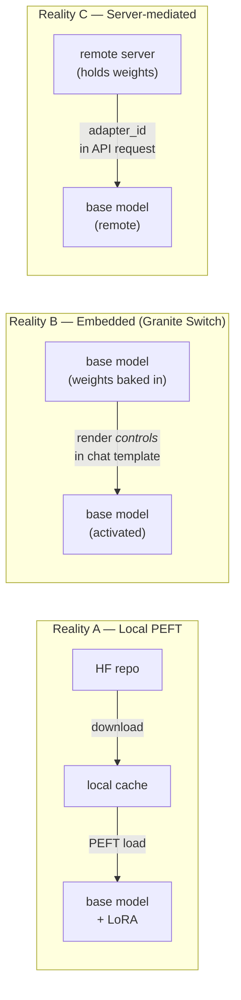
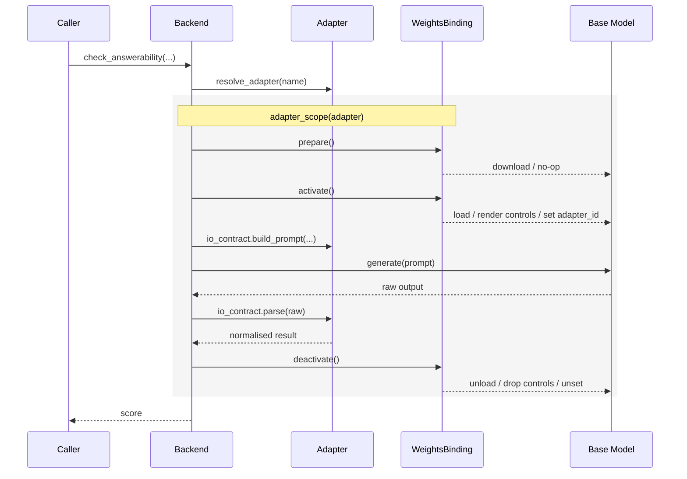
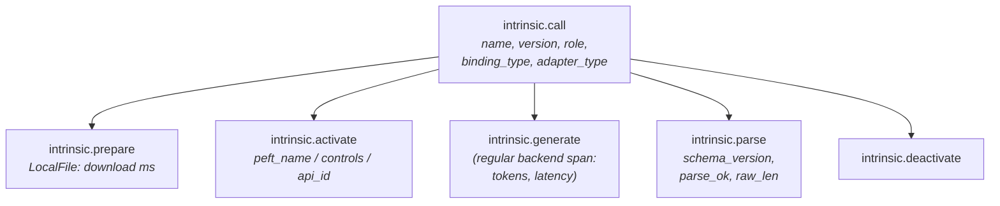

# Adapter Lifecycle — Design Proposal

> **Addresses:** [Epic #929 — Fix Intrinsic Adapter Lifecycle & Consistency in Mellea](https://github.com/generative-computing/mellea/issues/929). Read the epic first if you haven't; it catalogues the specific threads this proposal tries to resolve coherently rather than individually.
>
> **Status:** proposal for shape agreement; not a PR candidate. Preserved on a branch for review. Once agreed, the content moves into `docs/dev/intrinsics_and_adapters.md` as the current-state doc and this file is deleted.
>
> **Structure:** **Part I** covers the problem, goals, terminology, end state, and the decisions that gate decomposition. **Part II** contains supporting detail — read after Part I is agreed, not before.
>
> **Terminology:** this proposal uses **"adapter"** as the primary user-facing term. "Intrinsic" appears only as the legacy name where it still refers to existing Mellea classes (e.g. the `Intrinsic` AST component). Rename strategy is in §5 Q5.
>
> **Related issues and prior work:** see the appendix at the end of this document for a linked index with annotations.

---

# Part I — Summary for agreement

## 1. The problem we are solving

Mellea intrinsics — `check_answerability`, `requirement_check`, `find_citations`, the Guardian helpers — let users add specialised capabilities to a base model. Under the hood each one is an **adapter**: a small artefact that specialises the base model for that one task.

Three sources of friction have accumulated:

1. **Three different kinds of adapter share one class hierarchy.** Local PEFT adapters (weights on disk), Granite Switch "embedded" adapters (weights baked into the base model), and the yet-to-return OpenAI-compatible adapters (weights served behind an API) all try to live under one base class. The code branches on backend identity (`if backend._uses_embedded_adapters:`) to route between them.
2. **Adapter lifecycle is not modelled.** `call_intrinsic` constructs an `IntrinsicAdapter` as a side effect of invoking one, which triggers an unconditional weight download even when no download is needed. The user sees a misleading download error; the real error is masked. There is no concept of "prepare," "activate," "deactivate" as distinct steps.
3. **Small, visible follow-on issues cluster around these two roots** — a five-place model-options hierarchy with a silent-overwrite bug; JSON output keys hardcoded in helpers (`result_json["answerability"]`) that break when an adapter ships a new output schema; the `"requirement-check"` string duplicated across four files; a `CustomIntrinsicAdapter` whose constructor monkey-patches the global catalog with a self-confessed "temporary hack."

Every thread in #929 is a symptom of not having separated the kinds of adapter and their lifecycles cleanly. This is not a theoretical concern: **seven fix-up commits have been merged in the adapter area in recent history** (full list in the appendix), alongside the `obtain_lora`-always-called masked error and the hardcoded `"requirement-check"` strings flagged by #929 point 7 / PR #1008 — the picture is of a subsystem that receives repeated small-scope fixes rather than a stable abstraction.

## 2. What we are trying to achieve

Four outcomes, in order of importance. Detail on each lives in Part II; this list is the ask.

1. **One adapter model, one code path.** Reasonable from the outside, unified from the inside — no more `if backend._uses_embedded_adapters:` branches.
2. **Safe evolution.** Model-option precedence is documented and enforced; adapter output schemas can version without breaking callers.
3. **First-class customer adapters.** Customers can ship their own against the same API as first-party ones — today it requires patching the catalog or subclassing a self-confessed "temporary hack" ([#424](https://github.com/generative-computing/mellea/issues/424)).
4. **Observable and parity-respecting.** Every lifecycle phase is a distinct span; high-level helpers (`check_answerability` etc.) keep their shape; manual adapter construction becomes simpler, not harder.

## 3. Key terms (brief)

Only the few terms needed to read Part I:

- **Adapter** — the user-facing term for a specialised capability added to a base model (answerability, requirement-check, etc.). The "adapter" replaces Mellea's legacy term "intrinsic" in prose; legacy class names (`Intrinsic`, `IntrinsicAdapter`) are a migration question, not a meaning question.
- **Base model** — the general-purpose LLM everything runs on top of (e.g. `ibm-granite/granite-4.1-3b`).
- **LoRA / aLoRA** — the two PEFT technologies adapters use. Both are supported.
- **Reality A / B / C** — shorthand introduced in §4 for the three "where the weights live" stories.

Full glossary (identity, I/O contract, weights binding, role, qualified name, catalog, io.yaml) is in §7 — needed only when you descend into the detail.

## 4. Rough end result

An **Adapter** is a small object composed of three parts:

```
Adapter
├── identity      — name, adapter type (lora/alora), schema version, optional role
├── io_contract   — parsed io.yaml: prompt building, output parsing, model options
└── weights       — one of three pluggable bindings (LocalFile, Embedded, ServerMediated)
```

The **weights binding** is where the three realities live. It exposes a single verb set — `prepare`, `activate`, `deactivate`, `release` — that every backend calls uniformly. What each verb does per reality lives in §9; the high-level picture is all three realities converging on one shared `io_contract`:



Adapter invocation becomes one flow, no branches on backend type:

```
adapter = backend.resolve_adapter(name)
with backend.adapter_scope(adapter):
    raw = backend.generate(adapter.io_contract.build_prompt(...))
return adapter.io_contract.parse(raw)
```

From this shape, the seven threads of #929 resolve cleanly. Full verb semantics per binding, the lifecycle sequence diagram, and the thread-by-thread mapping are in Part II (§9 and §12).

**What users see:** high-level helpers (`check_answerability` etc.) keep their current shape, with the `model_options=` addition that PR #1003 is introducing. Manual adapter construction collapses from four classes to one, with the binding as the pluggable part. Custom intrinsics no longer require monkey-patching the catalog. Detail in Part II §13.

**What cross-cutting concerns look like:** observability (spans + a schema-drift metric), docs rewrite (`intrinsics_and_adapters.md` is 39 lines describing classes this renames), and a test-parity commitment travel **with** the refactor, not after it. Detail in Part II §14–§15.

### 4.1 Backend scope

Of Mellea's five backends (`LocalHFBackend`, `OpenAIBackend`, `OllamaBackend`, `WatsonxBackend`, `LiteLLMBackend`), **the two primary adapter backends are `LocalHFBackend` and `OpenAIBackend`** — those are what this design targets. The remaining three are out of scope for adapter support because the underlying providers do not support the mechanisms Mellea's adapters need today. The `WeightsBinding` abstraction does not preclude adding them later. Full backend × reality matrix with per-backend reasoning is in §10.

## 5. Decisions needed now

These gate decomposition; everything else can live in sub-issues once these are agreed.

1. **Does the end-state shape (§4) hold?** Three realities, `Adapter = identity + io_contract + weights`, role-based lookup for rerouting. Yes / no / what's missing.
2. **Adapter lifecycle default — session-scoped or request-scoped?** Today's HF backend keeps adapters loaded once added; request-scoped load/unload is safer for multi-tenancy but costs latency on a 7B base.
3. **Reality C target shape.** The active work item is [#27](https://github.com/generative-computing/mellea/issues/27) (aLoRA on remote vLLM), paced by upstream vLLM's position. Do we leave the `ServerMediatedBinding` slot empty in 0.6.0 and populate it when #27 unblocks, or invest in a no-op/stub subclass now? Recommendation: leave empty, design the slot, revisit when upstream moves.
4. **Deprecation window.** How long do `IntrinsicAdapter` / `EmbeddedIntrinsicAdapter` / `CustomIntrinsicAdapter` stay as shims before removal? One minor release is the default; confirm.
5. **Terminology rename scope.** Three levels of commitment to the "adapter over intrinsic" shift:
   a. **Prose only** (docs, error messages, help text). Zero breakage. Recommended unconditionally.
   b. **Module rename**: `mellea.stdlib.components.intrinsic` → `mellea.stdlib.components.adapter`, with the old path re-exported for one release. Breaking for anyone importing from the submodule path.
   c. **AST class rename**: `Intrinsic` → something like `AdapterCall`, with `Intrinsic` as an alias for one release. Breaking for advanced users calling `mfuncs.act(Intrinsic(...))` directly.
   Confirm how deep to go.

> **Implementation note, not a reviewer question:** intrinsic-level observability (§14) should coordinate with the in-flight [#1035](https://github.com/generative-computing/mellea/issues/1035) / [PR #1036](https://github.com/generative-computing/mellea/pull/1036) work so content capture uses the same `MELLEA_TRACE_CONTENT` flag and doesn't get designed twice. Flagged here for awareness; sequenced during implementation.

## 6. Impact and blast radius

Scope of this refactor in concrete terms so reviewers can weigh the cost.

### API surface

- **Unchanged** — every high-level helper (`check_answerability` etc.) keeps its signature. `m.instruct`, `m.validate`, `m.chat` unaffected. The `model_options=` addition from [#1003](https://github.com/generative-computing/mellea/issues/1003) arrives on top, not instead.
- **Deprecated but shimmed for one release** — `IntrinsicAdapter`, `EmbeddedIntrinsicAdapter`, `CustomIntrinsicAdapter` public classes. Direct users get `DeprecationWarning` pointing to the new constructor.
- **Optional, was mandatory** — the adapter catalogue. Stays as a convenience resolver, stops being a gate.
- **Possibly moved/renamed** — depends on §5 Q5 (terminology rename scope).

### User-archetype impact

| Audience | Impact |
| --- | --- |
| Helper user (`check_answerability`-style calls) | None beyond the `model_options=` addition from [#1003](https://github.com/generative-computing/mellea/issues/1003) and clearer error messages. |
| Advanced user constructing adapters directly | One release of deprecation warnings, then adopt the new `Adapter(name=…, weights=…)` constructor. |
| Customer writing their own adapter | First-class path; no more `CustomIntrinsicAdapter` monkey-patching; no forced catalogue upload. Resolves [#424](https://github.com/generative-computing/mellea/issues/424). |
| Backend author | `AdapterMixin` verb set narrows to the natural operations each backend can perform; existing implementations update or use shim methods. |
| Operator / SRE | New spans and metrics per §14; easier diagnosis of adapter failures and cost attribution. |

### Code reach

Files and modules touched, approximate: `mellea/backends/adapters/{adapter,catalog,__init__}.py`, `mellea/backends/{huggingface,openai}.py`, `mellea/stdlib/components/intrinsic/*`, `mellea/formatters/granite/intrinsics/*`, `mellea/stdlib/requirements/requirement.py`, `docs/examples/intrinsics/*`, `docs/dev/{intrinsics_and_adapters,requirement_aLoRA_rerouting}.md`. Larger than a typical feature PR; phased per §16 so individual PRs stay reviewable.

### Release planning

- **Target release (minor, exact number TBD)**: §5 agreement plus Phases 0–2 of the migration (new `Adapter` / `WeightsBinding` / `IOContract` types, call-site adoption, backend narrowing, deprecation shims for old classes, unified model-option precedence, observability per §14, tests per §15).
- **Follow-on minor release**: [#1018](https://github.com/generative-computing/mellea/issues/1018) (embedded adapters on `LocalHFBackend`), Phase 4 shim removal.
- **Deferred until upstream moves**: Reality C / [#27](https://github.com/generative-computing/mellea/issues/27).

### Blocking and unblocking

- **Blocks** [#1018](https://github.com/generative-computing/mellea/issues/1018) (explicitly stated in its issue body).
- **Substantially addresses** [#423](https://github.com/generative-computing/mellea/issues/423) (adapter code undocumented and over-specialised), [#424](https://github.com/generative-computing/mellea/issues/424) (cannot use intrinsics without uploading), all seven threads of [#929](https://github.com/generative-computing/mellea/issues/929).
- **Coordinates with** [PR #1036](https://github.com/generative-computing/mellea/pull/1036) on content-capture semantics.
- **Blocked by** upstream vLLM position on aLoRA ([#27](https://github.com/generative-computing/mellea/issues/27)) — and only for Reality C. Parts I–II of this design are not gated on upstream.

### Performance

- **Likely neutral or improved.** Session-scoped lifecycle is the proposed default (matches current `LocalHFBackend` behaviour); no additional load/unload cost per call. Unified parsing avoids the double-parse that the current output-normalisation sometimes does.
- **Regression watch**: if §5 Q2 chooses request-scoped, per-call PEFT load/unload becomes a visible cost. Measure before adoption.

### Risk

- **Biggest unknown**: whether the unified `resolve_model_options` handles every combination currently in use. Mitigation: keep the five-layer precedence explicit, add per-adapter override documentation, and assert resolved values in tests.
- **Second biggest**: schema-version dispatch (§12 and §9 in Part II). Worked example is the [#1008](https://github.com/generative-computing/mellea/pull/1008) `requirement-check` change — verifying v1 and v2 both pass through cleanly gates the parsing refactor.
- **Mitigated by**: per-phase test-parity commitment (nothing merges if existing tests regress); observability introduced alongside the refactor so production regressions surface as dashboard signals rather than silent behavioural drift.

---

# Part II — Supporting detail

> For deeper review once Part I is agreed. Part II expands the definitions and the design so that reviewers can pressure-test the specifics. Sections are roughly ordered from "what exactly are we talking about" (terminology, realities, end-state detail) through "why this shape is right" (current tangle, thread mapping) to "what it looks like in practice" (user-facing, observability, docs/tests, migration, open questions).

## 7. Terminology (full glossary)

Names matter because they appear in user-facing error messages, docs, and telemetry attributes. The short list for quick reading is in Part I §3; this is the complete reference.

| Term | Meaning |
| --- | --- |
| **Base model** | The general-purpose LLM (e.g. `ibm-granite/granite-4.1-3b`) that everything runs on top of. |
| **Adapter** | The user-facing term for a specialised capability added to a base model — answerability, citations, requirement-check, etc. In the redesign, `Adapter` is one class composed of three parts (identity, I/O contract, weights binding). This is the primary noun users and docs should reach for. |
| **Intrinsic** | Legacy Mellea term for the same concept. Still appears in the current class names (`Intrinsic` AST component, `IntrinsicAdapter`, `mellea.stdlib.components.intrinsic` module). The direction of travel is to fold "intrinsic" language into "adapter" — the rename scope is a decision in Part I §5. |
| **Identity** | The part of an adapter that says *what it is*: name (e.g. `answerability`), adapter type (`lora` / `alora`), schema version, and optional role. |
| **I/O contract** | The parsed `io.yaml` — prompt template, output parser, model-option defaults. Always present, same shape regardless of reality. |
| **Weights binding** | The part of an adapter that says *how its weights are made available*. Three subclasses, one per reality. Exposes `prepare`, `activate`, `deactivate`, `release`. |
| **Reality A / B / C** | Shorthand for the three "where the weights live" stories: A = local PEFT file, B = shipped with the base model (Granite Switch), C = server-mediated (future OpenAI/vLLM). |
| **LoRA / aLoRA** | Two PEFT technologies. LoRA weights always participate; aLoRA only participates after an activation token is seen. A single adapter ships as one or the other (some intrinsics as either); both are supported across all three realities (including embedded — Granite Switch has LoRA and aLoRA adapters in the same repo, `technology` field on each). |
| **Role** | A *semantic* label on an adapter distinct from its name — e.g. `requirement_check`, `context_attribution`. Used by callers (the `Requirement` rerouting path) to find "the adapter that plays this role" without hardcoding a name string. |
| **Qualified name** | Today's disambiguator: `<name>_<adapter_type>`. In the redesign, derived on demand from `identity` rather than stored as a field. |
| **Catalog** | The registry of known adapters at `mellea/backends/adapters/catalog.py`. Becomes optional and advisory rather than mandatory and monkey-patched. |
| **`io.yaml`** | The YAML file that declares an adapter's input template, output schema, and generation parameters. Lives in the adapter's HuggingFace repo. |

## 8. Three realities of "where the weights live"

### 8.1 Reality A — Local PEFT adapter (today's `IntrinsicAdapter`)

- Weights are a distinct file Mellea downloads from HuggingFace into the local cache.
- At call time, the backend uses the PEFT library to plug those weights into the base model.
- After the call, the backend can unplug them.
- **Physical weights, runtime activation, downloadable lifecycle.**

### 8.2 Reality B — Embedded adapter (today's `EmbeddedIntrinsicAdapter`, used by Granite Switch)

- Adapter weights **ship in the same HuggingFace repo as the base model**. They come down with the base-model snapshot and are not fetched separately — confirmed by the fact that `EmbeddedIntrinsicAdapter.from_hub` downloads only `adapter_index.json` + `io_configs/**`, not weight files. The phrase "baked into the base model" is a useful shorthand but imprecise: the weights are still distinct PEFT modules, just co-located and pre-loaded by the inference runtime.
- **Both LoRA and aLoRA are supported.** `adapter_index.json` lists each embedded adapter with a `technology` field (`"lora"` or `"alora"`). The chat template uses that field to place the `controls` JSON at the correct position — beginning of sequence for LoRA, before the generation prompt for aLoRA — so the right adapter is active for the right span of tokens. Granite Switch therefore genuinely carries both technologies; it is not a LoRA-only reality.
- On the client side, only `io.yaml` is needed to format inputs and parse outputs.
- **Pre-installed weights, prompt-level activation, no separate download lifecycle.**

### 8.3 Reality C — Server-mediated adapter (partially gap today)

The OpenAI-compatible backend **already supports adapters** — but only embedded ones (Granite Switch via Reality B, added in [PR #881](https://github.com/generative-computing/mellea/pull/881)). What's missing is *non-embedded* server-side adapters.

**The history (corrected):** Mellea previously ran aLoRA adapters through the OpenAI backend against a **custom vLLM build** that carried an aLoRA patch. The upstream vLLM project declined to merge that patch (confirmed in [PR #543](https://github.com/generative-computing/mellea/pull/543)'s review: "the vLLM aLoRA PR will not [be] accepted, so the alora/intrinsics code for openai is now all dead code"), so PR #543 removed the dead path. Upstream vLLM has therefore **never carried** aLoRA support — the right framing is "declined upstream," not "dropped."

**Live tracking item:** [Issue #27 "Add support for aloras to remote vllm when vllm supports it"](https://github.com/generative-computing/mellea/issues/27) is the open work item for this reality. It remains open because the upstream situation has not changed.

**Scope of this reality:** whatever the eventual technology path, the design slot is the same. Two sub-cases the binding must accommodate when the path becomes viable:

- **C1 — Client-pulled, server-activated**: weights exist as a file client-side (or somewhere pullable), but activation happens on a remote inference server which loads them and exposes them via a LoRA ID or per-request model alias. This is the vLLM-shaped path, paced by #27 being unblocked.
- **C2 — Provider-hosted**: weights live entirely on the provider's infrastructure. The client only ever passes an identifier. Applies to commercial fine-tunes behind OpenAI, Azure, etc. Not currently a known target in Mellea.

Both share: **no local weight loading, API-parameter activation, `io.yaml` still required client-side.** The first concrete `ServerMediatedBinding` subclass sets the idiom for the API shape.

**Intent summary for OpenAI-compatible support:** keep and extend. Embedded support stays. The design leaves a clean slot for C1 to be populated when #27 is unblocked upstream; C2 is noted for completeness but not a near-term target.

## 9. End-state design detail

### 9.1 Weights binding verbs per reality

Each concrete binding implements the four-verb set from Part I §4. The column meanings do not change between realities — only what happens inside the verb does.

| Binding | `prepare` | `activate` | `deactivate` |
| --- | --- | --- | --- |
| `LocalFileBinding` (Reality A) | Download from repo → cache path | PEFT `load_adapter` | PEFT `unload_adapter` |
| `EmbeddedBinding` (Reality B) | No-op (weights shipped with base model) | Render `controls` field into chat template | Drop the `controls` field |
| `ServerMediatedBinding` (Reality C) | No-op (or push weights, depending on sub-case) | Set adapter identifier on API request | Unset identifier |

`release()` is implemented per-binding as needed (cache eviction for LocalFile; no-op for the others).

### 9.2 Lifecycle sequence

The lifecycle inside `adapter_scope` is the same for every binding — only the verbs do reality-specific work:



## 10. Backend × reality matrix

Mellea currently exposes five backends. Adapter support varies — and is not a goal for every backend.

| Backend             | Reality A (Local PEFT) | Reality B (Embedded) | Reality C (Server-mediated) | Notes |
| ------------------- | :--------------------: | :------------------: | :-------------------------: | --- |
| `LocalHFBackend`    | ✅ today                | ⏳ [#1018](https://github.com/generative-computing/mellea/issues/1018) | — | Primary local backend; only one with aLoRA support today. |
| `OpenAIBackend`     | —                      | ✅ today ([#881](https://github.com/generative-computing/mellea/pull/881)) | ⏳ [#27](https://github.com/generative-computing/mellea/issues/27) | OpenAI-compatible endpoint, including vLLM servers. |
| `OllamaBackend`     | —                      | —                    | —                           | Ollama's LoRA/PEFT story is GGUF-based and immature; not a current target. |
| `WatsonxBackend`    | —                      | —                    | —                           | Would require watsonx-side adapter support; no current plan. |
| `LiteLLMBackend`    | —                      | —                    | —                           | Multi-provider shim; adapter support would depend on the underlying provider and is not a coherent single-backend target. Could opportunistically inherit C2 if any wrapped provider exposes fine-tuned identifiers. |

Legend: ✅ supported today, ⏳ planned future work tracked by the linked issue, — not applicable or not planned.

**What this says about intent:**

- The two **primary adapter backends are `LocalHFBackend` and `OpenAIBackend`.** The refactor targets these first.
- Granite Switch (embedded) is the newest addition but is **not** "the premier option": local PEFT via `LocalHFBackend` remains the development/on-prem path and is the only reality that ships with both LoRA and aLoRA today.
- The remaining three backends (`OllamaBackend`, `WatsonxBackend`, `LiteLLMBackend`) are **out of scope for adapter support under this design**. The `WeightsBinding` abstraction does not preclude adding them later, but no issue currently tracks the intent and the underlying providers do not support the mechanisms Mellea's adapters need.
- The design keeps every ✅ cell working, adds clean paths for the ⏳ cells without ad-hoc branching, and leaves empty cells empty rather than stubbing them speculatively.

## 11. Why the current code is tangled (concrete example)

Inside `_util.call_intrinsic`:

```python
if getattr(backend, "_uses_embedded_adapters", False):
    adapters = EmbeddedIntrinsicAdapter.from_source(...)
else:
    intrinsic_adapter = IntrinsicAdapter(...)  # Reality A path
```

Three problems:

1. **`_uses_embedded_adapters` is a backend flag, not an adapter property.** It hard-codes "this backend type → always this adapter type." Reality C needs a third branch, then a fourth if a backend supports both.
2. **The `else` branch calls `obtain_lora` unconditionally** via `IntrinsicAdapter.__init__` → `download_and_get_path`. If the adapter was meant to be a different type, the user sees a misleading download-path error instead of the real cause.
3. **Output parsing assumes one schema.** `result_json["answerability"]` is hardcoded in helpers. When PR #1008 changed `requirement-check` output from `{"requirement_likelihood": 0.9}` to `{"requirement_check": {"score": 0.9}}`, the parsing helper had to be rewritten and the catalog gained a second entry (`requirement_check` for Granite 3.x, `requirement-check` for Granite 4.x) to support both.

## 12. Full #929 thread mapping

| Thread | Resolution |
| --- | --- |
| 1a. Loading/unloading divergence | One `WeightsBinding` verb set; control flow identical across realities. |
| 1b. `obtain_lora` always-called bug | Only `LocalFileBinding.prepare` calls `obtain_lora`; others no-op. |
| 1c. Backend- + adapter-type-specific abstraction | `WeightsBinding` is the adapter-type axis; `AdapterMixin` verbs are the backend axis. |
| 2a. Intrinsic rewriters overwrite options | `Adapter.resolve_model_options()` replaces the five-place merge with one documented stack. |
| 2b/2c. Model-option hierarchy | Five layers enforced in `resolve_model_options` (base model → adapter config → `io.yaml` defaults → `io.yaml` per-intrinsic → caller). |
| 3. Naming consistency | Three-axis identity (`name`, `adapter_type`, `version`) plus explicit `role`. |
| 4a. `call_intrinsic` assumes one output schema | `io_contract.parse()` dispatches on `(name, version)`; helpers see normalised shape. |
| 4b. Per-adapter vs standard schema | `io_contract.parse()` is per-adapter; helpers define the normalised post-parse shape. |
| 4c. Versioning | Schema version declared in `io.yaml` (`schema_version:`); defaults to `v1`. |
| 5. OpenAI backend support | Ships as one or two `ServerMediatedBinding` subclasses. |
| 6. Catalog cleanup | Catalog becomes optional resolver (`LocalFileBinding.from_catalog(name)`). Custom adapters bypass it; no monkey-patching. Duplicate `requirement_check` / `requirement-check` entries collapse into one entry with two schema versions. |
| 7. Hardcoded `requirement-check` refs | Callers look up by **role**, not name. |

## 13. What users see — detailed

**High-level helpers** keep their signatures. The `model_options=` parameter is added via PR #1003:

```python
score = check_answerability(question, documents, context, backend)
score = check_answerability(question, documents, context, backend,
                            model_options={"temperature": 0.1})
```

**Manual adapter construction** collapses from four classes (`IntrinsicAdapter`, `EmbeddedIntrinsicAdapter`, `CustomIntrinsicAdapter`, abstract base) to one `Adapter` + a binding:

```python
# Stock intrinsic from the catalogue:
adapter = Adapter(name="answerability",
                  weights=LocalFileBinding.from_catalog("answerability"))

# Custom intrinsic — no catalog monkey-patching:
adapter = Adapter(name="my-thing",
                  weights=LocalFileBinding(source="myuser/my-adapter",
                                           base_model_name="granite-4.1-3b"),
                  io_contract=IOContract.from_yaml("./io.yaml"))

# Granite Switch embedded:
adapter = Adapter(name="answerability",
                  weights=EmbeddedBinding.from_base_model(backend))
```

**Backend authors** keep `AdapterMixin` as the backend surface, but it exposes only the verbs a backend naturally has: `load_peft_adapter`, `unload_peft_adapter`, `render_controls`, `set_request_adapter`. Bindings call into these verbs. Adding a new reality = adding a new verb + new binding.

## 14. Observability

### 14.1 Why adapters need bespoke observability

Adapter calls hide the complexity that matters most when something goes wrong (weight fetching, activation side-effects, schema contracts). Without per-phase instrumentation, four failure modes are hard or impossible to diagnose — and Mellea has already hit the first two in production:

1. **Masked errors.** The `obtain_lora`-always-called bug (#929 point 1b) showed users a misleading download error while the real cause (adapter-type mismatch) stayed invisible. A span at the `prepare` boundary recording the exception would have surfaced the actual cause on first run.
2. **Silent schema drift.** When PR #1008 changed `requirement-check` output from `{"requirement_likelihood": 0.9}` to `{"requirement_check": {"score": 0.9}}`, `requirement_check_to_bool` silently returned `False` for every call until someone noticed. A `parse_failures` counter labelled by `(name, version)` would have climbed immediately; a parse-status span attribute would have shown every call as "parsed with warnings."
3. **Latency attribution.** "`check_answerability` is slow" is unanswerable today — download, PEFT load, generation, and JSON parse collapse into one backend span. Phase-level spans make the culprit obvious in any trace viewer.
4. **Alerting and cost attribution.** OTel `ERROR` status on failed download/activation makes generic dashboards and alerts work. Token counts labelled by adapter answer "which capability is 30% of our spend?" Both impossible today.

Adding instrumentation now costs one span attribute per verb. Retrofitting after the refactor means re-editing every binding. And during a refactor this wide, the fastest way to spot a regression in a specific reality is a dashboard, not a bug report.

### 14.2 Spans and metrics

**Spans** — each `adapter_scope` wraps a child span tree rooted at `intrinsic.call`:



Standard attributes: `intrinsic.name`, `intrinsic.version`, `intrinsic.role`, `intrinsic.adapter_type`, `intrinsic.binding_type`, `intrinsic.source`, `intrinsic.target`. Errors set OTel `ERROR` status (aligns with #1035 gap 4).

**Metrics** — an `IntrinsicMetricsPlugin` alongside the existing Token / Latency / Error plugins:
- `mellea.intrinsic.invocations` — counter labelled by name, version, binding type, adapter type, outcome.
- `mellea.intrinsic.phase_duration_ms` — histogram labelled by name, phase.
- `mellea.intrinsic.parse_failures` — counter labelled by name, version. This is the **schema-drift detector**: a climbing counter against a specific `(name, version)` pair means an upstream adapter shipped a schema change without a version bump.

**Content capture** — gated behind PR #1036's `MELLEA_TRACE_CONTENT` flag. Intrinsics emit `intrinsic.input.kwargs` (structured dict), `intrinsic.output.raw` (raw JSON string), and `intrinsic.output.parsed` (normalised shape) as span events. Different shape from chat `gen_ai.*.message` events because intrinsics have different semantics.

## 15. Docs, tests, tutorials

First-class deliverables, not afterthoughts.

**Docs** — rewrite (not edit) for `docs/dev/intrinsics_and_adapters.md` (39 lines describing classes that get renamed). Update `docs/dev/requirement_aLoRA_rerouting.md` to describe role-based lookup instead of hardcoded strings. User-facing `docs/docs/advanced/intrinsics.md` and examples under `docs/examples/intrinsics/` are breaking-API touched. New dev doc for adapter observability. Update AGENTS.md §13 once normalised post-parse shapes are stable.

**Tests** — existing adapter tests stay green per phase. New tests cover: each binding × each verb (unit); integration matrix `{HF, OpenAI} × {applicable bindings} × {lora, alora where applicable} × {every existing adapter}`; per-version parse round-trips (with `requirement-check` v1 / v2 as the worked case); concurrency window correctness; span/metric emission assertions.

**Qualitative effectiveness suite (optional, per-adapter).** The tests above verify plumbing. They do *not* answer "does the answerability adapter actually judge answerability correctly?" A per-adapter qualitative suite (`@pytest.mark.qualitative`, opt-in, kept out of the fast loop) takes a small canonical dataset per adapter and asserts an accuracy floor on its outputs. Without this, a refactor can pass every structural test while silently degrading the behaviour users care about.

Two existing tools — already part of Mellea's broader LLM-unit-testing conversation rather than bespoke to this refactor — fit naturally here and should be preferred over ad-hoc harnesses:

- **`TestBasedEval`** (in-tree — `mellea/templates/prompts/default/TestBasedEval.jinja2`, documented at `docs.mellea.ai/how-to/unit-test-generative-code`) is Mellea's own LLM-as-judge component. Each adapter gets a JSON file of test cases (`{input, target, guidelines}`); a judge model returns `{"score": 0|1, "justification": "..."}`. Runnable from the CLI (`m eval run tests/eval_data/<adapter>.json --backend ollama --model granite4.1:3b`) so the same fixtures power both CI and interactive debugging. This is the default mechanism for per-adapter qualitative coverage.
- **BenchDrift** (`github.com/IBM/BenchDrift`) addresses a second failure mode: an adapter that works on its canonical phrasing but breaks on semantically-equivalent rephrasings. BenchDrift generates syntactic variations of each test case while preserving meaning, then scores consistency across variations. Worth applying to the adapters where phrasing-invariance is a real concern — answerability, context-relevance, requirement-check, and the Guardian family all qualify. Optional extension rather than baseline coverage, but enabling it per-adapter is a one-config-file step once the `TestBasedEval` fixtures exist.

Kept cheap (tens of test cases per adapter, not hundreds) so qualitative runs fit in a reasonable nightly-CI budget.

**Tutorials** — three worth writing alongside the refactor:
- "Adding a custom intrinsic in 20 lines" — replaces the `CustomIntrinsicAdapter` monkey-patch story.
- "Shipping a new schema version without breaking users" — worked example using `requirement-check` v1 → v2.
- "Reading intrinsic telemetry" — short dashboard-building guide.

**Release notes** separate: no-op for high-level helper users; deprecated-but-shimmed for direct adapter constructors; removed at Phase 4 (see below).

## 16. Migration (rough shape only)

Detail deferred until Part I §5 decisions are agreed, but the intended phasing is:

1. **Phase 0 — parallel types.** Introduce `Adapter` / `WeightsBinding` / `IOContract` alongside existing classes. No call-site changes, tests unchanged.
2. **Phase 1 — callers move.** `_util.call_intrinsic`, requirement rerouting, and each helper switch to new types. Old classes become deprecation shims.
3. **Phase 2 — backends move.** `AdapterMixin` narrows to the new verb set. Backends drop per-call `_simplify_and_merge` in favour of `resolve_model_options`.
4. **Phase 3 — Reality C ships.** `ServerMediatedBinding` subclass(es) written; OpenAI backend drops `_uses_embedded_adapters` hard-code.
5. **Phase 4 — shim removal.** After one minor release with deprecation warnings.

Observability and docs deliverables attach to the phase that first exercises them.

## 17. Open questions (full list)

1. **Naming.** `WeightsBinding` vs `ResourceStrategy` vs `AdapterProvider`. Pick one; the term leaks into error messages.
2. **Lifecycle default** — session-scoped or request-scoped (also in Part I §5).
3. **Role vs name.** Free-form `role` string, or a small enum so users can't invent roles backends don't honour?
4. **Reality C idiom.** Back-reference to Part I §5 Q3 — no separate question here; the sub-case framing (C1 = vLLM-backed, C2 = commercial fine-tunes) is in §8.3.
5. **Rewind interaction (PR #1028).** `factuality_detection` / `factuality_correction` mutate context via `context.previous_node`. Belongs on `io_contract.build_prompt` (cleaner) or stay in the helper (smaller migration blast radius)?
6. **Telemetry coupling with #1035** (also in Part I §5).
7. **Deprecation window** (also in Part I §5).

---

# Appendix — Referenced issues and PRs

Linked index of every issue, PR, and commit cited in this document. Use this to jump to primary sources.

### Tracking items (open, design-relevant)

| Ref | Title | Relevance |
| --- | --- | --- |
| [Epic #929](https://github.com/generative-computing/mellea/issues/929) | Fix Intrinsic Adapter Lifecycle & Consistency in Mellea | *the epic this proposal addresses* |
| [#27](https://github.com/generative-computing/mellea/issues/27) | Add support for aloras to remote vllm when vllm supports it | live tracking item for Reality C |
| [#423](https://github.com/generative-computing/mellea/issues/423) | Adapter code is undocumented and over-specialized to Intrinsics | Priority-labelled; overlaps this refactor |
| [#424](https://github.com/generative-computing/mellea/issues/424) | Cannot use intrinsics without uploading them | customer-adapter friction |
| [#1018](https://github.com/generative-computing/mellea/issues/1018) | add support for granite-switch / embedded adapters on HF backend | explicitly sequenced after this refactor |

### History and rework evidence

| Ref | Title | Role in this doc |
| --- | --- | --- |
| [#543](https://github.com/generative-computing/mellea/pull/543) | revert: remove adapters/intrinsics/alora/lora from openai code | why OpenAI backend lost adapter support (upstream vLLM declined aLoRA PR) |
| [#881](https://github.com/generative-computing/mellea/pull/881) | feat: add embedded adapters (granite switch) to openai backend | why OpenAI backend got Reality B back |
| [#946](https://github.com/generative-computing/mellea/pull/946) | feat: simplify intrinsics | rework evidence |
| [#972](https://github.com/generative-computing/mellea/pull/972) | fix: model options with intrinsics | rework evidence for #929 point 2 |
| [#979](https://github.com/generative-computing/mellea/pull/979) | fix: key in json returned by policy_guardrails intrinsic | rework evidence for output parsing |
| [#986](https://github.com/generative-computing/mellea/pull/986) | fix: issues introduced by intrinsic changes | rework evidence |
| [#994](https://github.com/generative-computing/mellea/pull/994) | fix: default intrinsic adapter types; granite-switch tests | rework evidence |
| [#1008](https://github.com/generative-computing/mellea/pull/1008) | fix: rewrite requirement_check_to_bool for new schema | worked example for the schema-version story |
| [#1028](https://github.com/generative-computing/mellea/pull/1028) | feat: normalize intrinsics interfaces | introduces the factuality rewind path |

#### Rework evidence in detail

Seven recent fix-up commits in the adapter area, all symptomatic of the design gaps described in §1 rather than straightforward feature work. Referenced from §1 as evidence that this is friction, not theory:

| Commit / PR | What it fixed |
| --- | --- |
| `1734900d` | Remove `answer_relevance*` intrinsics and unrelated intrinsic issues. |
| `8b6b8d55` ([#972](https://github.com/generative-computing/mellea/pull/972)) | Model options with intrinsics (precedence bug surfaced). |
| `c57aba1d` ([#986](https://github.com/generative-computing/mellea/pull/986)) | Issues introduced by preceding intrinsic changes. |
| `8577d092` ([#994](https://github.com/generative-computing/mellea/pull/994)) | Default intrinsic adapter types; canned I/O with temperature. |
| `4d372b0e` ([#979](https://github.com/generative-computing/mellea/pull/979)) | Key in JSON returned by `policy_guardrails` intrinsic. |
| `0617bd96` ([#1008](https://github.com/generative-computing/mellea/pull/1008)) | Rewrote `requirement_check_to_bool` for a changed output schema; flipped `"requirement_check"` → `"requirement-check"` in four files. |
| `75465d29` ([#946](https://github.com/generative-computing/mellea/pull/946)) | "Simplify intrinsics" — reacting to accumulated complexity. |

### Related in-flight and planned work

| Ref | Title | Role in this doc |
| --- | --- | --- |
| [#1003](https://github.com/generative-computing/mellea/issues/1003) | fix: intrinsic function signatures (model_options on helpers) | high-level helper signature evolution |
| [#1035](https://github.com/generative-computing/mellea/issues/1035) | OTel emission gaps | parent for telemetry coordination |
| [PR #1036](https://github.com/generative-computing/mellea/pull/1036) | feat(telemetry): close five OTel GenAI semconv gaps | in-flight telemetry work to coordinate with |

### Sequencing

**Why [#1018](https://github.com/generative-computing/mellea/issues/1018) waits for this proposal:**

- #1018's own body states: *"May require sorting out some of the issues in #929 first. Or at least creating a comprehensive plan."*
- Once Part I is agreed and Phase 0–2 of the migration have merged, #1018 reduces to *"add the `EmbeddedBinding` path to `LocalHFBackend`"* following the pattern already used for `OpenAIBackend`.
- Attempting #1018 without this refactor re-creates the same branching problem on a second backend.

### Verification trail

Verified against: `mellea/backends/adapters/{adapter,catalog,__init__}.py`, `mellea/stdlib/components/intrinsic/{_util,intrinsic,core,rag,guardian}.py`, `mellea/backends/{openai,huggingface}.py`, `mellea/formatters/granite/intrinsics/input.py`, `mellea/stdlib/requirements/requirement.py`, `docs/dev/{intrinsics_and_adapters,requirement_aLoRA_rerouting}.md`; commits `666d646a`, `8b6b8d55`, `c57aba1d`, `8577d092`, `c6a3e643` (aLoRA → PEFT 0.18.1 migration).
