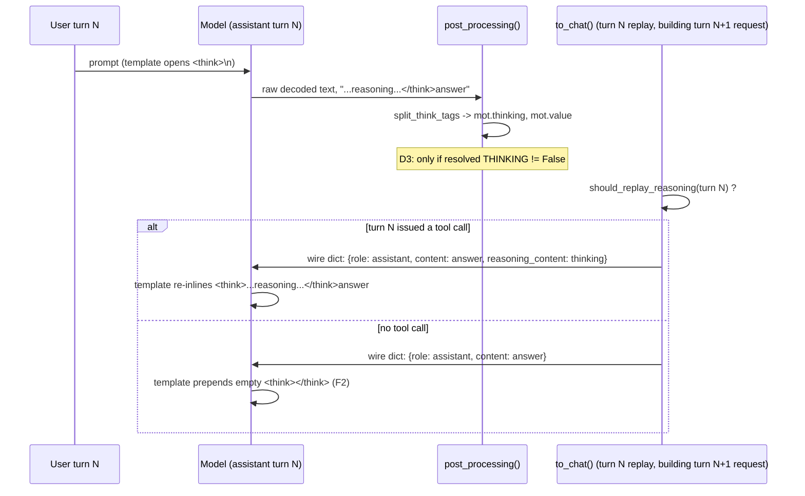

# HF backend reasoning (`<think>` tag) handling — design proposal

> **Status:** Draft proposal, not agreed. Do not implement beyond the
> narrow slice already merging in PR [#1616](https://github.com/generative-computing/mellea/pull/1616)
> until the decisions in Part I §5 are settled.
>
> **Addresses:** [#1604](https://github.com/generative-computing/mellea/issues/1604)
> (umbrella: "implement better hugging face output parsing" — this doc is the
> design work that issue asked for) and the four review comments on PR #1616,
> which implements the narrower [#1610](https://github.com/generative-computing/mellea/issues/1610)
> ("add think tag parsing for granite models to hugging face backend").
>
> **Structure:** Part I is the ask — read it alone and you can say yes/no to
> the shape. Part II is supporting detail: current-state analysis, the
> upstream `transformers` mechanism, the Granite/Qwen3 template mechanism,
> and a full finding list. Appendix indexes referenced issues/PRs and the
> verification trail.
>
> **Terminology stance:** this doc uses *reasoning* and *thinking*
> interchangeably (both appear in code and in HF/Granite/Qwen naming); *think
> tags* refers specifically to the `<think>`/`</think>` textual delimiters.
> Full glossary in Part II §7.

## Part I — Summary for agreement

### §1 Problem

**The reported symptom.** `LocalHFBackend` never populated
`ModelOutputThunk.thinking`. Every other backend Mellea supports — Ollama,
LiteLLM, OpenAI, WatsonX — gets reasoning pre-separated from the answer by its
SDK: the transport delivers `thinking`/`reasoning_content` as a field distinct
from `content`. HF's `transformers.generate()` returns one flat token
sequence; decoding it (`mellea/backends/huggingface.py:1701-1710`,
`skip_special_tokens=True`) leaves Granite's `<think>...</think>` block glued
inline to `mot.value`, unparsed, visible to end users, and liable to confuse
anything scanning the answer text (tool-call detection, requirement checks).
Granite's `<think>`/`</think>` tokens are registered `special: false` in its
tokenizer, so `skip_special_tokens=True` does not strip them — they survive
into the decoded string as literal text.

PR #1616 fixes this for the common case: a `_split_think_tags()` helper,
wired into `post_processing()`, partitions the decoded text on the first
`</think>` when the active chat template declares a thinking variable.

**The deeper framing.** HF is the *only* backend where Mellea, not the
provider SDK, owns the reasoning/answer split. That makes this a genuine
backend-local policy decision — where the split happens, what "raw" means
once it has, and how a split value round-trips back into history — not
transport plumbing. Mellea has never written that policy down, and issue
#1610 asked only for the split itself, not for the policy around it.

**The scope framing.** The reviewer who wrote #1610 (jakelorocco) left four
inline comments on PR #1616 and said directly: *"I think I did not realize
how many aspects of the hf backend this would impact when I created the
issue. I think there's actually a fair bit of design work that might be
required to address these concerns."* Investigation for this doc confirms
all four comments are real, and surfaces five more gaps the four comments
didn't cover. The table below shows why a 45-line diff touches this much
surface:

| Subsystem touched | How |
|---|---|
| LRU cache (`_cache`/`cache_get`/`cache_put`) | Cache key computed from the pre-split string's object identity |
| History serialization (`to_chat`) | Reasoning is dropped on replay, and — new finding — the model's own template reacts to that absence |
| Chat-template introspection (`_chat_template_allowlist`) | Gate only checks which variable *names* a template declares, never resolved values |
| Tool-call scanning, stop-string/finish-reason derivation | Correctly read different values (split vs. raw) — confirmed right, but undocumented as intentional |
| `GenerateLog` / observability | Reasoning is absent from the trace |
| Intrinsic adapter functions (RAG/core aLoRAs) | Now receive reasoning-free response text where they previously didn't — a real, untested behaviour change |
| Streaming (`astream()`) | Split is skipped entirely; `m serve` still shows raw tags |

### §2 Goals / non-goals

**Goals:**
- One written policy for *where* the reasoning/answer split happens, *what
  value* each downstream consumer (cache, tool-call scanner, `to_chat`,
  intrinsics, logging) should read, and *how* a split value round-trips
  through multi-turn history.
- Resolve the four PR #1616 review comments with a stated position each, not
  just a restatement of the problem.
- Name what stays deliberately out of scope, and why.

**Non-goals:**
- Incremental (streaming-safe) splitting. Already deferred to #1604 by PR
  #1616's own comments; this doc keeps that deferral but insists it be named
  prominently (§6), not buried, since it is the gap most visible to `m
  serve` users.
- A general multi-convention reasoning parser for models Mellea doesn't ship
  against (channel-based conventions like gpt-oss, bracket conventions like
  `[THINK]`). See Part II §13 (Generality).
- Revisiting `should_replay_reasoning`'s existing cross-backend consensus
  rule (reasoning replays only on an assistant turn that issued a tool call)
  — from prior work tracked in #1201, referenced in
  `mellea/helpers/openai_compatible_helpers.py:321-354`. This doc asks
  whether to *apply* that rule to HF, not whether to change it.

### §3 Key terms

- **Capture** — reasoning text becoming `mot.thinking` (separate from
  `mot.value`), for the turn just generated.
- **Replay** — a *previous* turn's `Message.thinking` being sent back to the
  model as part of the next turn's input.
- **Template-declared thinking variable** — a Jinja variable name
  (`enable_thinking`, `think`, `thinking`) that a model's chat template
  references, detected today by static AST introspection
  (`_chat_template_allowlist`, Part II §8), independent of what value was
  actually passed for it.
- Full glossary: Part II §7.

### §4 Decisions

Each decision states the recommended position and the alternative rejected.
Corresponding open questions (where the position isn't fully settled) are in
§5.

**D1 — Where the split happens, and what "raw" means.** *Shipped.*
Recommended, and now implemented: keep exactly one split point, in
`post_processing()`, and treat the pre-split decoded string (captured
locally as `raw_value` before the split) as the canonical "raw" text for
that turn. Every consumer either reads before this point (raw) or after
(split) — no third copy. The executable sequence, as shipped: (1) build
`cache_info` from `hf_output`'s KV-cache/scores fields and clear those
fields from `hf_output`, but do **not** cache-key or cache-put yet; (2)
capture `raw_value = mot.value`; (3) run the resolved-value-gated split
(D3), reassigning `mot.value`; (4) only now compute `cache_key = id(mot.value)`
and `cache_put()` (D6) — on the post-split object, not the pre-split one;
(5) the stop-string check reads `raw_value` exclusively, never `mot.value`.
Rejected alternative: adding a new public `raw`-text field to
`ModelOutputThunk` speculatively, before any consumer outside this backend
needs one (see D6 / Q6).

**D2 — Boundary detection: token check, string match, or declared schema.**
Recommended: prefer `transformers`' own `PreTrainedTokenizerBase.parse_response()`
(reads a per-tokenizer `response_schema`) when a tokenizer declares one;
fall back to `_split_think_tags()`'s string partition otherwise, and treat
the fallback explicitly as a fallback in its docstring (currently it reads
as the primary mechanism). See Part II §10 for why upstream's own
`parse_response()` is *also* text-level, not token-level — the reviewer's
"look at the tokens" suggestion (PR comment on `huggingface.py:278`) does
not resolve the ambiguity for Granite, because Granite's real `</think>`
token is itself non-special (Part II §10). Rejected alternative: building a
token-ID-based disambiguator for Granite specifically — verified not to
work for this model family (Part II §10), so building it would be dead
code.

**D3 — Gate on declared variable name alone, or also on resolved value.**
*Shipped.* Recommended, and now implemented: gate on both — the template
must declare a thinking variable *and* the resolved per-call value
(`mot._call.model_options.get(ModelOption.THINKING)` — the same dict
`_filter_for_chat_template` reads `ModelOption.THINKING` from when
resolving the pre-generation template kwargs, so this mirrors what the
model was actually asked to do) must not be explicitly `False`. A
`None`/unset value still allows the split, since both Granite 4.2 and
Qwen3 default thinking to `True` (`chat_template.jinja:13`:
`enable_thinking if ... is defined else True`). Rejected alternative: the
prior behaviour (declared-name only) — confirmed to false-positive
whenever a template declares the variable regardless of its resolved
value (Part II §9, F3).

**D4 — Replay wire format for HF's `to_chat`.** *Interim forward shipped;
final policy still open (Q3).* The interim fix now attaches
`reasoning_content` to the assistant wire dict in `to_chat()`
**unconditionally** (whenever `Message.thinking` is non-empty), not yet
gated by `should_replay_reasoning()`. This was necessary sooner than this
doc's full agreement: shipping D1's capture fix alone, without any replay
forward, silently changed multi-turn HF Granite prompt content (§6, §9 F2)
— every assistant turn without `reasoning_content` gets an empty
`<think></think>` prepended by Granite's own template
(`chat_template.jinja:89-90`), so a plain capture fix drops reasoning the
model previously saw. The unconditional attach restores the pre-#1610
parity (raw tags were inline on every turn before) without deciding D5's
real question. **The final, gated design this doc still recommends** —
attach `reasoning_content` only when `should_replay_reasoning()` says yes
(`openai_compatible_helpers.py:321-354`), matching OpenAI/LiteLLM/WatsonX
(`openai_compatible_helpers.py:471`: `result["reasoning_content"] = msg.thinking`)
— is Q3's open question, not yet implemented. Rejected alternative (the
original reviewer's suggestion at `huggingface.py:1853`): saving a raw
unsplit copy and re-inlining `<think>...</think>` directly into `content`
on replay — contradicts the wire-format convention every other backend
follows, and is unnecessary now that `reasoning_content` is confirmed to
be a real, consumed template variable (Part II §11).

**D5 — Whose replay policy governs: Mellea's or the template's own.**
*Open — this is what the interim D4 forward deliberately left undecided.*
Recommended: once D4 moves off the unconditional interim, apply
`should_replay_reasoning()` first (keeps HF consistent with every other
backend's replay rule), and *document* — not fight — the fact that
Granite's template applies a second, looser gate of its own
(`truncate_history_thinking`, defaulting to `True`, dropping reasoning on
turns before the last user message — `chat_template.jinja:18,99`). A
consequence worth naming explicitly rather than letting D4/D5 quietly
absorb it: applying `should_replay_reasoning()` means a **plain assistant
turn that issued no tool call permanently loses replayed reasoning** on
every subsequent turn, even though the interim unconditional forward
currently preserves it. That is a deliberate policy choice inherited from
the #1201 consensus rule, not an oversight — see Q3 for the explicit
decision this doc asks for. Rejected alternative: skipping Mellea's policy
and relying solely on the template's own truncation, which would make HF's
replay behaviour diverge from OpenAI/LiteLLM/WatsonX for no reason tied to
HF's actual constraints.

**D6 — Cache-key fix timing.** *Shipped.*
Recommended, and now implemented: the split runs before
`cache_key = id(mot.value)` is computed (D1's sequence), so the key is
derived from the same string object `mot.value` holds afterward.
`cache_get()` had zero call sites anywhere in `mellea/` or `test/` before
this fix — this was a latent correctness fix for a not-yet-built consumer,
not a live-bug fix, and a test now exists (Part II §15 item 9) asserting
the key is retrievable, making it the first in-tree `cache_get()` caller.
Rejected alternative: leaving it, on the grounds that nothing reads the cache today
— rejected because a dead-path bug keyed on Python object identity is
invisible to whoever wires up the first reader, and the fix is one line.

### §5 Open questions

Numbered; every question here also appears, unrestated, in Part II §17 (a
back-reference, not a repeated version) with its full context. These are the decisions this doc is *not* making unilaterally.

1. **Will Granite tokenizers ever ship a `response_schema`?** (Cross-team:
   Granite model/tokenizer team.) D2 recommends preferring
   `transformers.PreTrainedTokenizerBase.parse_response()` when a tokenizer
   declares `response_schema`. No Granite tokenizer publishes one today
   (Part II §10), so today's fallback string-parser is the *only* path. If
   the Granite team plans to add one, this doc's fallback parser is
   transitional and should be structured as a fallback from day one (already
   D2's recommendation); if not, it's the permanent mechanism and deserves
   more structure than a single private helper function.
2. **First or last `</think>`?** Granite's own template keeps only the text
   *after the last* closing tag on replay (`chat_template.jinja:107`:
   `c.split('</think>')[-1]`); `_split_think_tags()` partitions on the
   *first* occurrence, and PR #1616's own unit test
   (`test/backends/test_huggingface_thinking.py:77-79`) pins that. Match the
   model's own convention (last), or keep first-occurrence and accept the
   documented divergence? This changes an already-merging test assertion.
3. **Replay-policy layering (D5), and the plain-turn consequence it commits to.**
   Confirm applying `should_replay_reasoning()` before the template's own
   `truncate_history_thinking` gate, per D5's recommendation, rather than
   relying on the template alone or keeping the current unconditional
   interim forward (D4) permanently. This has a concrete, permanent
   consequence that must be decided explicitly rather than absorbed as a
   side effect of "resolving" D4/D5: gating on `should_replay_reasoning()`
   means a plain assistant turn that issued no tool call **permanently
   loses replayed reasoning** on every later turn, even though today's
   interim unconditional forward preserves it. Accept that consequence (it
   matches the #1201 consensus rule every other backend already follows),
   or decide HF should replay reasoning on plain turns too — a genuine,
   named divergence from that consensus, not an oversight?
4. **Silent key drop on templates without `reasoning_content`.** Granite
   4.1, 4.0-micro, granite-switch-4.1-3b-preview, and other non-4.2 model
   templates don't declare `reasoning_content` at all. `apply_chat_template`
   silently drops unknown keys (documented in `merge_provider_fields`'s
   docstring), so attaching `reasoning_content` on those templates is a
   silent no-op — reasoning is requested to replay but nothing renders.
   Accept the silent no-op, add a one-time debug log gated by
   `_chat_template_allowlist`, or refuse to attach the key at all unless the
   active template declares it?
5. **Is the raw/batch generation path in scope?** `_generate_from_raw` (the
   non-chat completion path) never splits at all — it has no chat template
   to introspect, so the whole gating mechanism doesn't apply. Leave this
   path unsplit and documented as out of scope, or is there demand for
   reasoning-splitting on raw completions too?
6. **Promote the local `raw_value` var to a public field?** D1 keeps "raw"
   as the existing local variable at `huggingface.py:1839`. Should this
   become a real field on `ModelOutputThunk` (a public API addition scoped
   to one backend's benefit) so external code — not just HF-internal
   consumers — can reach the pre-split text? No consumer outside this
   backend needs it today.
7. **Does the intrinsic-input behaviour change (Part II §12, G4) need a
   re-baseline?** Adapter functions (`mellea/stdlib/components/intrinsic/`)
   read prior assistant response text via `turn.output.value`
   (`mellea/stdlib/components/intrinsic/_util.py:104-109,249`). On HF, that
   text previously included raw `<think>` blocks and now (post PR #1616)
   doesn't. This is a correctness improvement, but it changes the literal
   input intrinsic aLoRAs see on HF. Is this a documented bug fix, or does
   it warrant re-running intrinsic evals before merge to confirm no
   regression in adapter accuracy?
8. **Can PR #1616 merge independently of this doc?** Recommended: yes, once
   narrowed to D3/D6 plus the observability and docstring items in Part II
   §16 — all uncontroversial, no open design tradeoff. Confirm this framing.
9. **Doc placement and numbering.** This file is placed at
   `docs/dev/proposals/1604-hf-output-parsing.md`, numbered under #1604 (the
   umbrella issue) rather than #1610 (the narrow bug), because #1604 is what
   this design actually resolves. Confirm, or rename/renumber to #1610.
10. **Prose dialect.** Written in UK spelling per the author's standing
    convention; the repository states no dialect preference in
    `AGENTS.md`/`CLAUDE.md`. Confirm, or switch to US spelling for
    consistency with the rest of the docs tree.

### §6 Impact and blast radius

**API surface.** No new public fields proposed by the recommended positions
(D1 rejects a new `ModelOutputThunk.raw_value` field pending Q6; D4 uses the
existing `Message.thinking`/wire-dict mechanism other backends already use).
If Q6 resolves toward "yes, promote it," that is the one public API change
this doc could produce.

**User-archetype impact:**

| User | Before PR #1616 | After PR #1616 (narrowed, per §16) | After this doc's full recommendations |
|---|---|---|---|
| Non-streaming HF chat user | Raw `<think>` block visible in the answer | Clean split; `mot.thinking` populated | Same, plus correct gating on explicit `THINKING=False` |
| `m serve` (streaming) user | Raw `<think>` block visible | **Unchanged — still raw** (streaming split deferred, §6/G1) | Unchanged until #1604's incremental-splitting work |
| Multi-turn HF chat, tool-call turns | Reasoning silently dropped from history (pre-existing gap, not introduced by #1610/#1616) | Still dropped | Reasoning replays via `reasoning_content` per D4/D5 |
| Intrinsic adapter (RAG/core aLoRA) caller on HF | Adapter input included raw `<think>` text | Adapter input is reasoning-free (Q7) | Same, with the change explicitly documented |
| Anything reading `GenerateLog` for HF | Trace includes full raw text | Trace has post-split text only, reasoning absent (§16) | Reasoning added back to the trace |

**Code reach:** confined to `mellea/backends/huggingface.py` and
`mellea/backends/utils.py`; touches `mellea/helpers/openai_compatible_helpers.py`
only by reuse (no changes needed there — `should_replay_reasoning()` and
`message_to_openai_message()`'s `reasoning_content` pattern are reused
as-is). No changes to `mellea/core/base.py`'s `GenFields` hook contract —
confirmed there is no shared cross-backend `post_processing()` signature to
respect (Part II §8), so this stays backend-local.

**Release planning.** Target release: minor version, exact number TBD —
depends on when Q1–Q9 settle.

**Risk register:**
- Splitting on the *first* `</think>` (current behaviour, Q2 open) risks
  truncating an answer if the model ever emits a genuine second use of the
  literal text `</think>` inside its answer — low probability, unverified
  frequency.
- The `to_chat` regression this doc identifies (D4's motivation): PR #1616
  as merged, *before* D4 ships, changes multi-turn prompt content for HF
  Granite conversations (Granite's template re-inlines an empty
  `<think></think>` onto any assistant turn lacking `reasoning_content` —
  `chat_template.jinja:89-90`). This is a behaviour change introduced by the
  capture fix, not a pre-existing gap, and should be called out in PR
  #1616's own description regardless of this doc's timeline.
- Silent no-op risk (Q4) if `reasoning_content` ships before its no-op
  behaviour on older Granite templates is decided.

**Blocking / unblocking.** This doc blocks D4/D5/D2's full resolution (F2,
F4 in Part II §9) from being implemented in PR #1616. It does not block the
narrower fixes in §16, which ship independently per Q8.

---

## Part II — Supporting detail

### §7 Full glossary

| Term | Meaning |
|---|---|
| Capture | Reasoning text becoming `mot.thinking`, separate from `mot.value`, for the turn just generated |
| Replay | A previous turn's `Message.thinking` being sent back to the model in the next turn's input |
| Wire message | The `dict` built for a provider's chat API / `apply_chat_template` call — `{"role": ..., "content": ..., ...}` |
| Template-declared thinking variable | A Jinja variable name (`think`/`thinking`/`enable_thinking`) a chat template's source references, per static AST introspection |
| Resolved thinking value | The actual boolean forwarded for that variable on a specific generation call, derived from `ModelOption.THINKING` |
| Response schema | `transformers`' declarative per-tokenizer metadata describing how to parse structured content (e.g. reasoning) out of generated text — see §10 |
| Raw (this doc) | The fully-decoded text for a generation, before `_split_think_tags()` runs |
| Split / answer | The post-`_split_think_tags()` value assigned to `mot.value` |

### §8 Current-state analysis, per code path

**Chat path — `post_processing()`** (`huggingface.py:1756-1930`):
1. KV-cache metadata captured, keyed `cache_key = id(mot.value)` (line 1820)
   — **before** any split.
2. `raw_value = mot.value` captured locally (line 1839) — this is the "raw"
   text D1 recommends canonicalising.
3. Gate check (lines 1841-1850): `thinking_allowlist.intersection(_CHAT_TEMPLATE_THINKING_VARS)`
   — declared-name check only, no value check (F3, D3).
4. `_split_think_tags(raw_value)` (line 1851) — first-occurrence string
   partition (D2, Q2).
5. Tool-call scan (`to_tool_calls`) runs on the now-split `mot.value` —
   correct: reasoning must not be scanned for tool calls, and Granite emits
   `<tool_call>` after content, so a false-positive split at worst truncates
   an answer prefix, not a tool call (Part II §12, G6 — no fix needed, just
   documented as intentional).
6. Stop-string / finish-reason derivation (lines 1908-1924) reads `raw_value`
   (the *pre-split* text), not `mot.value` — correct as written, since a
   stop string could itself be `</think>`-adjacent; this local var is
   effectively already D1's "raw" concept, just not yet named as
   canonical or documented as intentional (G5).

**Raw/batch path — `_generate_from_raw`:** no chat template, no gating
mechanism, no split. Text returned as-is (Q5 — in/out of scope).

**`to_chat()`** (`mellea/backends/utils.py:74-134`) — *state as of this
doc's first draft, before D4's interim forward shipped:* built each wire
message from `{"role": m.role, "content": formatter.print(m)}` only —
`m.thinking` was never read. A pre-existing comment already named this gap,
referencing #1201 (the capture-gap issue this fix closes), not #1604 as an
earlier draft of this doc mistakenly said. As of D4's interim forward
(§4, §9 F2), `to_chat()` now attaches `reasoning_content` unconditionally;
the comment there now cites this doc and #1604 for the remaining,
still-open gated-replay design (D5/Q3).

**`Message._parse()`** (`mellea/stdlib/components/chat.py:207-292`): the HF
fallback branch (there is no HF-specific provider branch — HF's raw
response has no role/content structure to parse, so it falls through to a
generic path) *does* correctly carry `thinking` forward: `Message(role="assistant",
content=computed.value, thinking=computed.thinking)` (lines 264, 291). The
drop is specifically and only inside `to_chat()`, not here.

**Two unrelated caches, worth distinguishing explicitly** (reviewers will
conflate them): the `_cache`/`cache_get`/`cache_put`/`SimpleLRUCache`
mechanism this doc's D6 fixes is *not* the multi-turn KV-cache-continuation
mechanism (`_make_merged_kv_cache`, `self._cached_blocks: dict[str, DynamicCache]`),
which is keyed by literal `CBlock` content strings and is unaffected by
anything in this doc.

**Streaming (`astream()`):** the gate explicitly excludes streaming
generations (`if not mot.generation.streaming and ...`, line 1848) — the
split never runs during/after a stream. `astream()` itself is a pure
text-length diff (`beginning_length = len(str(mot._underlying_value))`) with
no notion of think tags at all.

### §9 Finding-by-finding resolution

**F1 — Cache key computed pre-split** (PR comment, `huggingface.py:1820`).
Confirmed: `cache_key = id(mot.value)` is Python object-identity of the
pre-split string; `_split_think_tags()` later reassigns `mot.value` to a new
string object, changing its `id()`. Confirmed dead path today: `cache_get()`
(`huggingface.py:2247`ish) has zero call sites in `mellea/` or `test/`.
Resolution: D6 — fix now regardless of doc outcome (one-line reorder).

**F2 — `to_chat` round-trip** (PR comment, `huggingface.py:1853`) — live
bug, bigger than the original comment suggested. Confirmed: `to_chat()`
drops `m.thinking` unconditionally. New finding beyond the PR comment:
Granite's template re-inlines an *empty* `<think></think>` onto any
assistant turn lacking `reasoning_content` (`chat_template.jinja:89-90`),
so PR #1616's capture fix — by finally putting reasoning into a field
`to_chat()` doesn't forward — silently changes multi-turn prompt content
for HF Granite conversations that previously carried the inline block
straight through. This is a regression the capture fix introduces, not
merely a missing round-trip feature — and because it changes model input
before any replay mitigation ships, it was treated as blocking rather than
deferrable. *Mitigated:* `to_chat()` now attaches `reasoning_content`
unconditionally (D4's interim forward), restoring parity with the pre-fix
behavior. *Still open:* the final, gated design (attach only per
`should_replay_reasoning()`, D5) remains an open question (Q3), including
the plain-turn consequence named there explicitly.

**F3 — Gating checks declared name, not resolved value** (PR comment,
`huggingface.py:1850`). Confirmed via direct read of the gate logic
(§8 step 3) and the template (`chat_template.jinja:13`, default `True`).
The existing e2e test for "thinking disabled"
(`test/backends/test_huggingface_thinking_e2e.py`,
`test_thinking_disabled_leaves_mot_thinking_none`) passes for an unrelated
reason: Granite genuinely emits no `</think>` when thinking is off, not
because the gate itself checks the resolved value. Resolution: D3.

**F4 — Token vs. text boundary detection** (PR comment,
`huggingface.py:278`) — confirmed, and the reviewer's own suggested
direction ("look at the tokens") does not resolve it for this model family.
See §10 for the full mechanism trace. Resolution: D2 (prefer
`response_schema`/`parse_response` when available; otherwise the existing
string fallback, explicitly labelled as a fallback, combined with D3's
resolved-value gate to reduce — not eliminate — false-positive risk).

Beyond the four review comments, this investigation found:

**G1 — Streaming still shows raw tags.** Already named in the PR's own
comments as deferred to #1604. This doc keeps that deferral (non-goal, §2)
but insists §6's impact table name it explicitly, since it's the gap most
visible to interactive users.

**G2 — Raw/batch path never splits.** §8, Q5.

**G3 — `GenerateLog` drops reasoning from the trace.** Other backends'
`GenerateLog` equivalents record the full provider response (which includes
reasoning); HF's records only the post-split `mot.value`. Resolution:
include reasoning in the log or its `extra` field — cheap, no design
tradeoff, part of §16's narrow slice.

**G4 — Intrinsic adapter functions see different input text than before.**
`mellea/stdlib/components/intrinsic/_util.py:104-109,249` reads
`turn.output.value` to build adapter input. HF and OpenAI are the only two
`AdapterMixin`-capable backends today. Before PR #1616, HF intrinsic input
on a thinking-enabled turn included the raw `<think>` block; after, it
doesn't. No existing test pins either the old or the new behaviour. This is
almost certainly a correctness improvement (adapters shouldn't see
reasoning noise) but is an unannounced behaviour change with real
consequences for anyone running intrinsic evals against HF. See Q7.

**G5 — Stop-string check correctly reads `raw_value`.** Confirmed correct
as written (§8); flagged here only so a future refactor doesn't
"helpfully" switch it to `mot.value` and break stop-string detection when a
stop string happens to be near a think-tag boundary. Resolution: add a
one-line comment pinning this, part of §16.

**G6 — Tool-call scan correctly reads post-split `mot.value`.** Confirmed
correct (§8); no fix needed, included here so reviewers don't re-litigate
it as a bug.

**G7 — Two layered replay policies.** Mellea's `should_replay_reasoning()`
(tool-call turns only) and Granite's own `truncate_history_thinking`
(all turns at/after the last user message) are both real and both would
apply if D4 ships. Resolution: D5.

**G8 — `Message._parse`'s HF fallback already carries `thinking` correctly.**
Confirmed (§8); included so no one "fixes" `_parse()` — the bug is
downstream, in `to_chat()`, only.

**G9 — No shared `post_processing()` contract across backends.** Confirmed:
every backend defines its own signature; the only shared contract is
`GenFields.process`/`post_process` coroutine hook slots in
`mellea/core/base.py`, invoked generically by `ModelOutputThunk` without
knowledge of each backend's internals. Included as a scope-limiter: nothing
in D1–D6 requires a cross-backend architecture change — it's all local to
`huggingface.py`/`utils.py`.

### §10 The upstream mechanism (`transformers.parse_response`)

Per this skill's "verify upstream before inventing a parallel concept"
rule: `transformers` (as vendored in this environment) already ships
`PreTrainedTokenizerBase.parse_response(response, schema=None)`, which
reads `tokenizer.response_schema` and, when present, runs a
`recursive_parse` over the *decoded text* to split out structured content
(including reasoning) per the schema. When no schema is set, it raises
`AttributeError`.

Two things follow directly from reading this mechanism, both load-bearing
for D2 and F4:

1. **No tokenizer available to Mellea today — including every Granite
   variant checked — declares a `response_schema`.** So `parse_response()`
   is not usable today; `_split_think_tags()`'s string fallback is the only
   working path, exactly as #1604 anticipated when it asked for "better
   output parsing."
2. **Even `parse_response()` operates on decoded text, not raw token
   IDs.** It calls `self.decode()` internally before parsing. This means
   the reviewer's "look at the tokens" suggestion (PR comment,
   `huggingface.py:278`) is not how upstream itself solves this class of
   problem either — upstream's answer to "don't confuse literal text with
   a control delimiter" is a *declared schema*, not token inspection.
   Verified separately (§8, §10): Granite's actual `</think>` token is
   itself registered `special: false` in its tokenizer, so even a
   token-identity check (had `_split_think_tags` been given token access)
   would not distinguish "the model emitted the genuine end-of-reasoning
   token" from "the model wrote the four characters `</think>` as prose" —
   both decode to the identical string, and the real token carries no
   distinguishing flag either way.

Conclusion: `_split_think_tags()` should be documented explicitly as a
fallback for `parse_response()`/`response_schema`, not as the primary
mechanism it currently reads as. If/when Granite tokenizers gain a
`response_schema` (Q1, a cross-team ask), Mellea should prefer that path.

### §11 The model's own template as source of truth

Verified directly against the on-disk artefact (not inferred):
`~/.cache/huggingface/hub/models--ibm-granite--granite-4.2-3b/snapshots/.../chat_template.jinja`.

- Line 13: ``
  — thinking defaults **on**.
- Line 18: ``
  — history truncation of reasoning also defaults **on**.
- Lines 83-84: ``
  → ``
  — **the template already has a working mechanism for accepting prior
  reasoning via a `reasoning_content` key and re-inlining it.** This is the
  mechanism D4 recommends using.
- Lines 89-90: `` —
  the source of F2's newly-found regression: any assistant turn arriving
  *without* think tags (i.e., without `reasoning_content` set) gets an empty
  `<think></think>` pair silently prepended.
- Lines 99, 105-112: history-truncation logic — turns before the last user
  message get reasoning dropped (if `truncate_history_thinking`), and
  turns that keep reasoning split on the **last** `</think>` occurrence
  (`c.split('</think>')[-1]`) — the opposite occurrence rule from
  `_split_think_tags()`'s first-occurrence partition (Q2).
- Lines 137-145: a second truncation branch with the same last-occurrence
  rule (`c.split('</think>')[-1]`), confirming this is the template's
  consistent convention, not a one-off.
- Lines 179-182: generation-prompt construction opens `<think>\n` (or the
  already-closed `<think></think>` when `enable_thinking` is false) — this
  confirms the opening tag is baked into the *prompt*, matching
  `_split_think_tags()`'s docstring rationale for splitting on `</think>`
  alone.

Qwen3's chat template (checked for generality, not reproduced verbatim
here) uses the same `reasoning_content` key and a `preserve_thinking`-style
gate with equivalent semantics — this is a cross-model Jinja convention
among reasoning models with think-tag delimiters, not a Granite-only
mechanism. Named as such in §13.

Round-trip sequence (proposed, D4/D5):

### §12 Consumer matrix

| Consumer | Reads today | Should read (proposed) | Notes |
|---|---|---|---|
| End user (`mot.value`) | Split answer (post PR #1616) | Same | Correct already |
| Tool-call scan (`to_tool_calls`) | Split `mot.value` | Same | G6 — correct, document as intentional |
| Stop-string / finish-reason | Pre-split `raw_value` | Same | G5 — correct, document as intentional |
| LRU cache key (`cache_key = id(mot.value)`) | Pre-split object identity | Post-split, or a stable key | F1/D6 |
| `to_chat()` wire message | `mot.value` only | `mot.value` + `reasoning_content` (gated) | F2/D4/D5 |
| `GenerateLog` | Post-split `mot.value` only | Include reasoning | G3 |
| Intrinsic adapter input (`_extract_last_response`) | Split, reasoning-free text (post PR #1616) | Same (this is the improvement) | G4 — behaviour change, needs Q7 |
| `astream()` deltas | Raw, unsplit, growing string | Unchanged (non-goal, §2) | G1 |
| `_generate_from_raw` completions | Raw, unsplit | Unchanged unless Q5 says otherwise | G2 |

### §13 Generality

Is this design Granite-specific? Partially, and this doc should say so
plainly rather than imply universality:

- **Generalises:** the declared-thinking-variable gate (D3), the
  `reasoning_content` replay key (D4), and the `<think>`/`</think>` literal
  boundary all generalise cleanly to Qwen3 (confirmed, §11) and to any
  future Granite-family model following the same template convention.
- **Does not generalise:** models using channel-based reasoning conventions
  (e.g. gpt-oss's channel markers) or bracket conventions (`[THINK]...[/THINK]`)
  would need a different boundary detector entirely — `_split_think_tags()`
  is scoped to the `<think>`/`</think>` textual convention by design
  (its own docstring already says this), and this doc doesn't propose
  changing that scope.
- If a second convention arrives, the natural extension point is a small
  per-model-family convention table keyed by the same
  `_chat_template_allowlist` introspection this doc already relies on — not
  designed here, since no second model needing it exists yet.

### §14 Observability

- `GenerateLog` should carry reasoning (G3) so debug/eval traces aren't
  missing it — matches what OpenAI/LiteLLM/WatsonX backends already log.
- A debug log line already exists on successful split
  (`huggingface.py`, `MelleaLogger.get_logger().debug(...)` after the split)
  — recommend a matching debug line when the gate *would* have split but
  the resolved-value check (D3) suppressed it, to make Q4's silent-no-op
  risk debuggable.

### §15 Docs and tests

All items below currently have zero coverage — required, not optional,
before the design's full recommendations (D4/D2/D5) ship:

1. Gate honours explicit `ModelOption.THINKING=False` with synthetic text
   containing a literal `</think>` — asserts no split (the case F3/D3 fixes).
2. Gate still splits when `THINKING` is unset (`None`) on a template that
   thinks by default — guards against over-correcting D3.
3. `to_chat()` with a non-empty `Message.thinking`: asserts `reasoning_content`
   present on the assistant wire dict for a tool-call turn, absent for a
   plain turn (existing `test/backends/test_utils.py` `to_chat` tests don't
   set `.thinking` at all today).
4. HF rows added to `test/backends/test_reasoning_replay.py` (currently
   covers OpenAI/Ollama/WatsonX only).
5. A rendered-prompt assertion: run `apply_chat_template` over a two-turn
   conversation and assert reasoning appears in the rendered string — the
   only test that catches Q4's silent-key-drop failure mode.
6. Truncated-reasoning case: thinking on, generation hits `max_new_tokens`
   before any `</think>` appears — assert whatever behaviour this doc's
   resolution of D2/D3 settles on (today: `_split_think_tags` returns
   `(None, text)`, silently surfacing the entire reasoning block as the
   answer).
7. Occurrence-rule test updated or explicitly justified if Q2 resolves
   toward last-occurrence (currently pinned first-occurrence at
   `test/backends/test_huggingface_thinking.py:77-79`).
8. An intrinsic-level test pinning that adapter functions receive
   reasoning-free response text on HF (G4/Q7).
9. A cache test: assert the key computed in `post_processing()` is
   retrievable via `cache_get()` after the split (F1/D6) — would be the
   first in-tree caller of `cache_get()`.
10. A guard test confirming a model whose template declares no thinking
    variable never attempts a split.

### §16 Migration / sequencing

**Shipped in PR #1616, independent of this doc's remaining open questions
(Q8):** D6 (cache-key reorder, with the test at §15 item 9 — the first
in-tree `cache_get()` caller), D3 (resolved-value gate, with the tests at
§15 items 1-2), G3 (`GenerateLog` reasoning), G5 (pin the `raw_value`
intent with a comment), relabelling `_split_think_tags()`'s docstring as a
`response_schema` fallback (§10), and — moved up from "waits for D5"
because leaving it unaddressed would have shipped a silent multi-turn
prompt regression (F2) — D4's **interim, unconditional** `reasoning_content`
forward in `to_chat()`, with the round-trip tests at §15 item 3. PR #1616's
description flags G4 (Q7) so reviewers running intrinsic evals know input
text changed, and discloses the F2 regression this interim forward
mitigates.

**Waits for this doc's decisions (D4's final gated form, D5, D2/Q2, Q4, Q5, Q6):**
everything else. Sequencing once agreed: D4's move from unconditional to
`should_replay_reasoning()`-gated and D5 (replay policy layering) ship
together as one PR (they're the same code path, and D5's plain-turn
consequence per §5 Q3 must be decided first); D2's
`response_schema` preference ships whenever Q1 resolves (likely later,
gated on an external team); Q5 (raw path) and Q6 (public field promotion)
are independent follow-ups if their answers are "yes."

### §17 Open questions (full list)

Back-reference only — each item below is the same decision as its Part I
§5 counterpart, not a restated version. See §5 for the question text.

1. Q1 → Part I §5.1 (`response_schema` availability; cross-team, Granite tokenizer team).
2. Q2 → Part I §5.2 (first- vs. last-`</think>` occurrence; see §11 for the template evidence).
3. Q3 → Part I §5.3 (replay-policy layering, D5).
4. Q4 → Part I §5.4 (silent `reasoning_content` key drop on older templates).
5. Q5 → Part I §5.5 (raw/batch path in scope?).
6. Q6 → Part I §5.6 (promote `raw_value` to a public field?).
7. Q7 → Part I §5.7 (intrinsic-input behaviour change; re-baseline needed?).
8. Q8 → Part I §5.8 (can PR #1616 merge independently of this doc?).
9. Q9 → Part I §5.9 (doc placement and numbering).
10. Q10 → Part I §5.10 (prose dialect).

---

## Appendix

### Tracking items

| Ref | Relation to this doc |
|---|---|
| [#1604](https://github.com/generative-computing/mellea/issues/1604) | Umbrella issue this doc resolves; this doc's numbering |
| [#1610](https://github.com/generative-computing/mellea/issues/1610) | The narrow bug PR #1616 fixes; this doc's proximate trigger |
| [#1201](https://github.com/generative-computing/mellea/issues/1201) (referenced, not re-opened) | Prior cross-backend consensus on `should_replay_reasoning`; this doc asks whether to apply it to HF, not to change it |
| PR [#1616](https://github.com/generative-computing/mellea/pull/1616) | Draft implementation under review; stays open per this doc's Part I §5 Q8 |

### History and rework evidence

- PR #1616, single commit `bf0f45e6`. Four inline review comments from
  `jakelorocco` at `huggingface.py:278`, `:1820`, `:1850`, `:1853`
  (verbatim quotes reproduced in Part I §1 and Part II §9).
- Top-level review comment from `jakelorocco`: *"I think I did not realize
  how many aspects of the hf backend this would impact when I created the
  issue. I think there's actually a fair bit of design work that might be
  required to address these concerns."*
- Pre-existing acknowledgement of the `to_chat` gap already in the codebase
  before this PR, at `mellea/backends/utils.py:100-104`, referencing **#1201**
  (corrected from an earlier draft of this doc, which incorrectly cited #1604) —
  evidence the gap was known before #1610 was filed.

### Related in-flight work

- Streaming-safe incremental splitting (deferred non-goal, §2/G1) — tracked
  under #1604, not designed in this doc.

### Verification trail

- Cache-key, `to_chat` drop, gating logic, and token-boundary claims:
  traced against `mellea/backends/huggingface.py`, `mellea/backends/utils.py`,
  `mellea/helpers/openai_compatible_helpers.py`, and
  `mellea/stdlib/components/chat.py` at the commit checked out in this
  worktree (`bf0f45e6` head of `issue-1610`); line numbers re-verified
  directly (not solely from prior research notes) immediately before this
  doc was written.
- Granite 4.2 template mechanism (`reasoning_content`, last-occurrence
  split, default-thinking-`True`): verified directly against
  `~/.cache/huggingface/hub/models--ibm-granite--granite-4.2-3b/snapshots/b7e947307dd2efb3ad3b853b0e8a7e75f8ad4ac2/chat_template.jinja`
  lines 13, 18, 83-118, 137-145, 179-182 on disk.
- `transformers.parse_response`/`response_schema` mechanism (§10): verified
  against the vendored `transformers` source in this environment; confirmed
  no Granite tokenizer checked declares a `response_schema`.
- Intrinsic adapter consumption (G4): verified against
  `mellea/stdlib/components/intrinsic/_util.py:104-109,249`.
