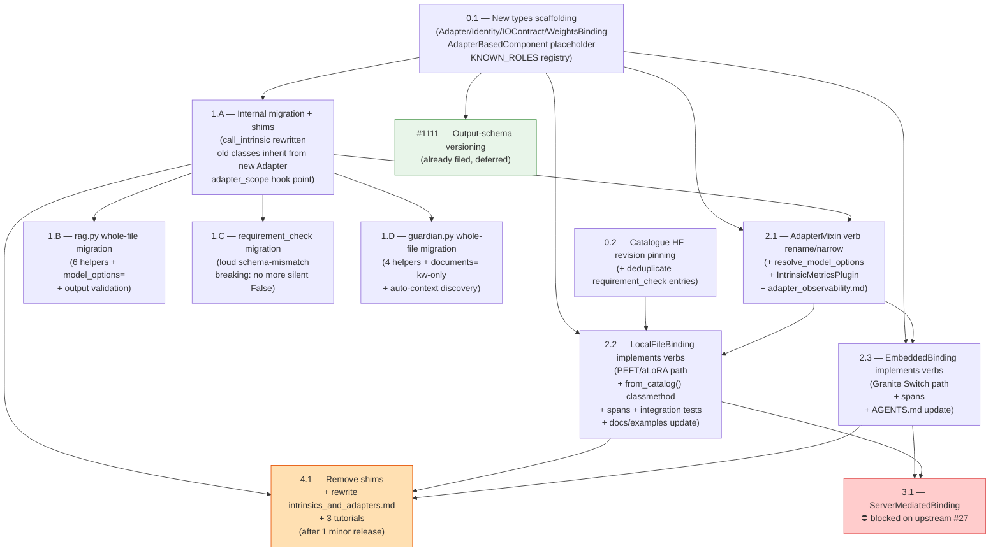

# Epic #929 — Issue Breakdown Plan

> **Companion to:** [929-adapter-lifecycle.md](./929-adapter-lifecycle.md) (the design proposal)
> **Parent epic:** [#929](https://github.com/generative-computing/mellea/issues/929)
> **PR:** [#1080](https://github.com/generative-computing/mellea/pull/1080)
> **Status:** review draft — issues to be filed after final approval
>
> This document combines the decomposition rationale, dependency diagram,
> filing plan, and full issue bodies for all 11 sub-issues. After issues
> are filed and PR #1080 closes, this becomes a historical artefact.

---

# Part 1 — Overview

**Parent:** [#929](https://github.com/generative-computing/mellea/issues/929) — Fix Intrinsic Adapter Lifecycle & Consistency in Mellea  
**Design proposal:** PR [#1080](https://github.com/generative-computing/mellea/pull/1080)  
**Detailed breakdown:** [`proposed-issues.v3.md`](./proposed-issues.v3.md) (full issue bodies, acceptance criteria, test plans)  
**Date:** 2026-05-21

---

## Background and rationale

The adapter/intrinsic area has produced seven fix-up commits in a short period, three silent bugs, and blocked two features (#1018, #27). The root cause is a single structural problem: code that should know what *kind* of adapter it is (local PEFT file, Granite Switch embedded, server-mediated) spreads that decision across every call site via `isinstance` branching. Adding a new backend reality forces a new branch everywhere.

The refactor replaces a four-class hierarchy (`IntrinsicAdapter`, `EmbeddedIntrinsicAdapter`, `CustomIntrinsicAdapter`, abstract `Adapter`) with a single composable type:

```
Adapter
├── identity      — name, adapter_type (lora|alora), optional role
├── io_contract   — wraps granite-common / granite-formatters; builds prompt, parses output
└── weights       — pluggable WeightsBinding: LocalFile / Embedded / ServerMediated
```

The binding says what kind of adapter it is. The backend executes four verbs (`prepare`, `activate`, `deactivate`, `release`) uniformly — no branching.

### Why decompose at all?

A single "refactor everything" PR would be: unreviable (thousands of LOC), all-or-nothing (any regression blocks the whole change), impossible to parallelise, and catastrophic to rebase if upstream keeps moving. The decomposition ensures:

- **Each PR is reviewable** — scoped to one file, one abstraction surface, or one coherent concern. Reviewers see a clear before/after, not a diff that touches 30 files.
- **Breakage is isolated** — each phase keeps existing tests green; a regression in one PR does not block all other work.
- **Work can be parallelised** — after the two bottleneck PRs (1.A and 2.1) merge, three to four independent PRs can proceed simultaneously.
- **Stacked PRs are minimised** — the only true stacks are 0.1→1.A and 1.A→2.1. Everything else in each wave is independent.
- **Incremental user-visible improvement** — each phase delivers working, shippable code; the epic does not need to land as a big-bang release.

---

## Decomposition shape — 11 issues

| Issue | Phase | Title | Depends on | Blocks |
|---|---|---|---|---|
| **0.1** | 0 | Introduce `Adapter` / `Identity` / `IOContract` / `WeightsBinding` scaffolding (+ `AdapterBasedComponent` placeholder, `KNOWN_ROLES`) | — | 1.A, 2.1, 2.2, 2.3 |
| **0.2** | 0 | Pin catalogue entries to HF revision SHAs (+ deduplicate requirement_check entries) | — | 2.2 |
| **1.A** | 1 | Internal migration with shims — old classes inherit from new `Adapter`; `call_intrinsic` rewritten | 0.1 | 1.B, 1.C, 1.D, 2.1 |
| **1.B** | 1 | RAG helpers (`rag.py` whole-file, 6 helpers) migrate to new types | 1.A | — |
| **1.C** | 1 | `requirement_check` / `requirement_check_to_bool` migrate to new types; schema-mismatch becomes loud | 1.A | — |
| **1.D** | 1 | `guardian.py` whole-file migration (4 helpers + `documents=` keyword-only + auto-context discovery) | 1.A | — |
| **2.1** | 2 | `AdapterMixin` verb rename/narrow + `resolve_model_options` centralisation + `IntrinsicMetricsPlugin` | 1.A | 2.2, 2.3 |
| **2.2** | 2 | `LocalFileBinding` implements verbs (PEFT/aLoRA path) + `from_catalog()` + spans + integration tests | 0.1, 0.2, 2.1 | 4.1 |
| **2.3** | 2 | `EmbeddedBinding` implements verbs (Granite Switch path) + spans | 0.1, 2.1 | 4.1 |
| **3.1** | 3 | `ServerMediatedBinding` implementation — **blocked on upstream #27 (vLLM aLoRA)** | Phase 2 + #27 | — |
| **4.1** | 4 | Remove deprecation shims; rewrite `docs/dev/intrinsics_and_adapters.md`; write 3 tutorials | 1.A + Phase 2 + 1 minor release | — |
| **[#1111](https://github.com/generative-computing/mellea/issues/1111)** | cross | Output-schema versioning (already filed, deferred) | 0.1 (needs `AdapterSchemaMismatchError`) + trigger conditions | — |

---

## Dependency diagram



---

## Filing waves

For a single developer, the waves define the serialisation constraint. Within each wave, issues are independent — the first to get a PR open does not block the others.

**Wave 1** (start immediately, parallel):  
→ 0.1, 0.2 — both independent; no shared files.

**Wave 2** (after 0.1 has a draft PR):  
→ 1.A — the only Phase 1 bottleneck. Kept deliberately narrow (~300–500 LOC) so it merges quickly.

**Wave 3** (after 1.A merges — four issues run fully in parallel):  
→ 1.B, 1.C, 1.D (independent helper files), and 2.1 (backend mixin) in parallel.

**Wave 4** (after 2.1 merges):  
→ 2.2, 2.3 — independent bindings for the two active realities.

**Tracking / deferred** (file any time, mark blocked):  
→ 3.1 (blocked on #27), 4.1 (deferred one minor release after shims introduced in 1.A).

The two bottlenecks (1.A, 2.1) are the only serialisation points. Kept small by design.

---

## Pre-flight — open issues and PRs to resolve first

| Item | Overlap | Action |
|---|---|---|
| **PR #935** — Guardian docs migration | Touches same docs as 1.D/2.2/2.3 | Merge before starting 1.D |
| **PR #1078** — intrinsic tests / safeguards (fixes #1029) | Adds formatter test data that 0.2/1.C build on | Merge before starting 0.2/1.C; close #1029 |
| **#1094** — Migrate session example off deprecated GuardianCheck | Same file as 1.D scope | Close with 1.D (include in 1.D scope) |
| **#1071** — Guardian-backed Requirement subclass (new feature) | Adds guardian code in old style | Do not start before 1.D merges |

---

## What each phase delivers

| Phase | Delivered | Breakage risk |
|---|---|---|
| 0 | New type vocabulary; catalogue with pinned SHAs; `KNOWN_ROLES` advisory registry | None for users — purely additive |
| 1 | All helpers on new types; `model_options=` on all helpers; loud schema-mismatch errors; deprecation warnings on old construction | `requirement_check_to_bool` stops returning silent `False` (intentional breaking change; flagged in changelog) |
| 2 | Fully working `LocalFileBinding` and `EmbeddedBinding`; observability spans + metrics; `from_catalog()` API; backend mixin cleaned up | `AdapterMixin` verb rename (downstream backends must update; migration table in changelog) |
| 3 | `ServerMediatedBinding` (when unblocked) | Internal to OpenAI backend |
| 4 | Shims removed; full docs rewrite; three tutorials | Old class imports break (by design, after deprecation window) |

---

## Cross-cutting deliverables (not phase-specific)

Every issue includes its own tests. The end state across all phases also delivers:

- **Telemetry:** `IntrinsicMetricsPlugin` (2.1) + per-verb OTel spans `intrinsic.call / prepare / activate / parse / deactivate` (2.2, 2.3). `parse_failures` counter is the schema-drift detector — a climbing count against `(name, revision)` means an upstream adapter pushed a breaking schema change. Content capture via `MELLEA_TRACE_CONTENT` gate (consistent with #1035 / PR #1036).
- **Docs:** `docs/dev/requirement_aLoRA_rerouting.md` (1.A), `docs/docs/advanced/intrinsics.md` (2.2, 2.3), `docs/dev/adapter_observability.md` (2.1+), `AGENTS.md §13` (2.3), full rewrite of `docs/dev/intrinsics_and_adapters.md` (4.1), three tutorials (4.1).
- **Examples:** `docs/examples/intrinsics/` updated at every helper-migration PR (1.B, 1.C, 1.D) and the new construction pattern added at 2.2.
- **Output-schema versioning:** tracked separately in [#1111](https://github.com/generative-computing/mellea/issues/1111); unblocked when `AdapterSchemaMismatchError` exists (0.1).

---

*Detailed issue bodies (problem, agreed design, scope, out of scope, acceptance criteria, test plan, risks, breaking changes, impinging issues, references) are in [`proposed-issues.v3.md`](./proposed-issues.v3.md) in this directory.*

---

# Part 2 — Full issue bodies

# Per-helper-file migration template

Issues 1.B, 1.C, 1.D share the same shape. Each issue body says "follows the per-helper-file migration template" plus the file-specific deltas.

### Common shape per migrated file

Each per-file PR does four things, in this order, on a single helper file:

1. **Migrate construction.** Replace internal use of `IntrinsicAdapter(...)` / `EmbeddedIntrinsicAdapter(...)` with direct construction of `Adapter(identity=..., io_contract=..., weights=...)` from the new types introduced in 0.1.
2. **Normalise signature.** Add `model_options: dict | None = None` as a keyword argument to every helper in the file. (File-specific: 1.D's factuality helpers also add `documents=` keyword-only — see 1.D.)
3. **Add output validation (Jake req 4).** Declare each helper's expected output contract; wire `io_contract.parse()` to raise `AdapterSchemaMismatchError` when parse cannot yield that contract. Forward-compatible additions (extra optional fields the parser ignores) do NOT raise — only contract-breaking deltas (missing required field, type change on a depended-on key) do.
4. **Update docs and examples.** The Phase 1 per-file PRs are when helpers gain new parameters and contracts; docs and examples must ship with the code, not after. Each per-file PR is responsible for: (a) updating the docstring for every helper it touches with the declared output contract and any new parameters; (b) updating `docs/examples/intrinsics/` examples that call helpers in this file; (c) adding a brief note to the PR description pointing at any user-facing docs page that needs a follow-up rewrite in Phase 2.

### Common acceptance criteria

- [ ] All helpers in the file construct their `Adapter` using the new types (no `IntrinsicAdapter(...)` calls in helper code)
- [ ] All helpers accept `model_options: dict | None = None` (file-specific extras as noted in each issue)
- [ ] Each helper's output is validated against a declared contract; `AdapterSchemaMismatchError` raised on contract-break, NOT on benign additions
- [ ] Existing helper tests pass (behavioural neutrality is the bar)
- [ ] New tests cover: (a) declared contract enforced — feed a synthetic output missing a required field, assert the error; (b) forward-compat — feed an output with an extra optional field, assert it does NOT raise
- [ ] Docstrings updated: every helper in the file documents its declared output contract and any new parameters
- [ ] `docs/examples/intrinsics/` examples that call helpers in this file updated to use `model_options=` where applicable; examples pass `uv run pytest docs/examples/intrinsics/` (or skipped with correct marker if backend-gated)
- [ ] `ruff format`, `ruff check`, `mypy` clean
- [ ] DeprecationWarning suppression: callers can still construct `IntrinsicAdapter(...)` (shim from 1.A) but emit a `DeprecationWarning` pointing at the new construction pattern

### Common test plan

- Existing happy-path tests pass unchanged
- New test: `AdapterSchemaMismatchError` raised on synthetic missing-field output (per helper)
- New test: forward-compatible addition (extra optional field) does NOT raise (per helper)
- Docstring spot-check: `help(check_answerability)` (or equivalent for this file's helpers) shows the declared contract and new parameters

### Why per-file PRs

Each PR is scoped to a single helper file (one coherent concern: "this file's helpers are now on the new types"). They run in parallel after 1.A merges, share no files, and the first one to merge sets the pattern reviewers can lean on for the rest.

---

# Phase 0 — parallel types

## 0.1 — Introduce `Adapter` / `Identity` / `IOContract` / `WeightsBinding` scaffolding (+ `AdapterBasedComponent` placeholder)

**Parent:** #929 · **Blocks:** 1.A, 2.1, 2.2, 2.3 · **Phase:** 0

### Problem

Today's adapter hierarchy is `IntrinsicAdapter` / `EmbeddedIntrinsicAdapter` / `CustomIntrinsicAdapter` plus an abstract base class `Adapter` (in `mellea/backends/adapters/adapter.py`). The split is by *where the weights live* (local PEFT file vs embedded in the base model vs server-mediated), but that distinction leaks into every caller as `isinstance` branching: `_util.call_intrinsic`, requirement rerouting, every helper, and the backends themselves all have separate code paths per subclass.

This branchy structure was the root cause of seven recent fix-up commits in the adapter area (`8b6b8d55`, `c57aba1d`, `8577d092`, `4d372b0e`, `0617bd96`, `75465d29`, `1734900d`). It also blocks adding new realities cleanly — see #1018 (granite-switch on HF backend).

Separately, IBM is retiring the term "Intrinsic" but has not confirmed the replacement name. Mellea agreed to use **`AdapterBasedComponent`** as a placeholder until that decision lands upstream.

### Agreed design

Replace the four-class hierarchy with a single `Adapter` composed of three parts plus a pluggable weights binding:

```
Adapter (new shape)
├── identity      — name, adapter_type (lora|alora), optional role
├── io_contract   — input/output handling; wraps granite-common / granite-formatters
└── weights       — pluggable WeightsBinding subclass (LocalFile / Embedded / ServerMediated)
```

**Naming-collision note (critical for implementer):** the existing `Adapter` ABC at `mellea/backends/adapters/adapter.py:24` is the same name as the proposed new type. The new type is introduced under a new module (`_core.py` or equivalent) and re-exported. Until 4.1 deletes the old shims, the old `Adapter` ABC and the new `Adapter` dataclass coexist. Implementer may either (a) introduce the new type under a different module path and alias as `Adapter` in the public surface, or (b) move the old ABC to a private name. Document the choice in the PR description.

**Types to introduce:**

- `Adapter` — dataclass holding `identity`, `io_contract`, `weights`
- `Identity` — dataclass holding `name: str`, `adapter_type: Literal["lora", "alora"]`, `role: str | None = None`
- `IOContract` — ABC with two methods:
  - `build_prompt(...) -> Component` — builds the prompt object (must return a `Component`-compatible object, not a raw string). Delegates `io.yaml` handling to granite-common / granite-formatters; does not re-implement that logic.
  - `parse(raw: str) -> dict` — parses adapter output. Raises `AdapterSchemaMismatchError` only when parse cannot yield the helper's declared output contract. Forward-compatible additions do NOT raise.
- `WeightsBinding` — ABC with four verbs (all abstract):
  - `prepare(self) -> None` — fetches/loads weights
  - `activate(self, ctx) -> None` — switches the adapter on for a generation
  - `deactivate(self, ctx) -> None` — switches it off
  - `release(self) -> None` — drops weights at session teardown
- Three stub subclasses raising `NotImplementedError` on each verb:
  - `LocalFileBinding` — Reality A
  - `EmbeddedBinding` — Reality B
  - `ServerMediatedBinding` — Reality C (blocked on #27)
- `AdapterSchemaMismatchError` exception class with attributes: `name`, `observed_keys`, `expected_keys`. Message format: `"Adapter '{name}' output cannot satisfy declared contract. Observed keys: {observed_keys}; expected: {expected_keys}."`

**Placeholder module (folded in from former issue 0.3):**

- New module path: `mellea.stdlib.components.adapter_based_component` (placeholder)
- Re-exports today's `Intrinsic` class as `AdapterBasedComponent`
- Old import path `mellea.stdlib.components.intrinsic` stays valid
- Module docstring notes the placeholder rationale and that the module will be renamed when IBM confirms the post-"Intrinsic" name, with one minor release of overlap

**`KNOWN_ROLES` advisory registry (§17 Q2):**

- New constant: `mellea/backends/adapters/roles.py` — `KNOWN_ROLES: frozenset[str]` containing the initial known role strings (e.g. `"requirement-check"`, `"answerability"`, `"guardian"`, `"factuality"`)
- `Identity` construction warns (`UserWarning`) when `role` is set to a value not in `KNOWN_ROLES`; does not reject it — `role` stays free-form
- The registry is advisory: downstream code and new adapter authors consult it to avoid typos; it is not a schema enforcement point

### Scope

- New module: `mellea/backends/adapters/_core.py` (or equivalent) with the new types
- New module: `mellea/backends/adapters/roles.py` with `KNOWN_ROLES`
- New module: `mellea/stdlib/components/adapter_based_component/__init__.py` re-exporting `Intrinsic` as `AdapterBasedComponent`
- Imports the new types and `KNOWN_ROLES` into `mellea/backends/adapters/__init__.py` for downstream use
- Existing `IntrinsicAdapter` / `EmbeddedIntrinsicAdapter` / `CustomIntrinsicAdapter` and the existing `Adapter` ABC are **not** modified in this issue (1.A handles those)

### Out of scope

- Any caller migration (1.A and per-file issues)
- Any binding verb implementation beyond `NotImplementedError` (Phase 2)
- Removal of old classes (4.1)
- Catalogue revision pinning (0.2)
- Renaming the AST class itself or rewriting prose (sequenced when IBM confirms the post-"Intrinsic" name)
- Observability spans on the verbs (added when Phase 2 implements them)

### Acceptance criteria

- [ ] `Adapter`, `Identity`, `IOContract`, `WeightsBinding` types exist and are importable from `mellea.backends.adapters`
- [ ] `IOContract` ABC enforces both `build_prompt` and `parse` as abstract
- [ ] `WeightsBinding` ABC enforces all four verbs as abstract
- [ ] `LocalFileBinding`, `EmbeddedBinding`, `ServerMediatedBinding` exist as concrete subclasses, each raising `NotImplementedError` on each verb
- [ ] `AdapterSchemaMismatchError` exists, carries the three attributes, formats messages correctly
- [ ] `from mellea.stdlib.components.adapter_based_component import AdapterBasedComponent` works
- [ ] `AdapterBasedComponent is Intrinsic` evaluates True (same class object, not a wrapper)
- [ ] Existing imports from `mellea.stdlib.components.intrinsic` continue to work
- [ ] Naming-collision resolution (old `Adapter` ABC vs new `Adapter` dataclass) documented in PR description
- [ ] `KNOWN_ROLES` importable from `mellea.backends.adapters`; `Identity(role="unknown-role")` emits a `UserWarning`; `Identity(role="answerability")` does not warn
- [ ] Unit tests cover: type construction, ABC enforcement (cannot instantiate without overriding), `AdapterSchemaMismatchError` formatting, both placeholder import paths, `KNOWN_ROLES` warning behaviour
- [ ] Existing tests pass unchanged (no caller migration in this issue)
- [ ] `ruff format`, `ruff check`, `mypy` clean

### Test plan

New tests under `test/backends/adapters/test_core_types.py`:
- `test_adapter_dataclass_construction`
- `test_identity_validation` — adapter_type literal enforcement
- `test_io_contract_abc_enforcement` — cannot instantiate without overriding methods
- `test_weights_binding_abc_enforcement` — same for the four verbs
- `test_stub_binding_subclasses_raise_not_implemented` — each verb on each subclass
- `test_adapter_schema_mismatch_error_format` — message string includes name + observed + expected keys

New test under `test/stdlib/components/test_adapter_based_component.py`:
- `test_adapter_based_component_is_intrinsic` — alias and original are the same class
- `test_both_import_paths_work` — old and new module imports succeed

New tests under `test/backends/adapters/test_roles.py`:
- `test_known_roles_is_frozenset`
- `test_unknown_role_warns` — `Identity(name="x", adapter_type="lora", role="typo-role")` emits `UserWarning`
- `test_known_role_does_not_warn`
- `test_none_role_does_not_warn` — role is optional

### Risks & Mitigations

| Risk | Mitigation |
|---|---|
| Naming collision: existing `Adapter` ABC and new `Adapter` dataclass share the name | Implementer documents the chosen resolution (alias vs old-rename) in PR description; reviewers confirm before merge |
| New types diverge subtly from granite-common / granite-formatters expectations | `IOContract.build_prompt` delegates rather than re-implements; tests assert delegation, not re-implementation |
| `AdapterSchemaMismatchError` swallowed somewhere upstream and turned back into silent False | Exception attributes are deliberate; 1.C tests will assert it propagates through `requirement_check_to_bool` |
| `AdapterBasedComponent` placeholder name leaks into user-facing prose / docs prematurely | Module docstring explicitly tags it as a placeholder; prose rewrites are out-of-scope here |

### Breaking Changes

None at the public-API level. Internal contributors who import `Adapter` from `mellea.backends.adapters.adapter` (the old ABC) may need to update if the implementer chooses to move that ABC to a private name — flagged in PR description.

### Impinging Issues / PRs

- #1018 — granite-switch on HF backend; blocked behind the new types becoming the canonical extension point
- #1080 (this proposal) — closes once issues filed
- #1111 — already filed (output-schema versioning); the `AdapterSchemaMismatchError` introduced here is the surface that #1111's versioning will eventually wrap

### References

- PR #1080 design proposal §4 (rough end result), §9 (end-state design detail), §9.2 (weights binding verbs per reality), Part I §5 Q5 (placeholder rationale)
- Jake req 4 (helpers raise on contract mismatch) — see also #1111

---

## 0.2 — Pin catalogue entries to HF revision SHAs

**Parent:** #929 · **Blocks:** 2.2 (revision-aware `prepare`) · **Phase:** 0

### Problem

The intrinsic catalogue (`mellea/backends/adapters/catalog.py`) does not record which *revision* of an upstream HF repository it expects. When upstream pushes new weights, every Mellea install silently picks them up — and if those weights have a different output schema, the helper that depends on the old schema breaks silently.

PR #1008 is the worked example: `requirement-check` output changed from `{"requirement_likelihood": 0.9}` to `{"requirement_check": {"score": 0.9}}` upstream. `requirement_check_to_bool` returned `False` for every call until someone noticed.

Verified state on main (2026-05-21): `IntriniscsCatalogEntry` has fields `name`, `internal_name`, `repo_id`, `adapter_types` — no `revision`. There are 14 catalogue entries across `_RAG_REPO`, `_CORE_REPO`, `_CORE_R1_REPO`, `_GUARDIAN_REPO`. Note: the type name typo `IntriniscsCatalogEntry` (missing `i`) is intentional convention to preserve — do not "fix" as part of this issue.

### Agreed design

Each catalogue entry gains a `revision` field pinned to a specific 40-character HF commit SHA. Mellea pins to that SHA when auto-loading the adapter. Callers can opt into tracking-latest by passing `revision="main"` explicitly, accepting the behavioural-drift risk.

This is Jake req 5.

**Catalogue deduplication (thread 6):** The catalogue currently carries two entries for the same adapter: `requirement_check` (underscore) and `requirement-check` (hyphen). The design resolves thread 6 by making the catalogue an optional resolver, keeping one canonical entry. Collapse to a single `requirement_check` entry with `role="requirement-check"` set on the `Identity`; the role-based lookup introduced in 1.A routes correctly regardless of the key used at construction time. This removes dead dead-state from the catalogue before 1.A adds the role-based lookup.

### Scope

- `mellea/backends/adapters/catalog.py` — add `revision` field to `IntriniscsCatalogEntry`, populate every entry with the current upstream HF SHA at the time of this PR
- Validation: `revision` must be a 40-character lowercase hex string OR the literal `"main"`
- Validation function lives next to the catalogue type
- Collapse the `requirement_check` / `requirement-check` duplicate catalogue entries into one canonical `requirement_check` entry (with `role="requirement-check"`)
- Update any catalogue-construction examples in `docs/examples/` and `test/` to include the new field and remove the duplicate entry reference

### Out of scope

- Any change to `prepare()` behaviour (issue 2.2 implements `LocalFileBinding.prepare` to *use* the pinned revision)
- Refresh policies for long-running sessions (issue 2.2; see also #1111)
- Auto-bumping the SHA when upstream pushes (manual maintenance for now)
- "Fixing" the `IntriniscsCatalogEntry` typo (preserve as-is)

### Acceptance criteria

- [ ] All 14 catalogue entries have a `revision` field with a 40-char hex SHA matching the current upstream
- [ ] Revision validation rejects malformed values (too short, non-hex, etc.) with a clear error
- [ ] `"main"` is accepted as the explicit opt-in for tracking-latest
- [ ] Tests cover: valid SHA accepted, malformed SHA rejected, `"main"` accepted, `None` handling documented (implementer's choice — accept-as-main or reject-with-error — must be tested explicitly)
- [ ] `requirement_check` and `requirement-check` catalogue entries collapsed to one (`requirement_check` with `role="requirement-check"`); no duplicate key
- [ ] Existing tests pass; helpers continue to function unchanged (the new field is metadata only at this stage)
- [ ] `ruff format`, `ruff check`, `mypy` clean

### Test plan

New tests under `test/backends/adapters/test_catalog_revision.py`:
- `test_catalog_entries_have_revision` — every entry has the field set to a valid value
- `test_revision_validation_rejects_malformed` — short, long, non-hex
- `test_revision_validation_accepts_main_literal`
- `test_revision_round_trip` — construct entry, retrieve, assert preserved
- `test_no_duplicate_requirement_check_entry` — catalogue has exactly one entry matching the requirement_check/requirement-check family

### Risks & Mitigations

| Risk | Mitigation |
|---|---|
| SHA pinned at PR-write time is already stale by merge time | Reviewer re-fetches upstream HEAD just before merge; documented in PR description |
| Implementer pins to a revision whose schema is ALREADY broken vs current Mellea code | Validation is mechanical; behavioural correctness verified by existing helper tests passing post-merge |
| Field added but no enforcement until 2.2 ships | Documented as "metadata-only at this stage" in module docstring; 2.2 dependency relationship called out |
| Pydantic validator perf hit if called on every catalogue access | Catalogue is constructed once at import; validator runs at construction, not access |

### Breaking Changes

None for end users. Anyone constructing `IntriniscsCatalogEntry` directly (downstream forks, tests outside Mellea) must add the new field or accept the implementer's `None` handling.

### Impinging Issues / PRs

- PR #1008 — the schema flip that motivated this; reference in PR description
- #1111 — versioning for output schemas (deferred); this issue is the upstream half (pin the input weights), #1111 is the downstream half (version the output contract)

### References

- PR #1080 design proposal §17 Q6 (version pinning for auto-loaded adapters), §6 risk discussion
- PR #1008 — worked example of silent schema drift
- Jake req 5

---

# Phase 1 — callers move

## 1.A — Internal migration with shims (Phase 1 foundation)

**Parent:** #929 · **Depends on:** 0.1 · **Blocks:** 1.B, 1.C, 1.D, 2.1, 4.1 · **Phase:** 1

### Problem

`mellea/stdlib/components/intrinsic/_util.py:call_intrinsic` and the requirement-rerouting code in `mellea/stdlib/requirements/requirement.py` both branch on the old `IntrinsicAdapter` / `EmbeddedIntrinsicAdapter` subclasses. Until these internal callers operate on the new `Adapter` type from 0.1, no helper can migrate.

External users may also be constructing the old classes directly (e.g. for custom intrinsics). Migrating internal callers without a backward-compat path would break them.

### Agreed design

This issue does two tightly-coupled things in one PR — splitting them creates ordering pain and conflicting branch state. Combined, they form a single coherent change: "internal code now operates on `Adapter`; old constructors keep working via subclass shims."

**(a) Old classes become inheriting shims.** `IntrinsicAdapter`, `EmbeddedIntrinsicAdapter`, and `CustomIntrinsicAdapter` are restructured so they:

- **Inherit from `Adapter`** (the new dataclass from 0.1) — `isinstance(x, IntrinsicAdapter)` continues to work, and any `isinstance(x, Adapter)` check is also satisfied.
- Translate constructor arguments into the equivalent `Identity` + `IOContract` + `WeightsBinding` triple, then call `Adapter.__init__` with that triple.
- Emit a `DeprecationWarning` once per construction site (`stacklevel=2`), pointing at the new construction pattern.
- Carry no behavioural state of their own — every method delegates to the inherited `Adapter` machinery.

**(b) Internal callers operate on `Adapter`.** `_util.call_intrinsic` and requirement rerouting are rewritten:

```python
adapter = backend.resolve_adapter(name)
with backend.adapter_scope(adapter):
    raw = backend.generate(adapter.io_contract.build_prompt(...))
return adapter.io_contract.parse(raw)
```

`adapter_scope` wraps `activate()` / `deactivate()` per call. `prepare()` happens at session start (issue 2.2); `release()` at session teardown.

Role-based lookup for requirement rerouting uses `Identity.role` instead of `isinstance` branching on subclass.

Backend-side: `resolve_adapter` and `adapter_scope` are new methods on the abstract backend. Real implementations come in Phase 2; for now, existing backends grow stub implementations that delegate to the old code paths via a temporary internal shim. This stub is intentional — it lets internal callers migrate while Phase 2 fills in the backend verbs.

### Why this is one issue / one PR

- Splitting (a) and (b) creates an ordering question with no clean answer.
- Combined, the change is ~300–500 LOC across `_util.py`, `requirement.py`, three old class definitions, and the abstract backend stub. Reviewable as a single coherent PR.
- Once merged, every Phase 1 per-file PR becomes a small, independent change touching one helper file each.

### Scope

- `mellea/backends/adapters/__init__.py` — old classes restructured as shims inheriting from `Adapter`
- `mellea/stdlib/components/intrinsic/_util.py` — `call_intrinsic` rewritten
- `mellea/stdlib/requirements/requirement.py` — rerouting rewritten
- Abstract backend (and concrete backend stubs): `resolve_adapter`, `adapter_scope` methods added; backed by temporary internal delegation to old code paths. `adapter_scope` is **the future telemetry parent** — Phase 2 will wrap it in an `intrinsic.call` OTel span; stubs here do not add instrumentation yet, but the hook point must exist at the right call-site boundary so Phase 2 can instrument in one place.
- `docs/dev/requirement_aLoRA_rerouting.md` — update to describe role-based lookup (using `Identity.role`) instead of the previous hardcoded `requirement-check` string; this is the direct resolution of thread 7 in the design proposal's thread mapping

### Out of scope

- Any helper file migration (1.B–D)
- Backend verb implementations (2.2, 2.3)
- `AdapterMixin` rename/narrow (2.1)
- Final shim removal (4.1)

### Acceptance criteria

- [ ] `IntrinsicAdapter(...)` returns a subclass instance that satisfies both `isinstance(x, IntrinsicAdapter)` and `isinstance(x, Adapter)`
- [ ] Same for `EmbeddedIntrinsicAdapter` and `CustomIntrinsicAdapter`
- [ ] Each old constructor emits exactly one `DeprecationWarning` per call (not per import), with `stacklevel=2`
- [ ] `_util.call_intrinsic` operates on `Adapter`; no `isinstance` branching on old subclasses
- [ ] Requirement rerouting uses `Identity.role`
- [ ] `adapter_scope` exists at the correct call-site boundary (ready for Phase 2 span wrapping); implementation is a pass-through context manager at this stage
- [ ] `docs/dev/requirement_aLoRA_rerouting.md` updated to describe role-based lookup; markdownlint passes
- [ ] All existing tests pass — behavioural neutrality is the bar
- [ ] Explicit test for "external user constructs old class" path still works (drop-in replaceability)
- [ ] `ruff format`, `ruff check`, `mypy` clean

### Test plan

- Existing helper and backend tests pass without modification
- New tests under `test/backends/adapters/test_old_class_shims.py`:
  - `test_old_classes_inherit_from_adapter`
  - `test_old_constructor_emits_deprecation_warning` — once per call, `stacklevel=2`
  - `test_old_constructor_drop_in_replaceable` — construct via old API, assert behaviour matches direct `Adapter(...)` construction
- New tests for the role-based lookup with multiple registered roles

### Risks & Mitigations

| Risk | Mitigation |
|---|---|
| Shims silently change behaviour vs old classes | Behavioural-neutrality test suite (existing tests) is the gate; explicit drop-in replaceability test |
| `DeprecationWarning` spam for users with deep call stacks | `stacklevel=2`; documentation of the migration path in the warning message |
| `resolve_adapter` / `adapter_scope` stubs in backends drift from real Phase-2 behaviour | Stubs delegate to old code paths so behaviour is unchanged; Phase-2 PRs replace internals while keeping the surface stable |
| External users override `_simplify_and_merge` or other internals on old classes | Document in PR that subclassing old classes is unsupported for the deprecation period; surface in changelog |
| 300–500 LOC PR runs into review fatigue | PR description leads with "this is the only Phase-1 bottleneck"; reviewers know everything else is parallel after this |

### Breaking Changes

- **Subclassing the old classes** — anyone subclassing `IntrinsicAdapter` etc. and overriding internal methods may break. The public constructor signature is preserved; only internal structure changes.
- **`isinstance` checks against the old `Adapter` ABC** — if anyone external relies on the abstract base class identity, the implementer's resolution from 0.1 (alias vs rename) determines whether this breaks.

### Impinging Issues / PRs

- #1018 — granite-switch on HF backend; uses the new `resolve_adapter` / `adapter_scope` surface introduced here
- PR #972 — historic precedence bug in `_simplify_and_merge`; this issue does not touch that code path (2.1 does)
- #1080 §17 Q3 — auto-context discovery decision; consumed by 1.D, not here

### References

- PR #1080 §9 (end-state design detail), §11 (why current code is tangled), §16 Phase 1 first step
- #929 thread mapping rows 1, 2, 3

---

## 1.B — RAG helpers (`rag.py` whole-file) per-file migration

**Parent:** #929 · **Depends on:** 1.A · **Phase:** 1

### Problem

`mellea/stdlib/components/intrinsic/rag.py` contains six helpers in one file: `check_answerability`, `rewrite_question`, `clarify_query`, `find_citations`, `check_context_relevance`, `flag_hallucinated_content`. All currently construct via `IntrinsicAdapter(...)` (now a deprecation shim after 1.A). Signatures do not consistently accept `model_options=`. None has output validation — schema drift from upstream `_RAG_REPO` weights would silently change behaviour.

Per-helper PRs would all touch the same file and serialise behind one another. One PR migrates the whole file.

### Agreed design

**Follows the per-helper-file migration template** (top of this document). File-specific deltas:

- **Six helpers, six declared output contracts** — each helper declares its own contract; implementer confirms each against current weights before writing the contract.
- **Forward-compat tolerance applies per helper** — extra optional fields in upstream output do NOT raise.
- **No `documents=` parameter on any of these** — that's specific to factuality (1.D).

### Scope

- `mellea/stdlib/components/intrinsic/rag.py`
- Tests under `test/stdlib/components/intrinsic/test_rag.py` (or split per helper if that file exists)

### Out of scope

- Other helper files (1.C, 1.D)
- Backend changes (Phase 2)
- Removing the old `IntrinsicAdapter` shim (4.1)
- "Fixing" or refactoring helper signatures beyond the additive `model_options=` (preserve existing positional args)

### Acceptance criteria

See common acceptance criteria. Plus, for each of the six helpers:

- [ ] Constructs via `Adapter(identity=..., io_contract=..., weights=...)`
- [ ] Accepts `model_options: dict | None = None`
- [ ] Has a declared output contract documented in its docstring
- [ ] Forward-compat: synthetic output with an extra optional field does NOT raise
- [ ] Contract-break: synthetic output missing a required field raises `AdapterSchemaMismatchError`

### Test plan

See common test plan, applied per helper. Each helper gets its own pair of contract tests (pass and fail).

### Risks & Mitigations

| Risk | Mitigation |
|---|---|
| Implementer guesses an output contract that doesn't match current weights | Each helper's contract is verified against current `_RAG_REPO` weights before writing the test; PR description documents the verification |
| Six contract changes in one PR creates a large diff | Diff is mechanical (one pattern repeated six times); reviewer can spot-check 1-2 helpers and trust the rest |
| `flag_hallucinated_content` returns a boolean-like that downstream callers coerce informally | Document expected output type explicitly in helper docstring; coercion responsibility stays with caller |

### Breaking Changes

None at signature level (additive `model_options=`). Behaviour is neutral; only adds the `AdapterSchemaMismatchError` that previously did not exist (callers that swallowed `KeyError` will now see `AdapterSchemaMismatchError` — surface in changelog).

### Impinging Issues / PRs

- PR #1080 §13 (what users see) — design surface for these helpers
- Any open issue against a specific RAG helper (implementer should `gh issue list --search "rag" --state open` before starting and reference any active threads)

### References

- PR #1080 §13, Jake req 4
- Per-helper-file migration template (top of this document)

---

## 1.C — `requirement_check` per-helper migration

**Parent:** #929 · **Depends on:** 1.A · **Phase:** 1

### Problem

`requirement_check` and `requirement_check_to_bool` (in `mellea/stdlib/requirements/requirement.py`) currently route through `IntrinsicAdapter(...)`. PR #1008 is the canonical evidence that schema drift here is real and previously silent — the output schema flipped from `{"requirement_likelihood": 0.9}` to `{"requirement_check": {"score": 0.9}}`, and `requirement_check_to_bool` returned `False` for every call until someone noticed.

Today (verified on main 2026-05-21): `requirement_check_to_bool` uses the post-#1008 schema `req_dict["requirement_check"]["score"]` and returns `False` with a warning on schema mismatch — silent failure mode.

### Agreed design

**Follows the per-helper-file migration template.** File-specific deltas:

- **Output contract:** the helper's declared output is the post-#1008 shape `{"requirement_check": {"score": float}}`. Implementer confirms against current weights.
- **Schema-mismatch is loud here in particular** — this helper is the design's worked example. If a future upstream change breaks the contract, callers must see `AdapterSchemaMismatchError` immediately rather than silently-wrong booleans.
- **`requirement_check_to_bool` wrapper** stops returning `False` on parse failure — it now propagates `AdapterSchemaMismatchError`. This IS a behavioural change vs main; flagged below as a breaking change.

### Scope

- `mellea/stdlib/components/intrinsic/` — wherever `requirement_check` lives
- `mellea/stdlib/requirements/requirement.py` — `requirement_check_to_bool`
- Tests covering both functions

### Out of scope

- Other helpers (1.B, 1.D)
- Auto-bumping catalogue revision when upstream pushes (project-wide, not here)
- Catalogue deduplication — the `requirement_check` / `requirement-check` duplicate entries are collapsed in issue 0.2; by the time this issue is worked, only the `requirement_check` entry (with `role="requirement-check"`) exists in the catalogue. This issue resolves whichever canonical entry the role-based lookup (from 1.A) surfaces.

### Acceptance criteria

See common acceptance criteria. Plus:

- [ ] `requirement_check(...)` returns the expected shape on happy path
- [ ] `requirement_check_to_bool(...)` returns `bool` on happy path
- [ ] `requirement_check_to_bool(...)` propagates `AdapterSchemaMismatchError` on schema-break (NOT silent `False`)
- [ ] Synthetic output `{"requirement_check": {"score": 0.9}}` parses correctly
- [ ] Synthetic output `{"requirement_likelihood": 0.9}` (the pre-#1008 shape) raises `AdapterSchemaMismatchError`

### Test plan

See common test plan. Plus a regression test specifically named after #1008 demonstrating that the pre-#1008 shape now raises rather than silently coerces to `False`.

### Risks & Mitigations

| Risk | Mitigation |
|---|---|
| Callers depending on the silent-`False` behaviour break | Flagged as breaking change in changelog; behaviour change documented in PR description; prior silent failure was a bug, not a feature |
| Both `requirement_check` and `requirement-check` catalogue entries exist (3.2/3.3 compat) | Out-of-scope to change; helper resolves whichever entry the running model needs |
| `requirement_check_to_bool` is on a hot path (every requirement check) | Validation is one extra dict access on the parsed output; negligible perf cost |

### Breaking Changes

- **`requirement_check_to_bool` no longer returns silent `False` on parse failure** — it now raises `AdapterSchemaMismatchError`. Any caller that wraps this in a try/except and treats failure as "requirement not met" must update to handle the exception explicitly. Surface in changelog.

### Impinging Issues / PRs

- PR #1008 — the original schema flip; reference in PR description
- **PR #1078** — open PR adding canned I/O test data for `requirement-check` and `uncertainty` formatters (under `test/formatters/granite/`). Merge before starting 1.C; this PR's test data is the foundation the 1.C tests build on.
- 0.2 — catalogue revision pinning; once 0.2 ships, the upstream half of "no silent drift" is in place; 1.C is the downstream half

### References

- PR #1080 §14.1 #2 (silent schema drift worked example)
- PR #1008 — the original schema flip
- Jake req 4

---

## 1.D — `guardian.py` whole-file migration (Guardian + factuality + auto-context)

**Parent:** #929 · **Depends on:** 1.A · **Phase:** 1

### Problem

`mellea/stdlib/components/intrinsic/guardian.py` (verified on main, 221 lines) contains FOUR helpers in one file:

- `policy_guardrails`
- `guardian_check` (Guardian family core)
- `factuality_detection`
- `factuality_correction`

All currently construct via the old API. Splitting into separate PRs (Guardian vs factuality) would force same-file conflicts. One PR migrates the whole file.

Additional file-specific concerns:

- Factuality helpers historically take `documents` as a positional argument — inconsistent with kw-only patterns elsewhere.
- Factuality return type changed from `float` to `str` per #1003 (closed PR #1028 inherited the direction).
- When `documents=None`, callers are forced to pass documents explicitly even when those documents are already in conversation context.

### Agreed design

**Follows the per-helper-file migration template.** File-specific deltas — beyond the template, this PR also does:

**(i) Family-level migration of all four helpers in `guardian.py`.** Each helper has its own declared output contract; validate per-helper.

**(ii) `documents=` keyword-only on factuality helpers.** `factuality_detection` and `factuality_correction` accept `documents: list[str] | None = None` as keyword-only. Default `None` triggers auto-discovery (see iv). Other Guardian helpers (`policy_guardrails`, `guardian_check`) do NOT take `documents=`.

**(iii) Factuality return type `str`.** Per #1003 / closed PR #1028, both factuality functions return `str` (was `float`). Update tests accordingly.

**(iv) Auto-context document discovery (factuality only).** When `documents=None`, the helper auto-discovers user-supplied documents from the conversation context. **Mechanism:** documents flow through ordinary conversation context (e.g. as part of a `Message`'s content). The helper reads whatever documents are present in the context it receives. The caller is responsible for *populating* that context — via explicit `documents=`, prior `Message`s, retrieval, etc. **No `_docs`-specific extraction path.** This adopts the direction of PR #1028 but not its specific code path; per intrinsics-team guidance recorded in PR #1080 §17 Q3 (2026-05-20).

### Why one PR

These four helpers all live in `guardian.py`. Three theoretical PRs (Guardian-core / factuality-pair / auto-context) would conflict on the same file. Combined, the work is one PR ~300–400 LOC, reviewable as one coherent change anchored on "everything in `guardian.py` is on the new types and consistent."

### Scope

- `mellea/stdlib/components/intrinsic/guardian.py`
- Tests under `test/stdlib/components/intrinsic/test_guardian.py` (or split per helper if that structure already exists)

### Out of scope

- Other helper files (1.B, 1.C)
- Reviving #1028's `_docs` scanning code (explicitly shelved)
- Modifying how callers populate context (caller's responsibility, by design)
- Adding new Guardian capabilities

### Acceptance criteria

See common acceptance criteria. Plus, per helper:

**`policy_guardrails`, `guardian_check`:**
- [ ] Construct via new types
- [ ] Accept `model_options: dict | None = None`
- [ ] Each has a declared output contract; contract-break raises, forward-compat does not
- [ ] No `documents=` parameter

**`factuality_detection`, `factuality_correction`:**
- [ ] Construct via new types
- [ ] Accept `model_options: dict | None = None`
- [ ] `documents: list[str] | None = None` is keyword-only; positional second arg raises `TypeError`
- [ ] Return type is `str` (per #1003)
- [ ] `documents=[...]` works (explicit pass-through, auto-discovery skipped)
- [ ] `documents=None` with documents in conversation context works (auto-discovery picks them up)
- [ ] No `_docs`-specific code path exists in this file
- [ ] Behaviour when no documents are anywhere (`documents=None` and no context documents) is documented and tested explicitly — implementer's choice between sentinel return and explicit error

### Test plan

See common test plan, applied per helper. Plus:

- `test_factuality_detection_explicit_documents` — pass-through
- `test_factuality_detection_auto_discovery_from_context` — picks up documents from prior Messages
- `test_factuality_detection_no_documents_anywhere` — implementer-chosen behaviour, documented in test name
- `test_factuality_documents_kwonly` — positional second arg raises `TypeError`
- `test_factuality_return_type_is_str`

### Risks & Mitigations

| Risk | Mitigation |
|---|---|
| Auto-context discovery picks up documents the user did not intend as factuality sources | Helper docstring documents the contract: "any document present in the context is a candidate"; caller-side responsibility framing |
| `documents=` becoming kw-only is a breaking change for callers using positional form | Surface in changelog; deprecation period not feasible (kw-only is mechanical, can't dual-support cleanly without runtime introspection); call out as a breaking change with migration example |
| Return-type change `float → str` is already in place from #1003; this PR formalises the contract | Test specifically asserts `str`; fail-loud if a future change tries to revert |
| Four helpers in one PR creates a wide diff | Reviewer can spot-check Guardian helpers and factuality helpers as two coherent sections |
| Auto-discovery interacts poorly with #1080's broader context model | Document the mechanism explicitly; if the broader context model changes, this helper updates with it |

### Breaking Changes

- **`factuality_detection` / `factuality_correction` `documents=` becomes keyword-only.** Positional callers must update.
- **Return type already changed in main per #1003** — this PR codifies it as a contract; no further user impact.

### Impinging Issues / PRs

- PR #1080 §17 Q3 (resolved 2026-05-20) — auto-context decision
- PR #1028 (closed) — direction inherited, mechanism shelved
- #1003 — original signature/return-type scope
- intrinsics-team guidance recorded in §17 Q3
- **#1094** — "Migrate creating_a_new_type_of_session.py example off deprecated GuardianCheck" — close with this issue; include the example migration in this PR's scope (add `docs/examples/sessions/creating_a_new_type_of_session.py` to scope)
- **#1071** — "feat: intrinsic-backed Requirement subclass for Guardian safety validation" — DO NOT start before this issue merges; once merged, the new `Adapter` types from Phase 0/1 are the right foundation for that feature
- **PR #935** — open docs PR touching `docs/docs/advanced/intrinsics.md` and guardian examples; coordinate or merge before starting this issue to avoid doc conflicts

### References

- PR #1080 §13 (what users see), §17 Q3
- Per-helper-file migration template (top of this document)

---

# Phase 2 — backends move

## 2.1 — `AdapterMixin` verb rename/narrow + `resolve_model_options` centralisation

**Parent:** #929 · **Depends on:** 1.A · **Blocks:** 2.2, 2.3 · **Phase:** 2

### Problem

Two related backend-surface concerns ship together:

**(a) Mixin verb mismatch.** Today's `AdapterMixin` (verified on main, `mellea/backends/adapters/adapter.py:240`) exposes five verbs: `base_model_name`, `add_adapter`, `load_adapter`, `unload_adapter`, `list_adapters`. The proposed verbs in PR #1080 §13 are different in shape and naming: `load_peft_adapter`, `unload_peft_adapter`, `render_controls`, `set_request_adapter`. This is a **rename + introduce + narrow**, not a pure narrow. The existing verbs do not map 1:1 onto the proposed verbs.

**(b) Per-call option merging.** Each backend calls `_simplify_and_merge` on every adapter call to combine model options from various sources (caller, helper defaults, backend defaults). Duplicated logic and a known source of precedence bugs (PR #972 was a fix).

Both concerns touch the same backend mixin surface and the same set of backend implementations (`LocalHFBackend`, `OpenAIBackend`). Combining keeps the backend-surface change as one coherent PR.

### Agreed design

**(a) Mixin verb rename/narrow.** `AdapterMixin` ends up with the proposed verb set:

```
AdapterMixin (post-2.1):
  load_peft_adapter / unload_peft_adapter   # for LocalFile reality
  render_controls                           # for Embedded reality
  set_request_adapter                       # for ServerMediated reality
```

Implementer maps existing implementations onto the new verbs (`load_adapter` → `load_peft_adapter` is the obvious starting point; map case-by-case). `base_model_name` and `list_adapters` are removed if unused after 1.A; otherwise relocated or kept with documented justification.

**Bindings (Phase 2.2/2.3) call into these from their `prepare`/`activate`/etc. implementations.**

**(b) Option resolution.** New utility `mellea/backends/_options.py:resolve_model_options` (or similar) documents and implements the precedence: explicit caller-passed `model_options=` > helper defaults > backend defaults. Each adapter-supporting backend's adapter call path replaces `_simplify_and_merge` with `resolve_model_options`.

### Scope

- `mellea/backends/adapters/adapter.py` — `AdapterMixin` verb rename + narrow
- New utility: `mellea/backends/_options.py:resolve_model_options`
- Backends affected: `LocalHFBackend`, `OpenAIBackend` (the two adapter-supporting backends per PR #1080 §10) — verb implementations renamed/narrowed; `_simplify_and_merge` calls replaced
- Backends NOT affected for adapters: `OllamaBackend`, `WatsonxBackend`, `LiteLLMBackend` (no adapter support)
- **`IntrinsicMetricsPlugin`** — new plugin at `mellea/core/plugins/intrinsic_metrics.py` alongside the existing `TokenMetricsPlugin` / `LatencyMetricsPlugin` / error plugins. Registers three OTel metrics:
  - `mellea.intrinsic.invocations` — counter; labels: `name`, `revision`, `binding_type`, `adapter_type`, `outcome` (`success` / `schema_error` / `error`)
  - `mellea.intrinsic.phase_duration_ms` — histogram; labels: `name`, `phase` (`prepare` / `activate` / `generate` / `parse` / `deactivate`)
  - `mellea.intrinsic.parse_failures` — counter; labels: `name`, `revision`. This is the **schema-drift detector**: a climbing counter against a specific `(name, revision)` pair means a breaking schema change was pushed upstream without revision-pinning catching it. Each increment corresponds to an `AdapterSchemaMismatchError` at the call site. Auto-wired via the existing `TokenMetricsPlugin` registration pattern.
- New dev doc: `docs/dev/adapter_observability.md` — documents the span tree, metric labels, `parse_failures` schema-drift detector pattern, and `MELLEA_TRACE_CONTENT` content-capture gate. Phase 2.2/2.3 will add span emission details; this issue writes the structure document.

### Out of scope

- Binding implementations (2.2, 2.3)
- Span instrumentation (lives in 2.2/2.3 where the verbs that emit them are implemented)
- HF backend embedded-adapter support (#1018)

### Acceptance criteria

- [ ] `AdapterMixin` exposes exactly the four verbs documented above; old verbs removed or relocated with justification
- [ ] Both adapter-supporting backends implement the new verb set
- [ ] `resolve_model_options` exists, documented, tested
- [ ] Both adapter-supporting backends call `resolve_model_options` instead of `_simplify_and_merge` on the adapter call path
- [ ] `IntrinsicMetricsPlugin` exists and can be registered like existing plugins
- [ ] All three metrics are registered with correct label sets
- [ ] `mellea.intrinsic.parse_failures` increments on each `AdapterSchemaMismatchError` (wired via the same hook as `schema_error` outcome on `invocations`)
- [ ] `docs/dev/adapter_observability.md` written, covers span tree structure, metric labels, `parse_failures` pattern, `MELLEA_TRACE_CONTENT` gate; passes markdownlint
- [ ] Existing tests pass (precedence behaviour unchanged; behavioural neutrality)
- [ ] New unit tests cover precedence: caller > helper > backend
- [ ] New test asserts `AdapterMixin` exposes exactly the four verbs (catches accidental re-additions)
- [ ] Unit tests for `IntrinsicMetricsPlugin`: assert each metric emits with the correct label on a synthetic call; assert `parse_failures` increments on `AdapterSchemaMismatchError`
- [ ] `ruff format`, `ruff check`, `mypy` clean

### Test plan

- Existing backend tests pass
- Unit tests for `resolve_model_options` covering each precedence pair (caller-vs-helper, caller-vs-backend, helper-vs-backend)
- New tests asserting the verb set on `AdapterMixin`
- Verb-rename: each old verb's test is renamed/relocated to the new verb name; coverage stays intact
- Unit tests for `IntrinsicMetricsPlugin` using a synthetic OTel exporter (not real infra): `test_invocations_counter_emits_on_success`, `test_invocations_counter_emits_schema_error_outcome`, `test_parse_failures_counter_increments`, `test_phase_duration_histogram_emits_for_each_phase`

### Risks & Mitigations

| Risk | Mitigation |
|---|---|
| Verb rename misses a subclass implementation, leaving an abstract method unimplemented at instantiation | `mypy` catches abstract-method-not-implemented; CI gate |
| External implementations of `AdapterMixin` (downstream forks) break | Surface as breaking change in changelog with migration table (old → new verb names) |
| `resolve_model_options` introduces a precedence regression vs `_simplify_and_merge` | Existing tests validate precedence; new explicit precedence tests as belt-and-braces |
| Combining (a) and (b) widens the diff vs splitting | Both touch the same files (backend adapter surface); splitting would cause same-file rebase pain |
| `base_model_name` / `list_adapters` removal breaks introspection helpers | Search before removal; relocate if any internal helper depends on them |

### Breaking Changes

- **`AdapterMixin` verb rename** — downstream backends extending `AdapterMixin` must update to the new verb names. Migration table in changelog.
- **`_simplify_and_merge` removal from adapter call path** — internal API change; not part of the public surface, but flagged for any unusual downstream code.

### Impinging Issues / PRs

- PR #972 — historic precedence bug, evidence the centralisation matters; reference in PR description
- #1018 — HF backend embedded adapters; will use `render_controls` post-2.1
- PR #881 — Reality B added to OpenAI backend; uses what becomes `render_controls`

### References

- PR #1080 §13 (what users see — detailed), §16 Phase 2 final step
- PR #972 — precedence bug
- Verified state on main: `mellea/backends/adapters/adapter.py:240` (AdapterMixin)

---

## 2.2 — `LocalFileBinding` implements verbs (PEFT/aLoRA path)

**Parent:** #929 · **Depends on:** 0.1, 0.2, 2.1 · **Blocks:** 4.1 · **Phase:** 2

### Problem

`LocalFileBinding` is currently a stub from issue 0.1, raising `NotImplementedError` on each verb. Reality A (today's `IntrinsicAdapter`) needs the four verbs working before the binding is usable.

### Agreed design

Implement the four verbs:

- `prepare()` — resolves the configured HF revision (uses `revision` field from issue 0.2; defaults to the catalogue-pinned SHA if not specified). Downloads the PEFT weights via the existing HF download path. Registers with the backend via `AdapterMixin.load_peft_adapter`.
- `activate(ctx)` — switches the adapter on in the backend (PEFT layer enabled for the next generation). Uses backend's existing PEFT activation primitives.
- `deactivate(ctx)` — switches the adapter off. Auto-called after each generation by `adapter_scope` (set up in 1.A).
- `release()` — removes the PEFT adapter (`AdapterMixin.unload_peft_adapter`). Called at session teardown.

`prepare` is session-scoped — called once per session (or per explicit `release()`+`prepare()` cycle for refresh). `activate`/`deactivate` are call-scoped.

### Scope

- `LocalFileBinding` class — verb implementations
- Backend integration via existing `AdapterMixin.load_peft_adapter` / `unload_peft_adapter` (renamed in 2.1)
- `LocalFileBinding.from_catalog(name: str) -> LocalFileBinding` classmethod — convenience constructor that looks up the catalogue entry by name (post-0.2 canonical entry, with pinned revision) and returns a fully configured binding. This is the user-facing "standard path" shown in the design proposal's §13 examples: `Adapter(name="answerability", weights=LocalFileBinding.from_catalog("answerability"))`.
- **Span instrumentation.** `adapter_scope` (from 1.A) is now wrapped in an `intrinsic.call` OTel span. `LocalFileBinding` emits child spans:
  - `intrinsic.prepare` — attributes: `intrinsic.name`, `intrinsic.revision` (resolved SHA, not "main"), `intrinsic.binding_type="local_file"`, `intrinsic.source` (HF repo ID), download duration
  - `intrinsic.activate` — attribute: `intrinsic.peft_name`
  - `intrinsic.deactivate`
  - `intrinsic.parse` is emitted by `io_contract.parse()` — attributes: `intrinsic.revision`, `intrinsic.parse_ok`, `intrinsic.raw_len`
- **Content capture** (gated on `MELLEA_TRACE_CONTENT` env var, consistent with #1035 / PR #1036): `intrinsic.input.kwargs`, `intrinsic.output.raw`, `intrinsic.output.parsed` emitted as span events
- Update `docs/dev/adapter_observability.md` (created in 2.1) with LocalFile-specific span attributes and the resolved-revision attribute
- Update `docs/docs/advanced/intrinsics.md` to reflect the new `Adapter(weights=LocalFileBinding.from_catalog(...))` construction pattern alongside the existing helper-only examples; the old `IntrinsicAdapter(...)` construction is shown as deprecated with migration note
- Update `docs/examples/intrinsics/` examples: at least one example must show the new Adapter construction; existing helper-call examples gain `model_options=` where relevant

### Out of scope

- `EmbeddedBinding` (2.3)
- `ServerMediatedBinding` (3.1)
- Long-running session refresh policy (deferred — PR #1080 §17 Q5)
- Full rewrite of `docs/dev/intrinsics_and_adapters.md` (deferred to 4.1 when shims are gone and the final API shape is stable)

### Acceptance criteria

- [ ] All four verbs implemented for `LocalFileBinding`
- [ ] `prepare()` downloads from HF using the pinned revision; explicit `revision="main"` opts into tracking-latest
- [ ] `activate` / `deactivate` toggle the backend's PEFT layer correctly
- [ ] `release()` cleanly unregisters from the backend; second call is a no-op
- [ ] `LocalFileBinding.from_catalog("answerability")` returns a correctly configured binding with the catalogue's pinned revision
- [ ] `intrinsic.call` parent span emitted for every adapter call; child spans `intrinsic.prepare`, `intrinsic.activate`, `intrinsic.deactivate`, `intrinsic.parse` emitted with required attributes
- [ ] `intrinsic.prepare` span records the resolved HF SHA (not `"main"`) as `intrinsic.revision`
- [ ] `MELLEA_TRACE_CONTENT=1`: content events (`intrinsic.input.kwargs`, `intrinsic.output.raw`, `intrinsic.output.parsed`) present; absent otherwise
- [ ] `IntrinsicMetricsPlugin` (from 2.1): `invocations` counter increments; `parse_failures` increments on `AdapterSchemaMismatchError`; `phase_duration_ms` histogram records prepare and activate durations
- [ ] `docs/docs/advanced/intrinsics.md` updated: new construction pattern present, deprecated old pattern noted with migration path
- [ ] `docs/examples/intrinsics/` examples updated: at least one shows new construction; all examples pass `uv run pytest docs/examples/intrinsics/` (or backend-gated with correct marker)
- [ ] `docs/dev/adapter_observability.md` updated with LocalFile-specific attributes
- [ ] Behavioural tests for an end-to-end adapter call (prepare → activate → generate → deactivate → release) pass
- [ ] `ruff format`, `ruff check`, `mypy` clean

### Test plan

Unit tests (`test/backends/adapters/test_local_file_binding.py`), with mocked HF download and mocked backend:
- `test_prepare_uses_pinned_revision` — mocked HF download confirms the catalogue SHA is requested, not "main"
- `test_prepare_allows_main_override` — `revision="main"` passes "main" to the download
- `test_release_is_idempotent` — second `release()` call is a no-op
- `test_from_catalog_returns_binding_with_correct_revision`
- `test_activate_deactivate_call_correct_mixin_verbs`
- Span assertion tests using a synthetic OTel exporter: `test_call_span_emitted`, `test_prepare_span_has_revision_attribute`, `test_content_events_absent_by_default`, `test_content_events_present_with_gate_set`
- `test_metrics_invocation_counter_increments` — `IntrinsicMetricsPlugin` wired; assert counter increments on a successful call
- `test_metrics_parse_failures_increments` — inject a synthetic schema-mismatch; assert `parse_failures` increments

Integration tests (`test/backends/adapters/test_local_file_integration.py`, mark `@pytest.mark.integration`, `@pytest.mark.hf`, `@pytest.mark.slow`):
- Full integration matrix: `LocalHFBackend × LocalFileBinding × {lora, alora} × {check_answerability, requirement_check}` — prepare → activate → generate → deactivate → release; assert expected output shape
- Per-version parse round-trip: inject the pre-#1008 `{"requirement_likelihood": 0.9}` output shape; assert `AdapterSchemaMismatchError` (regression test for the silent-failure case)

Qualitative test (optional, `@pytest.mark.qualitative`, kept out of fast loop):
- `test_check_answerability_quality` — small canonical dataset, accuracy floor on actual adapter output

### Risks & Mitigations

| Risk | Mitigation |
|---|---|
| HF download timeout / network failure during `prepare` | Bubble the underlying `huggingface_hub` exception cleanly; document in helper docstring that `prepare` may raise on network failure |
| `release()` called twice | Make idempotent — second call is a no-op |
| `activate`/`deactivate` race if generation throws mid-call | `adapter_scope` (from 1.A) is a context manager — `__exit__` calls `deactivate` even on exception |
| PEFT layer enable/disable cost on hot path | Document expected overhead in PR; not a regression vs current behaviour |
| Pinned SHA differs from cached SHA from a previous `revision="main"` run | `huggingface_hub` cache key includes revision; correct behaviour by default |

### Breaking Changes

None for end users — the binding replaces internal stubs. Behaviour matches the existing `IntrinsicAdapter` runtime path post-1.A.

### Impinging Issues / PRs

- 0.2 — catalogue revision pinning; this binding is the consumer
- PR #1080 §17 Q5 — long-running session refresh policy (deferred)
- #1018 — HF backend embedded adapters; orthogonal to this binding (Embedded uses 2.3)

### References

- PR #1080 §8.1 (Reality A), §9.2 (verbs per reality), §9.3 (lifecycle sequence)

---

## 2.3 — `EmbeddedBinding` implements verbs (Granite Switch path)

**Parent:** #929 · **Depends on:** 0.1, 2.1 · **Blocks:** 4.1 · **Phase:** 2

### Problem

`EmbeddedBinding` is a stub from issue 0.1. Reality B (Granite Switch's embedded adapters; today's `EmbeddedIntrinsicAdapter`, used by the OpenAI backend per PR #881) needs the four verbs working.

### Agreed design

Implement the four verbs for Reality B (embedded — adapters are part of the base-model weights, not a separate file):

- `prepare()` — verifies the base model exposes the required adapter (e.g. controls registry on Granite Switch). No file download.
- `activate(ctx)` — calls `AdapterMixin.render_controls` to render the adapter's control prompt
- `deactivate(ctx)` — clears the rendered controls
- `release()` — no-op (nothing to unload; the adapter is part of the base model)

### Scope

- `EmbeddedBinding` class — verb implementations
- Uses `AdapterMixin.render_controls` for activation
- Currently only the OpenAI backend supports Reality B (per PR #881); the HF backend will gain support via #1018, sequenced after this refactor
- **Span instrumentation.** `EmbeddedBinding` emits child spans under the `intrinsic.call` parent (set up in 2.2):
  - `intrinsic.prepare` — attributes: `intrinsic.name`, `intrinsic.binding_type="embedded"`, `intrinsic.source` (base model identifier). No download — span records "no-op prepare" outcome.
  - `intrinsic.activate` — attribute: `intrinsic.controls_key` (name of the controls field rendered into the chat template)
  - `intrinsic.deactivate`
- `release()` is a no-op; no span emitted for release
- Update `docs/dev/adapter_observability.md` (from 2.1) to add Embedded-specific span attributes and note the no-op prepare behaviour
- Update `docs/docs/advanced/intrinsics.md` to cover the Embedded reality: `Adapter(weights=EmbeddedBinding.from_base_model(backend))` construction example; note which backends support which bindings
- Update `AGENTS.md §13` (post-parse shapes are now stable for both bindings) with the normalised post-parse shape reference table

### Out of scope

- HF backend support for embedded adapters (#1018)
- Other realities (2.2, 3.1)

### Acceptance criteria

- [ ] All four verbs implemented for `EmbeddedBinding`
- [ ] OpenAI backend continues to support embedded adapters via the new binding
- [ ] Existing Granite Switch tests pass through the new binding
- [ ] `release()` is a no-op (asserted explicitly in test)
- [ ] `intrinsic.prepare`, `intrinsic.activate`, `intrinsic.deactivate` spans emitted with `binding_type="embedded"` attribute; prepare span records no-op outcome
- [ ] `IntrinsicMetricsPlugin` counters increment correctly for Embedded calls
- [ ] `docs/dev/adapter_observability.md` updated with Embedded-specific span attributes
- [ ] `docs/docs/advanced/intrinsics.md` updated: Embedded construction example present; backend × reality matrix visible to users
- [ ] `AGENTS.md §13` updated with normalised post-parse shape reference
- [ ] `ruff format`, `ruff check`, `mypy` clean

### Test plan

Unit tests (`test/backends/adapters/test_embedded_binding.py`), with mocked OpenAI backend:
- `test_prepare_is_noop` — no download; no backend call; span records no-op
- `test_activate_calls_render_controls`
- `test_deactivate_clears_controls`
- `test_release_is_noop`
- `test_multi_call_isolation` — controls from call N do not leak into call N+1
- Span assertion tests: `test_prepare_span_binding_type_is_embedded`, `test_activate_span_has_controls_key`
- `test_metrics_invocation_counter_increments_for_embedded`

Integration test (`test/backends/adapters/test_embedded_integration.py`, mark `@pytest.mark.integration`, `@pytest.mark.openai`):
- `OpenAIBackend × EmbeddedBinding × lora/alora` against Granite Switch — prepare → activate → generate → deactivate → release cycle; assert existing Granite Switch tests still pass

Docs verification:
- `npx markdownlint-cli2 "docs/docs/advanced/intrinsics.md" "docs/dev/adapter_observability.md" "AGENTS.md"` clean

### Risks & Mitigations

| Risk | Mitigation |
|---|---|
| `prepare()` verification probe fails for older base models that lack the controls registry | Bubble a clear error naming the missing capability; document required base-model version in helper docstring |
| `activate`/`deactivate` controls leak between calls | `adapter_scope` ensures `deactivate` runs; explicit test for multi-call isolation |
| OpenAI backend uses different control-rendering API in newer versions | Verify against current OpenAI backend implementation before writing; PR description documents the version pinned against |

### Breaking Changes

None for end users — the binding replaces internal stubs. OpenAI-backend Granite Switch behaviour is preserved.

### Impinging Issues / PRs

- PR #881 — Reality B added to OpenAI backend; this binding is the structural home for that work
- #1018 — HF backend embedded adapters; sequenced after this issue; will reuse `EmbeddedBinding` against `LocalHFBackend`

### References

- PR #1080 §8.2 (Reality B), §9.2, §10 (backend × reality matrix)
- PR #881 (Reality B added to OpenAI backend)

---

# Phase 3 — Reality C ships (blocked on upstream)

## 3.1 — `ServerMediatedBinding` implementation

**Parent:** #929 · **Depends on:** Phase 2 complete + #27 unblocked · **Phase:** 3

### Status: blocked

Filed for traceability. Sits blocked until vLLM (or another OpenAI-compatible server) supports aLoRA adapters at the API level (#27). Per PR #1080 Part I §5 Q3 (Resolved, Paul): we design the slot but don't invest in stubs while upstream is blocked.

### Problem

OpenAI-compatible servers (notably vLLM) do not currently support aLoRA adapters at the API layer. The OpenAI backend cannot serve adapter-based helpers without falling back to embedded (Reality B) or removing adapter support entirely (as PR #543 did in 2026-04). When upstream gains support, Mellea needs `ServerMediatedBinding` ready to plug in.

### Agreed design

Implement the four verbs for Reality C — server-mediated adapter where the *server* (not Mellea) owns the weights:

- `prepare()` — verifies the server exposes the named adapter (probe API)
- `activate(ctx)` — calls `AdapterMixin.set_request_adapter` to set the per-request adapter header/parameter
- `deactivate(ctx)` — clears the per-request adapter
- `release()` — typically a no-op (server owns the weights)

Specific server-API integration (vLLM, others) is implementer's call when this issue is unblocked.

### Scope

- `ServerMediatedBinding` verb implementations
- `OpenAIBackend` integration: drop the `_uses_embedded_adapters` hard-code; use `ServerMediatedBinding` for non-embedded adapters when supported

### Out of scope

- Driving vLLM upstream to accept aLoRA support (separate effort, #27)
- Other servers beyond vLLM-compatible (revisit if a customer asks)

### Acceptance criteria

- [ ] All four verbs implemented for `ServerMediatedBinding`
- [ ] OpenAI backend uses it for the appropriate adapter type
- [ ] E2E tests against a real vLLM-compatible server with aLoRA support
- [ ] Existing OpenAI backend tests still pass

### Test plan

Implementer's call when unblocked. Likely requires a vLLM test fixture or service-level mock.

### Risks & Mitigations

| Risk | Mitigation |
|---|---|
| Issue sits blocked for many months and design assumptions go stale | Tracking issue with quarterly check-in; revisit assumptions when #27 has a roadmap |
| Multiple OpenAI-compat servers diverge on aLoRA API shape | Implement against the first one that lands; abstract per-server quirks behind the binding's internals; surface as follow-up issues |
| Hard-coded `_uses_embedded_adapters` removal causes regression on Granite Switch path | Existing Reality B tests gate the change; `EmbeddedBinding` (2.3) is the runtime path for that case |

### Breaking Changes

None until unblocked. When implemented, `_uses_embedded_adapters` removal is internal.

### Impinging Issues / PRs

- #27 — vLLM aLoRA support; the actual blocker
- PR #543 — historic context (adapter support removed from OpenAI backend when vLLM declined aLoRA)
- PR #881 — embedded adapters added back later

### References

- PR #1080 §8.3 (Reality C), Part I §5 Q3
- #27 — vLLM aLoRA support
- PR #543, PR #881

---

# Phase 4 — shim removal

## 4.1 — Remove deprecation shims for old `IntrinsicAdapter` classes

**Parent:** #929 · **Depends on:** 1.A + Phase 2 complete + 1 minor release elapsed · **Phase:** 4

### Status: deferred — file as tracking issue

### Problem

The deprecation shims from 1.A still exist after one minor release of warnings. Mellea wants to remove them to finish the structural refactor cleanly.

Per Part I §5 Q4 (Resolved by Paul/Jake), the deprecation window is at least one minor release (≈ 4–6 weeks), extendable if user impact warrants.

### Agreed design

Delete the shim classes:

- `IntrinsicAdapter`
- `EmbeddedIntrinsicAdapter`
- `CustomIntrinsicAdapter`

Update the changelog. If `AdapterBasedComponent` placeholder (introduced in 0.1) has been replaced with IBM's final name by this point, fold that rename in here too — otherwise that's a separate issue when the name lands.

This is also the natural point for a full dev-doc rewrite: the shims are gone, the API shape is final, and the old documentation (which describes the class hierarchy being deleted) is now actively misleading.

### Scope

- Delete the three shim classes from `mellea/backends/adapters/__init__.py` and definitions
- Update changelog
- **Rewrite `docs/dev/intrinsics_and_adapters.md`** — the current doc describes the old four-class hierarchy (`IntrinsicAdapter`, `EmbeddedIntrinsicAdapter`, etc.). Rewrite (not edit) to document the final `Adapter` + `WeightsBinding` + `IOContract` model. The design proposal §15 explicitly flags this as "rewrite, not edit."
- **Three tutorials (§15)** — write alongside or immediately after shim removal, when the full API is stable:
  - "Adding a custom intrinsic in 20 lines" — replaces the `CustomIntrinsicAdapter` monkey-patch story
  - "Handling a breaking schema change without breaking users" — `requirement-check` v1→v2 worked example; HF revision pinning and `AdapterSchemaMismatchError`
  - "Reading intrinsic telemetry" — short dashboard-building guide referencing `parse_failures`, `phase_duration_ms`, and the span tree

### Out of scope

- Any new functionality
- The post-"Intrinsic" name rename (sequenced when IBM confirms — separate issue)

### Acceptance criteria

- [ ] Shim classes removed
- [ ] No internal references to the old class names remain (`grep` gate in test plan)
- [ ] Changelog entry recording the removal with migration note (import path change)
- [ ] `docs/dev/intrinsics_and_adapters.md` rewritten; describes `Adapter` + `WeightsBinding` + `IOContract`; no references to deleted class names
- [ ] At least two of the three tutorials written and linked from `docs/docs/advanced/intrinsics.md`
- [ ] All tutorials' code examples validated against current source (pass `uv run pytest` on any embedded examples)
- [ ] markdownlint clean on all touched docs
- [ ] Existing tests pass (callers should already be on the new types)

### Test plan

- `grep` for old class names — should return no hits in `mellea/` (gate in CI)
- `grep` for old class names in `docs/` — no hits in the rewritten docs
- Existing test suite passes
- Docs validation: `npx markdownlint-cli2 "docs/dev/intrinsics_and_adapters.md"` clean
- Tutorial code examples: run via `uv run pytest` (mark examples with `# pytest: e2e, hf` or appropriate markers)

### Risks & Mitigations

| Risk | Mitigation |
|---|---|
| External users still depending on old class names break on update | Deprecation window honoured (1 minor release minimum); changelog entry; window extendable per Q4 |
| Removal coincides with IBM's "Intrinsic" rename and conflates two changes | Decision called out in PR description: fold rename in only if IBM has confirmed by then; otherwise keep separate |
| Tests still reference old class names somewhere | `grep` gate in acceptance criteria catches |

### Breaking Changes

- **Removal of `IntrinsicAdapter`, `EmbeddedIntrinsicAdapter`, `CustomIntrinsicAdapter`.** Anyone still importing these breaks. By design, after the deprecation window.

### Impinging Issues / PRs

- All Phase 1 issues — must be merged for callers to be off the old classes
- All Phase 2 issues — must be merged for backend surface to be on the new types
- IBM "Intrinsic" rename decision — orthogonal, may or may not coincide

### References

- PR #1080 §16 Phase 4; Part I §5 Q4

---

# Cross-references summary

After filing, every issue body should include a "Related" section linking the parent (`#929`) and any blocking/blocked-by siblings explicitly. The dependency table at the top of this document is the source of truth — when filing, copy the relevant row's edges into each issue body.

GitHub sub-issues note: per memory `reference_github_subissues`, REST POST is broken; use the GraphQL `addSubIssue` mutation to wire each child to #929 as a formal sub-issue.

# Open issues / PRs to coordinate before filing

These are active open issues or PRs in the main repo that overlap with epic #929 work. They must be resolved or coordinated before the corresponding sub-issues are started to avoid conflicts.

| Item | Overlap | Action |
|---|---|---|
| **PR #935** — docs: migrate Guardian documentation from deprecated GuardianCheck to Intrinsics API | Large open docs PR touching `docs/docs/advanced/intrinsics.md`, AGENTS.md, guardian examples — same files as 1.D/2.2/2.3. Rebased onto main 2026-05-19. | **Merge before starting 1.D.** Our subsequent issues build on top of this docs baseline. If it won't merge before work starts, coordinate to avoid conflicts. |
| **PR #1078** — fix: intrinsic tests and add safeguards for future adapter changes (fixes #1029) | Adds canned I/O tests + `last_validated_commit` for `requirement-check` and `uncertainty` formatters (under `test/formatters/granite/`). | **Merge before starting 0.2/1.C.** Our revision-pinning (0.2) supersedes the `last_validated_commit` approach; 1.C builds on the formatter test data this PR adds. Close #1029 when #1078 merges. |
| **#1094** — Migrate creating_a_new_type_of_session.py example off deprecated GuardianCheck | Session example imports deprecated `GuardianCheck`; same problem space as 1.D. | **Close with 1.D** — include the example migration in 1.D's scope. Add to 1.D impinging issues. |
| **#1071** — feat: intrinsic-backed Requirement subclass for Guardian safety validation | New feature that would add code in the old guardian style | **Gate on 1.D** — do not start #1071 before 1.D merges. When #1071 is picked up, it should use the new `Adapter` types from Phase 0/1. Reference in 1.D's impinging issues. |
| **#1029** — update intrinsic tests | Addressed by PR #1078; 0.2+1.C supersede the `last_validated_commit` approach with revision-pinning. | Close when #1078 merges. No separate action needed. |

# Filing checklist

- [ ] **Pre-flight:** PR #935 merged (or conflict-plan in place)
- [ ] **Pre-flight:** PR #1078 merged; #1029 closed
- [ ] Wave 1: 0.1, 0.2 — file simultaneously
- [ ] Wave 2: 1.A — file after 0.1 has a draft PR
- [ ] Wave 3: 1.B, 1.C, 1.D + 2.1 — file after 1.A merges; 1.D must note #1094 (close with this issue) and #1071 (gate on this issue)
- [ ] Wave 4: 2.2, 2.3 — file after 2.1 merges
- [ ] Tracking: 3.1 and 4.1 — file at any point, mark blocked
- [ ] Wire #1111 as sub-issue of #929 (already filed)
- [ ] After every issue is filed, add as sub-issue of #929 via GraphQL `addSubIssue`
- [ ] Update the proposal branch's appendix to reference filed issue numbers (or skip — once PR #1080 closes, the branch is historical)

