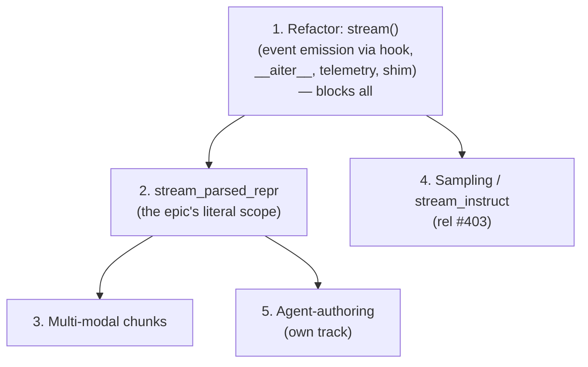

# Phase 2 Validated Streaming — Epic Breakdown

> **Purpose:** decompose what remains of the validated-streaming epic (after
> Phase 1 closed) into distinct, separately-shippable pieces, with dependencies
> and a
> recommended ordering. The Phase 1 *refactor* is the first item and it blocks
> the rest. Each item section is written to be liftable into a GitHub issue once
> the shape is agreed.
>
> **Status:** discussion draft to frame the Phase 2 planning conversation.
> Shared alongside a working POC on this branch; nothing is filed yet.
>
> **POC:** `mellea/stdlib/streaming_poc.py` (plus `ModelOutputThunk.__aiter__` in
> `mellea/core/base.py`) is a working prototype of item 1, including hook-based
> event emission. Sections below note where the POC already validates a decision.
>
> **Origin:** the companion proposal [streaming-simplification.md](streaming-simplification.md)
> came out of an offline discussion between @psschwei and @ajbozarth; it is
> included verbatim as the seed for the item-1 direction.

---

## Where things stand

- **Phase 1 (epic #891) is fully closed.** All children merged: `PartialValidationResult`
  (#898), `ChunkingStrategy` (#899), `stream_validate()` (#900), `stream_with_chunking()`
  (#901), and streaming event types (#902). Phase 1 shipped the working
  `stream_with_chunking` + `StreamChunkingResult` primitive.
- **#1013 is the open Phase 2 epic**, but today it is a *placeholder* scoped
  narrowly to one component (`stream_parsed_repr`). In practice "Phase 2" is
  larger than that one method — this doc argues for treating the epic as an
  umbrella over the items below.

### Related issues to coordinate with

- **#403** — streaming for sampling results. May relate to item 4; see that item.
- **#1051** — streaming span events (the OTel-side bridge). It has been waiting on
  a streaming-events design; once item 1's event hook is settled, #1051 becomes a
  possible *consumer* of that hook rather than separate work.
- **#444** — enhanced tracing epic. The "one span per stream" target (below) lives
  here; the item-1 telemetry cleanup should be coordinated with it.

---

## The core reframing

Phase 1 delivered streaming validation as a **standalone parallel interface**
(`stream_with_chunking` + `StreamChunkingResult`), which epic #891 openly called
a scoped pragmatic choice. Everything left to do divides along two independent
axes that Phase 1 collapsed onto the call site:

- **How output is consumed / orchestrated** — the *interface* (a separate result
  type + background task vs. folding into the normal generation flow).
- **What a "chunk" is and who owns its boundary** — the *type semantics* (an
  external string-splitter vs. the MOT knowing its own units).

The refactor addresses the first axis; `stream_parsed_repr` addresses the
second; the remaining pieces (sampling integration, multi-modal, agent-authoring)
build on one or both. Keeping them as separate items lets each ship and be
reviewed independently.

---

## Item map

Ordered by dependency. **Item 1 blocks all others.**

### 1. Refactor: single-task `stream()` primitive  ⟶ blocks everything

Replace `stream_with_chunking()` + `StreamChunkingResult` with a single
`stream()` consumed by a plain `async for`, driven on the caller's task (no
background orchestration task). The only durable state is a thin `Streamer`
handle (`failed_early`, `failure_reason`, `streaming_failures`, `full_text`,
`final_validations`, terminal `mot`).

```python
streamer = stream(action, backend, ctx, chunking="sentence", requirements=[req])
async for chunk in streamer:
    display(chunk)
if streamer.failed_early:
    handle_failure(streamer.failure_reason)
```

**Why this matters — streaming shouldn't be a separate interface.** Phase 1
delivered streaming validation as a standalone parallel path: its own entry
point (`stream_with_chunking`), its own result type (`StreamChunkingResult`,
distinct from `ModelOutputThunk`), and its own consumption protocol
(`astream()`/`events()`/`acomplete()`). Streaming is a *property of a generation
call*, not a different kind of call — the MOT already streams (`astream()`,
`is_computed()`, `cancel_generation()`). The parallel interface wraps a second
orchestration layer around a stream the framework already produces, and the seam
between the two leaks.

**The leak, concretely — the background-task split.** The parallel path runs on a
background `asyncio` task (`_orchestrate_streaming`); the caller pulls chunks and
events off two queues that task feeds. That *caller task* vs *orchestration task*
split is the root of a recurring class of problems:

| Symptom | Root |
|---|---|
| Cross-task OTel (tracing) span detach failure, worked around in PR #1361 | the tracing span opens on the caller task but the stream drains on the orchestration task, so the OTel context detach crosses tasks and fails |
| `acomplete()` "works by accident" if you fully drain `astream()` | `_done` is set by the orchestrator task as a drain side effect, not by the documented terminal call |
| `as_thunk` docstring says it raises "before `acomplete()`" but checks `_done.is_set()` | same — `_done` is orchestrator-set, not `acomplete`-set |
| Two text views (`accumulated` vs `emitted_end`) | chunker needs full accumulation; `full_text` should reflect only validated output; they diverge on early exit |
| Raise-once exception plumbing (`_orchestration_exception`, `_exception_surfaced`) | an exception on the orchestrator task must be surfaced to whichever of `astream()`/`acomplete()` the caller drains first |
| Single-consumer guards, `_orchestration_started` event | queue hand-off between tasks needs liveness/ordering coordination |

None are bugs in isolation — Phase 1 handled each carefully. They are all
consequences of the one architectural choice the refactor removes.

**Telemetry surfaced this, and single-task fixes it cleanly.** PR #1361 moved
streaming telemetry onto plugin hooks (the #444 direction); this refactor keeps
it there. The problem was never hooks-vs-inline — it is that the two-task split
forces the tracing-span lifecycle to be reconstructed across a task boundary. Per
@psschwei on #1361: *"we should strongly consider 'one span per stream' as the
target design."* A single-task design makes that fall out for free:
`STREAMING_START`/`STREAMING_END` fire at loop entry/exit on one task, so a
subscriber opens the OTel span on START and closes it on END with no cross-task
detach and no re-attach hook. The `STREAMING_ORCHESTRATION_START`/`END` pair —
which existed *only* to bridge the two tasks — can be dropped.

**Scope of the item:**

- **Core:** `ModelOutputThunk.__aiter__`/`__anext__` wrapping `astream()` in the
  async-iterator protocol. Generic and reusable by plain streaming — could land
  independently.
- **Stdlib:** `stream()` + `Streamer`; chunking and per-chunk validation layered
  over the shared iteration protocol; full-output validation on natural
  completion (this is what runs judge/aLoRA requirements that stream `"unknown"`).
- **Telemetry:** re-point the `STREAMING_*` hooks to fire on the single task; drop
  the now-unneeded orchestration-bridge hooks; and move `CompletedEvent` handling
  into the `STREAMING_EVENT` (event) plugin rather than finalizing it in the
  `STREAMING_END` (OTel span) hook. Coordinate with #444's one-span-per-stream
  target.
- **Events (emission):** part of this item — the loop fires `STREAMING_EVENT` for
  the full Phase 1 vocabulary (`QuickCheckEvent`, `ChunkEvent`,
  `StreamingDoneEvent`, `FullValidationEvent`, `ErrorEvent`, `CompletedEvent`)
  uniformly, no event queue. *Event consumption* (an in-band `events()` iterator)
  is intentionally **not** carried forward: no integrated consumer exists —
  `m serve` streams via raw `mot.astream()`, the telemetry plugins consume the
  hook, and the old `events()` iterator appears only in examples. Defer any
  convenience consumption API until a real consumer needs it.
- **Migration:** replace `stream_with_chunking()` with `stream()`, via a
  deprecation shim or a hard break (see agenda).

**POC status:** implemented in `mellea/stdlib/streaming_poc.py`. Validates the
single-task shape, per-chunk validation + early exit, full-output validation,
exception propagation, and hook-based event emission — all without the queues,
raise-once plumbing, or `acomplete()` ambiguity above.

**Deliberate interim behavior:** early-exit `full_text` is delta-granular, not
chunk-exact, until item 2 lands (documented in the POC; see that item).

### 2. `stream_parsed_repr`: MOT-owned chunking  (the epic's literal scope)

Move chunk-boundary knowledge onto the MOT: each MOT subclass yields complete,
typed units of its own `parsed_repr` type instead of an external
`ChunkingStrategy` splitting a raw string. This is the type-semantics axis from
the reframing — "what is a complete chunk of this output" is a property of the
output type, so it belongs on the MOT, which already owns `parsed_repr`.

- **Depends on:** item 1 (slots into the loop by changing the chunk *source* —
  `chunking.split(accumulated)` → `async for unit in mot.stream_parsed_repr()`).
- **Unblocks / fixes:** the early-exit `full_text` interim behavior from item 1
  (one unit per iteration makes partial output exact — no cursor, no whitespace
  edge); external `ChunkingStrategy` can then be deprecated.

**Example approaches** — these are starting points to react to in the call; the
chosen shape gets locked when the item's PR is opened, not here.

- **A — async generator yielding the parsed type.**
  ```python
  async def stream_parsed_repr(self) -> AsyncIterator[S]: ...
  ```
  Mirrors `astream()`; typed via the MOT's existing `S`. The `stream()` loop just
  iterates it. *For:* smallest surface, reuses the type parameter already on the
  MOT. *Against:* `S` is the *final* parsed type — a mid-stream partial (half a
  JSON object, a truncated sentence) may not be a valid `S`, so this forces either
  "only yield settled units" or a looser `S`.
- **B — pluggable boundary predicate, MOT supplies a default.**
  ```python
  mot.stream_parsed_repr(boundary=my_predicate)   # MOT has a type-appropriate default
  ```
  The MOT owns a sensible default boundary per type; callers can override.
  *For:* keeps an author extension point, and text vs. multi-modal can ship
  different defaults. *Against:* re-introduces a call-site knob the refactor was
  trying to remove, and blurs who owns the boundary (MOT vs. requirement).
- **C — typed chunk envelope instead of bare `S`.**
  ```python
  @dataclass
  class ParsedChunk(Generic[S]):
      partial: S | None    # best-effort parse so far (None if not yet parseable)
      raw: bytes | str     # the underlying bytes/text for this unit
      complete: bool       # settled unit vs. a running partial
  ```
  *For:* one shape handles multi-modal (bytes/frames), partial-parse state, and
  "not enough data yet" (`complete=False`) — it answers the multi-modal and
  error-handling questions below in one move. *Against:* heavier; text-only
  consumers pay for machinery they don't need, and every consumer unwraps the
  envelope.

The real fork is A vs. C: whether a "chunk" is always a complete `S`, or a
richer object that can carry partial/typed/binary state. Multi-modal (item 3)
pushes toward C.

**Open questions (from #1013):**

1. Generator shape & multi-modal — does the signature admit bytes/frames, not just
   `str`? (The A-vs-C fork.)
2. Boundary authority — MOT parser, pluggable predicate, or both?
3. Backpressure — if parsed chunks lag raw tokens, where does buffering live?
   (`_GenerationState`, added in #909's structural cleanup, is the natural home.)
4. Error handling — partial-parse failure: surface now, wait, or fall back to raw?
5. Backwards-compat — both external `ChunkingStrategy` and MOT-native during
   transition?
6. Testability — each MOT type's `stream_parsed_repr` verified against its
   non-streaming `parsed_repr`; shared harness shape.

### 3. Multi-modal streaming chunks

Extend `stream_parsed_repr` to non-string units — audio segments, image regions,
video. Epic #891 and #1013 name this the *first-class motivation* for MOT-owned
chunking (the `split(accumulated_text: str)` signature forecloses it by design).

- **Depends on:** item 2 (it is the generalization of the same mechanism to
  non-`str` units, and the case that most forces the typed-envelope decision).
- **Note:** likely its own item — the fixture/test story and the per-modality
  boundary logic are substantial and separable from the text case.

### 4. Sampling integration / convenience wrapper

A session-level entry point (epic #891 sketched `stream_instruct()`) giving the
familiar `instruct()`-style interface with streaming validation + retry handled
internally, so common-case callers never touch the low-level `async for` +
read-fields idiom.

- **Depends on:** item 1 only (wraps the new primitive, not `stream_with_chunking`).
  **Parallelizable with item 2** — a good candidate for a second developer to pick
  up alongside `stream_parsed_repr`, since both proceed directly off item 1.
- **Possible overlap with #403 (investigate at pickup):** #403 is an old,
  underspecified p2 asking to stream `SamplingResult`s from `BaseSamplingStrategy`. Item 4 also
  combines streaming with retry, but via a different path — Phase 1's primitive
  bypasses `BaseSamplingStrategy` (callers own the retry loop), so item 4's retry
  is not #403's sampling-loop retry. Whether they converge or stay separate is
  undecided; #403 has no concrete design to reconcile against yet. Resolve when
  item 4 is picked up, not before.
- **Existing unmigrated consumer:** the prototype
  [`Mellea-partials`](https://github.com/HendrikStrobelt/Mellea-partials) already
  ships a working `stream_instruct` (as a `MelleaSession` powerup, see its
  `doc/stream_instruct.md`) plus its own `StreamEvent` types — it predates the
  Phase 1 upstream and never migrated onto it. It is the natural reference
  implementation and forcing-function consumer: converging it onto the refactored
  primitive validates this API against real usage rather than a guess.
- **Open:** exact shape, name, and whether it is the home for a non-iterating
  "just give me the validated result" path. Genuinely undesigned — flag as such.

### 5. Agent-authoring patterns  (park / separate track)

Named directly in the #1013 body as in-scope Phase 2 work (one of the threads the
placeholder epic was raised to track). Both `stream_validate` and
`stream_parsed_repr` have a deterministic check against a non-streaming
counterpart (`validate()` / `parsed_repr`), which makes them candidates for
agent-friendly authoring (potentially skills). Also raised in the PR #942 thread.

- **Depends on:** item 2 (needs the `stream_parsed_repr` contract to exist first).
- **Recommendation:** its own issue, not folded into the type-semantics work — it
  will balloon scope otherwise.

---

## Dependency picture



Items 2 and 4 depend only on item 1 and can run in parallel (separate owners);
items 3 and 5 depend on item 2.

---

## Recommended sequencing

1. **Land the refactor (item 1) first** — the blocking foundation. Event emission
   via hook is part of it, so Phase 1's event surface is not regressed.
2. **Then parallelize across developers:** `stream_parsed_repr` (item 2) and
   sampling integration (item 4) both proceed directly off item 1 and are
   independent enough for separate owners.
3. **Multi-modal (item 3) and agent-authoring (item 5)** follow item 2.

Whether the existing epic becomes the umbrella, or a fresh epic is opened and
issue #1013 is demoted to the `stream_parsed_repr` item-2 issue, is an
implementation detail of issue bookkeeping, not a design decision.

---

## Open decisions to settle at the call

- Does the refactor (item 1) ship standalone, or is it gated on `stream_parsed_repr`
  (item 2)? Shipping item 1 alone means an interim mid-epic behavior break: early-exit
  `full_text` is delta-granular until item 2 lands.
- Migration: deprecation shim for `stream_with_chunking()`, or a hard break?
- Which `stream_parsed_repr` shape (A / B / C) is the direction — specifically the
  A-vs-C "bare `S` vs. typed envelope" fork, which multi-modal leans on.
