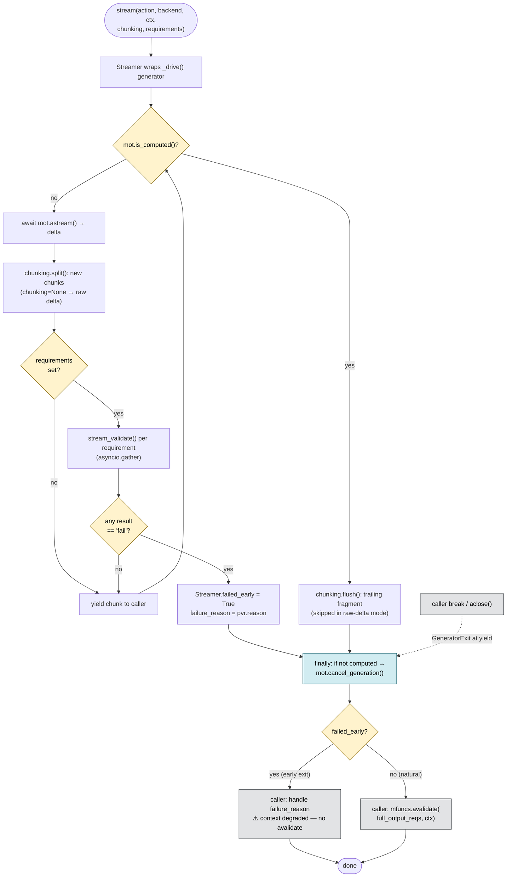

# Streaming API Simplification

---

## Proposal

Replace `stream_with_chunking()` + `StreamChunkingResult` (two async queues, a
background task, `_done`/`_orchestration_started` events, raise-once exception
plumbing, single-consumer guards) with a single `stream()` that you consume with
a plain `async for`. Chunking becomes a parameter; incremental validation
becomes a parameter; full-output validation runs after the loop exactly like the
non-streaming path. The only state that outlives the loop is a two-field
`Streamer` (`failed_early` / `failure_reason`). Migrate via a deprecation shim.

```python
streamer = stream(action, backend, ctx, chunking="sentence", requirements=[req])
async for chunk in streamer:
    display(chunk)

if streamer.failed_early:
    handle_failure(streamer.failure_reason)
```

---

## Flow

The natural-completion path and the early-exit path diverge on a single
`"fail"` result; both converge on the same `try/finally` cleanup that stops the
backend. Full-output validation runs *after* the loop, and only on natural
completion.



The dotted edge is the `break`-safety path: abandoning the `async for` delivers
`GeneratorExit` to the suspended `yield`, so the same `finally` cancels the
backend even when the caller never iterates to completion.

---

## Core insight

Streaming is a sequence of values over time. Chunking is a transformation on
that sequence. Validation is a filter on that sequence. These are all
composable operations on an `AsyncIterator[str]` — they do not require a
dedicated result object or a coupled orchestration layer.

The data emitted by a raw token stream and a chunked stream is the same type
(`str`). The only difference is granularity. There is no inherent reason they
need different return types or different call sites.
