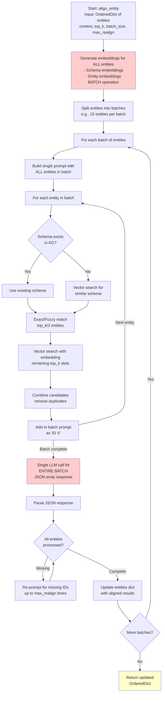
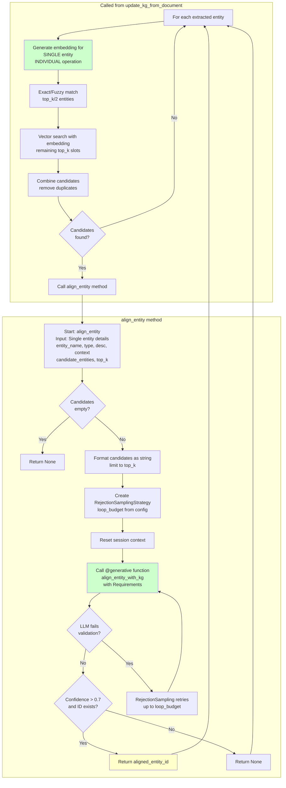

```mermaid
graph TB 
    A1[Start: align_entity<br/>Input: OrderedDict of entities<br/>context, top_k, batch_size, max_realign]
    A2[Generate embeddings for ALL entities<br/>- Schema embeddings<br/>- Entity embeddings<br/>BATCH operation]
    A3[Split entities into batches<br/>e.g., 10 entities per batch]
    A4[For each batch of entities]
    A5[Build single prompt with<br/>ALL entities in batch]
    
    A6[For each entity in batch]
    A7{Schema exists<br/>in KG?}
    A8[Use existing schema]
    A9[Vector search for<br/>similar schema]
    A10[Exact/Fuzzy match<br/>top_k/2 entities]
    A11[Vector search with embedding<br/>remaining top_k slots]
    A12[Combine candidates<br/>remove duplicates]
    A13[Add to batch prompt<br/>as 'ID X']
    
    A14[Single LLM call for<br/>ENTIRE BATCH<br/>JSON array response]
    A15[Parse JSON response]
    A16{All entities<br/>processed?}
    A17[Re-prompt for missing IDs<br/>up to max_realign times]
    A18[Update entities dict<br/>with aligned results]
    A19{More batches?}
    A20[Return updated<br/>OrderedDict]
    
    A1 --> A2
    A2 --> A3
    A3 --> A4
    A4 --> A5
    A5 --> A6
    A6 --> A7
    A7 -->|Yes| A8
    A7 -->|No| A9
    A8 --> A10
    A9 --> A10
    A10 --> A11
    A11 --> A12
    A12 --> A13
    A13 -->|Next entity| A6
    A13 -->|Batch complete| A14
    A14 --> A15
    A15 --> A16
    A16 -->|Missing| A17
    A16 -->|Complete| A18
    A17 --> A16
    A18 --> A19
    A19 -->|Yes| A4
    A19 -->|No| A20

    style A2 fill:#ffcccc
    style A14 fill:#ffcccc
    style A20 fill:#ffffcc 

```

```mermaid
graph TB
    subgraph "Called from update_kg_from_document"
        B0[For each extracted entity]
        B1[Generate embedding for<br/>SINGLE entity<br/>INDIVIDUAL operation]
        B2[Exact/Fuzzy match<br/>top_k/2 entities]
        B3[Vector search with embedding<br/>remaining top_k slots]
        B4[Combine candidates<br/>remove duplicates]
        B5{Candidates<br/>found?}
        B6[Call align_entity method]
    end
    
    subgraph "align_entity method"
        C1[Start: align_entity<br/>Input: Single entity details<br/>entity_name, type, desc, context<br/>candidate_entities, top_k]
        C2{Candidates<br/>empty?}
        C3[Return None]
        C4[Format candidates as string<br/>limit to top_k]
        C5[Create RejectionSamplingStrategy<br/>loop_budget from config]
        C6[Reset session context]
        C7[Call @generative function<br/>align_entity_with_kg<br/>with Requirements]
        C8{Confidence > 0.7<br/>and ID exists?}
        C9[Return aligned_entity_id]
        C10[Return None]
        C11{LLM fails<br/>validation?}
        C12[RejectionSampling retries<br/>up to loop_budget]
    end
    
    B0 --> B1
    B1 --> B2
    B2 --> B3
    B3 --> B4
    B4 --> B5
    B5 -->|Yes| B6
    B5 -->|No| B0
    B6 --> C1
    
    C1 --> C2
    C2 -->|Yes| C3
    C2 -->|No| C4
    C4 --> C5
    C5 --> C6
    C6 --> C7
    C7 --> C11
    C11 -->|Yes| C12
    C11 -->|No| C8
    C12 --> C7
    C8 -->|Yes| C9
    C8 -->|No| C10
    C9 --> B0
    C10 --> B0

    style B1 fill:#ccffcc
    style C7 fill:#ccffcc
    style C9 fill:#ffffcc    

```