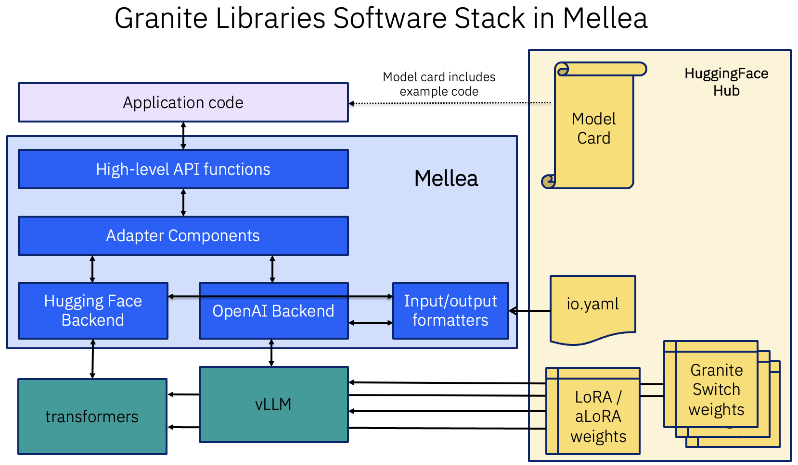

# Adapter Functions Examples

This directory contains examples for using Mellea's adapter functions - specialized model capabilities accessed through adapters.

## Concepts Demonstrated

- **Adapter Functions**: Specialized model capabilities beyond text generation
- **Adapter System**: Using LoRA/aLoRA adapters for specific tasks
- **RAG Evaluation**: Assessing retrieval-augmented generation quality
- **Quality Metrics**: Measuring relevance, groundedness, and accuracy
- **Backend Integration**: Adding adapters to different backend types (LocalHFBackend with runtime adapters, OpenAIBackend with Granite Switch embedded adapters)

## Basic Usage

```python
from mellea import model_ids, start_backend
from mellea.stdlib import functional as mfuncs
from mellea.stdlib.components.intrinsic import core

ctx, backend = start_backend(
    "hf", model_id=model_ids.IBM_GRANITE_4_1_3B, context_type="chat"
)

response, ctx = mfuncs.chat("What is 2 + 2?", ctx, backend)
print(f"Response: {response.content}")

# NOTE: There are additional functions for other adapter functions as well.
result = core.check_certainty(ctx, backend)
print(f"Certainty score: {result}")
```

OpenAIBackends also support a type of embedded adapter for Granite Switch models:
```python
backend = OpenAIBackend(
        model_id=IBM_GRANITE_SWITCH_4_1_3B_PREVIEW.hf_model_name,
        load_embedded_adapters=True,  # Auto-loads adapters from huggingface repo.
        ...
)
```

The underlying adapter functions can also be utilized directly when generating:
```python
from mellea.stdlib.components import Intrinsic
import mellea.stdlib.functional as mfuncs

...

out, new_ctx = mfuncs.act(
    Intrinsic(
        "requirement-check",
        intrinsic_kwargs={"requirement": "The assistant is helpful."}),
    ctx,
    backend
)
```

For complete runnable examples using the OpenAI backend with Granite Switch,
see [`../granite-switch/`](../granite-switch/).

> **Note:** Not all adapter functions are embedded in every Granite Switch model. You should check
> the model's `adapter_index.json` file for a definitive list. For granite switch models
> pre-built by IBM, we include a list of models in the Mellea `model_id`.

## Available Adapter Functions

- **answerability**: Determine if question is answerable
- **citations**: Extract and validate citations
- **context-attribution**: Identify context sentences that most influenced response
- **context_relevance**: Assess context-query relevance
- **factuality_correction**: Correct factually incorrect responses
- **factuality_detection**: Detect factually incorrect responses
- **guardian-core**: Safety risk detection (harm, bias, groundedness, custom criteria)
- **hallucination_detection**: Detect hallucinated content
- **policy_guardrails**: Determine if scenario complies with policy
- **query_clarification**: Generate a clarification request if needed, otherwise "CLEAR".
- **query_rewrite**: Improve query formulation
- **requirement_check**: Validate requirements (used by ALoraRequirement)
- **uncertainty**: Estimate certainty about answering a question

## Example Files

### RAG Adapter Functions

```bash
uv run answerability.py
```
Demonstrates checking if documents can answer a question.

```bash
uv run citations.py
```
Demonstrates extracting and validating citations from responses.

```bash
uv run context_attribution.py
```
Demonstrates identifying which context sentences influenced the response.

```bash
uv run context_relevance.py
```
Demonstrates assessing the relevance of documents to a query.

```bash
uv run hallucination_detection.py
```
Demonstrates detecting potentially hallucinated content.

```bash
uv run query_clarification.py
```
Demonstrates generating clarification requests when needed.

```bash
uv run query_rewrite.py
```
Demonstrates rewriting queries for better retrieval.

### Core Adapter Functions

```bash
uv run requirement_check.py
```
Demonstrates validating requirements against model outputs.

```bash
uv run uncertainty.py
```
Demonstrates assessing model certainty about its response.

### Guardian Adapter Functions

```bash
uv run factuality_detection.py
```
Demonstrates detecting factually incorrect statements.

```bash
uv run factuality_correction.py
```
Demonstrates automatically correcting factual errors.

```bash
uv run guardian_core.py
```
Demonstrates comprehensive safety checks (harm, bias, groundedness).

```bash
uv run policy_guardrails.py
```
Demonstrates checking compliance with policies.

### Comprehensive Example

```bash
uv run intrinsics.py
```
Full example showing multiple adapter functions working together in a RAG pipeline.

## Architecture


## Related Documentation

- See `mellea/stdlib/components/intrinsic/` for adapter function implementations
- See `mellea/backends/adapters/` for adapter system
- See `docs/dev/intrinsics_and_adapters.md` for architecture details
- See `docs/docs/examples/granite-switch/README.md` for more about granite-switch